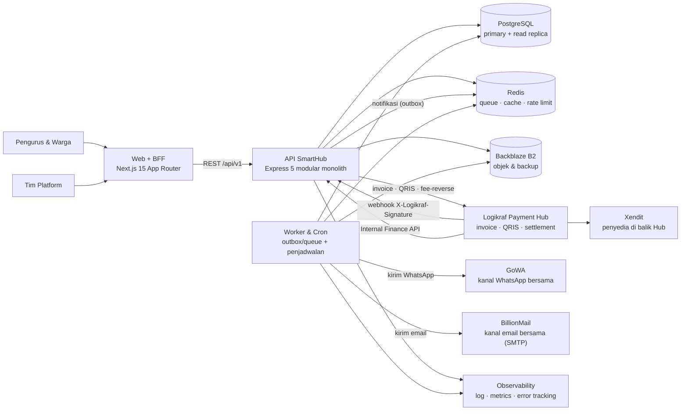
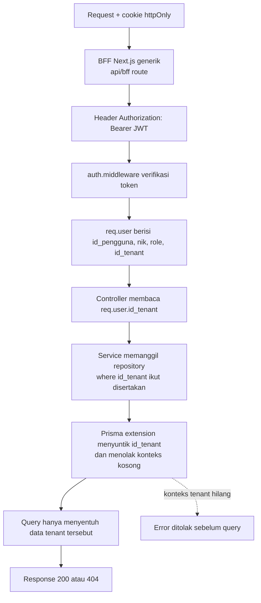
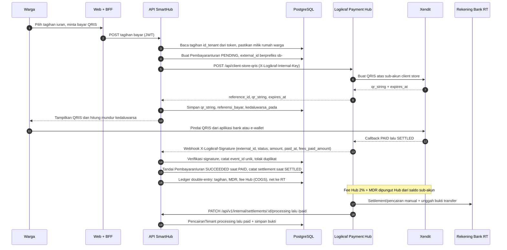
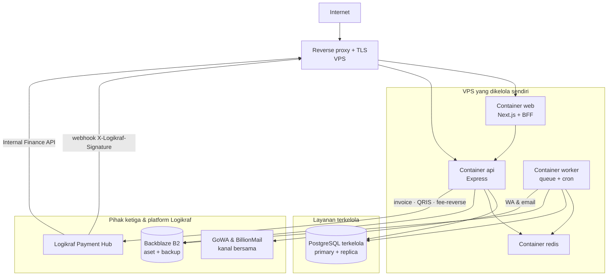

# Arsitektur SmartHub — Skala SaaS Komersial

Dokumen ini menjelaskan arsitektur **SmartHub** sebagai produk SaaS multi-tenant komersial untuk pasar Indonesia: bagaimana kode diorganisasi, bagaimana isolasi data antar-RT dijamin, bagaimana uang warga mengalir tanpa pernah singgah di rekening platform, dan bagaimana sistem dioperasikan, diamati, serta dipulihkan.

| Atribut | Nilai |
|---|---|
| Nama Dokumen | Architecture.md |
| Nama Produk | SmartHub — Platform Manajemen Warga & Kas RT |
| Versi Dokumen | 2.4 (KYC & Payout di SmartHub via Hub; Fee Flat Rp2.500) |
| Tanggal | 2026-09-24 |
| Pemilik Dokumen | Arsitek Teknis / Founder |
| Status | Disetujui untuk menjadi acuan implementasi |
| Dokumen Terkait | `PRD.md` 2.3, `API-Contract.md` 2.1, `UI-UX-Design.md` 1.1, `docs/pilot/rencana-validasi-harga.md`, `docs/pilot/hasil-pilot.md`, `docs/logikraf/payment-hub-integration-guide.md`, `docs/logikraf/notifications-architecture.md` |

> **Sumber kebenaran.** Istilah, nama peran, penomoran use case (UC-01…UC-38), nama model, dan aturan bisnis mengikuti `PRD.md` 2.3 secara harfiah. Dokumen ini tidak mendefinisikan ulang istilah tersebut, hanya menjelaskan arsitekturnya. Seluruh pembayaran melewati **Logikraf Payment Hub** dan seluruh notifikasi memakai kanal bersama Logikraf (**GoWA** dan **BillionMail**).
>
> **Konvensi status.** Setiap klaim dibedakan secara eksplisit antara **SAAT INI** (sudah ada di repositori) dan **TARGET** (belum dibangun, bagian dari Fase SaaS). Angka faktual (**145 endpoint**, 40 model, 19 migrasi, 90 test) hanya dinyatakan sebagai kondisi saat ini, bukan target.

---

## 1. Prinsip & Gaya Arsitektur

### 1.1 Gaya yang Dipilih
SmartHub memakai **Modular Monolith** di atas monorepo **pnpm workspaces**. Satu proses API melayani semua modul, tetapi batas modul di dalam kode ditegakkan sekeras batas service: tidak ada modul yang menyentuh tabel milik modul lain.

Alasan pemilihan:
1. **Tim kecil, kecepatan tinggi.** Satu deploy, satu skema database, tanpa biaya operasional jaringan antar-service. Microservices akan menambah kompleksitas distributed transaction tanpa manfaat pada skala 1.000 tenant.
2. **Konsistensi data keuangan.** Iuran, kas, pembayaran QRIS, dan ledger harus konsisten dalam satu transaksi database. Monolith dengan satu Postgres memberi jaminan transaksional yang sulit ditiru microservices.
3. **Siap diekstrak.** Karena setiap modul sudah dipisah routes/controller/service/repository dan hanya berkomunikasi lewat fungsi publik, modul `billing` atau `notifikasi` dapat dipisah ke proses tersendiri tanpa menulis ulang logika bisnis.

### 1.2 Aturan Isolasi Modul (tetap berlaku)
- Modul **dilarang** mengakses berkas repository modul lain atau menulis query langsung ke tabel modul lain.
- Ketergantungan antar-modul hanya melalui **fungsi publik yang diekspor service** (daftar di Bab 6).
- Repository adalah satu-satunya lapisan yang berbicara ke Prisma Client.
- Ketergantungan harus **searah** dan tidak boleh melingkar.

### 1.3 Prinsip Baru di Fase SaaS
| Prinsip | Konsekuensi arsitektur |
|---|---|
| **Isolasi tenant mutlak** | `id_tenant` ada di setiap tabel domain; scoping diambil dari token, bukan dari klien |
| **Dana non-kustodial** | Platform tidak punya rekening penampung; dana mengalir ke sub-akun milik client store (RT); fee Hub dicatat sebagai COGS, dan seluruh pembayaran lewat Logikraf Payment Hub |
| **Uang tidak boleh hilang tanpa jejak** | Setiap pergerakan nilai dicatat di ledger double-entry dan direkonsiliasi harian |
| **Idempotensi mutlak pada webhook** | Event diproses maksimal sekali berdasarkan `event_id` unik; nominal selalu dibaca dari database, tidak pernah dari payload |
| **Append-only audit** | Aksi sensitif tidak dapat diubah atau dihapus, hanya ditambah |
| **Expand–contract** | Perubahan skema kompatibel mundur: tambah kolom dulu, hapus belakangan |

### 1.4 Penegasan Penamaan: SmartHub v1 vs SmartHub Legacy v3
Repositori ini adalah **SmartHub v1** dengan stack **Node 22 + Express 5 + Prisma + Next.js 15**. Istilah "SmartHub V3" merujuk pada **produk lama** (Hono/Bun/Drizzle) yang **bukan** acuan arsitektur dokumen ini dan tidak dipelihara sebagai target. Seluruh contoh, konvensi, dan keputusan di dokumen ini mengikat SmartHub v1. Rujukan ke Hono, Bun, atau Drizzle hanya boleh muncul sebagai catatan historis/legacy, tidak sebagai pola implementasi.

Selain itu, SmartHub v1 adalah **Client Store Logikraf** berprefiks `sb-`. Pembayaran tidak pernah dibuat langsung ke Xendit; semuanya melalui **Logikraf Payment Hub** yang memegang satu API key Xendit untuk seluruh ekosistem.

---

## 2. Gambaran Sistem

SmartHub v1 terdiri dari komponen berikut: **Web + BFF** (Next.js 15), **API** (Express 5), **Worker** (job queue & cron), **PostgreSQL** (data), **Redis** (queue/cache), penyimpanan objek **Backblaze B2**, serta integrasi platform bersama Logikraf: **Logikraf Payment Hub** (satu-satunya pintu pembayaran), **GoWA** (kanal WhatsApp), dan **BillionMail** (kanal email).



**Keterangan status komponen:**

| Komponen | Status |
|---|---|
| Web + BFF Next.js 15 + React 19 | SAAT INI |
| API Express 5 modular monolith | SAAT INI |
| PostgreSQL | SAAT INI |
| Backblaze B2 (objek) | TARGET — saat ini disk lokal VPS |
| Logikraf Payment Hub | TARGET — belum ada integrasi pembayaran; SmartHub belum terdaftar sebagai Client Store `sb-` |
| Xendit (di balik Hub) | TARGET — key dipegang Hub, tidak pernah di SmartHub |
| Worker & Cron | TARGET — belum ada proses terjadwal |
| Redis (queue/cache) | TARGET — belum dipakai |
| GoWA (kanal WhatsApp bersama) | TARGET — notifikasi masih in-app |
| BillionMail (kanal email bersama) | TARGET — notifikasi masih in-app |

**Alur request normal (SAAT INI):** browser → Next.js route (App Router) → route handler BFF `/api/bff/[...path]` → API Express dengan header `Authorization: Bearer <JWT>` → repository → PostgreSQL. JWT tidak pernah disimpan di `localStorage`; ia berada di cookie **httpOnly** yang dipasang BFF.

---

## 3. Multi-Tenancy

### 3.1 Strategi: Shared Schema + `id_tenant`
Keputusan yang dikunci: **satu skema database bersama**, dengan kolom `id_tenant` sebagai pemisah logis. Bukan schema-per-tenant, bukan database-per-tenant.

Alasan:
- **Onboarding instan.** Pembuatan tenant oleh **Ketua_RT/Sekretaris** (UC-24) tidak perlu membuat schema/DB baru — cukup satu baris `Tenant`. **Self-serve publik dibatalkan (2026-09-23)**; akun operator diseed dengan role Ketua_RT/Sekretaris, data warga & akunnya dibuat pengurus.
- **Biaya operasional rendah.** Migrasi dijalankan sekali untuk semua tenant, cocok untuk monetisasi langganan murah per-RT.
- **Jalur upgrade jelas.** Tenant Enterprise dapat dipindahkan ke database khusus (Fase 2) tanpa mengubah kode karena batasnya tetap di repository.

Trade-off yang diterima: tidak ada isolasi fisik antar-tenant, sehingga kebocoran data hanya dapat dicegah oleh **penegakan scoping yang benar** (Bab 3.2) dan diuji secara otomatis (Bab 3.5).

### 3.2 Penegakan Scoping Berlapis (Defense in Depth)
Isolasi dijaga oleh tiga lapis, sehingga satu kesalahan manusia tidak cukup untuk membocorkan data:

1. **Sumber tunggal `id_tenant` = token.** `auth.middleware.ts` memverifikasi JWT dan mengisi `req.user`. Payload token memuat `id_tenant`. **Tidak ada** header, query param, atau body yang boleh menentukan tenant. Ini menutup celah IDOR lintas-tenant.
2. **Prisma Client Extension (target).** Sebuah extension `$extends({ query: { $allModels: { async $allOperations(...) } } })` menyuntikkan `where.id_tenant = context.id_tenant` pada operasi baca/tulis model yang memiliki kolom tersebut, dan menolak operasi bila konteks tenant tidak tersedia. Ini adalah jaring pengaman terpusat agar repository yang lupa memfilter tetap aman.
3. **Guard di service.** Setiap service yang menerima `id_*` dari klien wajib melakukan **assert kepemilikan**: ambil entitas dengan `where: { id, id_tenant }`, lalu 404 bila tidak ditemukan. 404 (bukan 403) dipakai agar keberadaan data tenant lain tidak terkonfirmasi.



### 3.3 Pola Query & Index Komposit
- Setiap tabel domain root wajib memiliki `id_tenant` sebagai kolom **pertama** pada index komposit. Contoh:
  - `@@index([id_tenant, status_bayar])` pada `IuranRumah`
  - `@@index([id_tenant, createdAt])` pada `KasUmum`
  - `@@index([id_tenant, dibaca_pada])` pada `Notifikasi`
- Tabel anak yang selalu diakses lewat induk (`PostinganLampiran`, `ReaksiPostingan`, `PollOpsi`, `PollSuara`, `ProdukFoto`, `FavoritProduk`) **disarankan** mendapat `id_tenant` sebagai *defense in depth*. Trade-off: menambah sedikit redundansi dan satu titik konsistensi (harus sama dengan induk), tetapi menghilangkan kebutuhan join untuk memverifikasi kepemilikan dan mempercepat guard.
- Query lintas-tenant (metrik platform, konsol admin) hanya boleh lewat modul `admin` dan tidak pernah lewat repository modul domain.

### 3.4 `id_tenant` Wajib pada Tabel Domain Root
`Rumah`, `KartuKeluarga`, `Warga`, `MutasiWarga`, `TamuKunjungan`, `KategoriKeuangan`, `IuranRumah`, `KasUmum`, `Postingan`, `KategoriProduk`, `Produk`, `LaporanProduk`, `Notifikasi`, dan `AkunPengguna`.

Catatan khusus `AkunPengguna`: kolom `email`, `username`, dan `nik` saat ini unik global. Setelah multi-tenancy, keunikannya menjadi **unik per-tenant** — misalnya `@@unique([id_tenant, username])` — agar dua RT boleh memiliki username sama. Email boleh tetap unik global untuk memudahkan pemulihan akun lintas perangkat, dan keputusan akhir dicatat sebagai ADR (Bab 17).

### 3.5 Migrasi Data Existing ke Tenant Default
Data yang sudah ada (dari Fase 1) harus tetap hidup. Strategi:

1. **Seed tenant default.** Buat satu `Tenant` bernama sesuai RT percontohan dengan slug unik, status `Aktif`.
2. **Expand.** Tambahkan kolom `id_tenant` sebagai **nullable** ke 14 tabel domain root lewat satu migrasi. Sistem lama tetap berjalan karena kolom boleh kosong.
3. **Backfill.** Isi semua baris lama dengan `id_tenant` tenant default dalam batch (mis. per 5.000 baris) untuk menghindari lock panjang.
4. **Contract.** Ubah kolom menjadi `NOT NULL` dan tambahkan foreign key serta index komposit. Setelah itu extension Prisma dinyalakan.
5. **Verifikasi.** Jalankan skrip pemeriksa `SELECT COUNT(*)` per tabel yang masih `id_tenant IS NULL` — hasil harus nol sebelum `NOT NULL` diberlakukan.

### 3.6 Risiko & Mitigasi
| Risiko | Dampak | Mitigasi |
|---|---|---|
| Repository lupa memfilter `id_tenant` | Kebocoran data antar-RT (cacat tertinggi) | Prisma extension + test isolasi wajib di CI (dua tenant fiktif, pastikan tenant A tidak dapat membaca data tenant B) |
| `id_tenant` diambil dari input klien | IDOR | Token sebagai satu-satunya sumber; validasi Zod menolak field `id_tenant` dari body |
| Index tanpa `id_tenant` | Query lambat saat ribuan tenant | Index komposit berawalan `id_tenant`; uji `EXPLAIN ANALYZE` pada volume target |
| Tabel anak tanpa `id_tenant` | Guard mahal (join berlapis) | Redundansi `id_tenant` disertai trigger/aplikasi yang menjaga konsistensi dengan induk |
| Backfill migrasi mengunci tabel | Downtime | Batch, jalankan di luar jam sibuk, pantau lock, siapkan rollback |

### 3.7 ADR Ringkas: RLS vs Application-Layer Scoping
**Keputusan:** scoping `id_tenant` di **application layer** (Bab 3.2) tetap mekanisme **utama** dan wajib. **Postgres Row-Level Security (RLS)** hanya berperan sebagai **hardening opsional**, bukan pengganti scoping aplikasi.

Alasan:
- Scoping aplikasi sudah berlapis (token, Prisma extension, guard service) dan dapat diuji di CI tanpa bergantung pada perilaku session database.
- RLS menambah kompleksitas operasional pada aplikasi yang memakai **connection pooling**: variabel sesi `SET LOCAL app.current_tenant` hanya hidup selama satu transaksi, sedangkan koneksi dikembalikan ke pool dan dapat dipakai ulang oleh tenant lain.

Catatan teknis bila RLS diaktifkan:
1. Set konteks **per transaksi** dengan `SET LOCAL app.current_tenant = '<id_tenant>'` di dalam transaksi yang sama, bukan `SET` biasa, agar nilai tidak bocor ke pemakai koneksi berikutnya.
2. Policy memakai `current_setting('app.current_tenant', true)` — argumen `true` membuat pembacaan mengembalikan `NULL` alih-alih melempar error bila variabel belum diset, sehingga query gagal-tertutup (menolak baris) alih-alih menggagalkan transaksi.
3. RLS diuji khusus pada jalur pool & transaksi bersarang sebelum dinyatakan aktif; keberadaan RLS tidak menggantikan test isolasi tenant.

Konsekuensi: tidak ada perubahan pada kontrak repository. RLS dapat ditambahkan belakangan sebagai lapisan tambahan tanpa mengubah logika domain.

---

## 4. Struktur Folder

```
smarthub/
├── apps/
│   ├── api/                                # Backend Express + Prisma (TypeScript)
│   │   ├── prisma/
  │   │   │   ├── schema.prisma               # 40 model saat ini + model Fase SaaS
  │   │   │   ├── migrations/                 # 19 migrasi saat ini
│   │   │   └── seed.ts                     # Tenant default, akun demo, paket, kategori
│   │   ├── src/
│   │   │   ├── config/                     # Konfigurasi global & infrastruktur
│   │   │   │   ├── database.ts             # Inisialisasi Prisma Client
│   │   │   │   ├── environment.ts          # Validasi .env (Zod)
│   │   │   │   ├── security.ts             # bcrypt, CORS, konstanta keamanan
│   │   │   │   ├── storage.ts              # Abstraksi penyimpanan (lokal → S3/B2)
│   │   │   │   ├── logger.ts               # pino
│   │   │   │   ├── logikraf-hub.ts         # [TARGET] klien Logikraf Payment Hub + verifikasi X-Logikraf-Signature
│   │   │   │   ├── redis.ts                # [TARGET] koneksi queue & cache
│   │   │   │   └── mailer.ts               # [TARGET] adapter email (BillionMail/SMTP) & WhatsApp (GoWA)
│   │   │   ├── common/
│   │   │   │   ├── middlewares/
│   │   │   │   │   ├── auth.middleware.ts        # Verifikasi JWT → req.user
│   │   │   │   │   ├── rbac.middleware.ts        # requireRole peran tenant
│   │   │   │   │   ├── tenant.middleware.ts     # [TARGET] konteks tenant dari token
│   │   │   │   │   ├── platform.middleware.ts   # [TARGET] guard peran platform
│   │   │   │   │   ├── rate-limit.middleware.ts # [TARGET] rate limit menyeluruh
│   │   │   │   │   ├── upload.middleware.ts      # Parsing multipart + filter mime
│   │   │   │   │   ├── validate.middleware.ts    # Validasi Zod → req.validated
│   │   │   │   │   ├── not-found.middleware.ts
│   │   │   │   │   └── error.middleware.ts       # Handler error terpusat
│   │   │   │   └── utils/                   # asyncHandler, HttpError, paginasi, serialisasi, response
│   │   │   ├── modules/                     # MODUL BISNIS
│   │   │   │   ├── auth/                    # Modul 1 — Autentikasi, Akun, Upload
│   │   │   │   │   ├── auth.routes.ts
│   │   │   │   │   ├── auth.controller.ts
│   │   │   │   │   ├── auth.service.ts
│   │   │   │   │   ├── auth.repository.ts
│   │   │   │   │   └── auth.validation.ts
│   │   │   │   ├── wilayah/                 # Modul 2a — Rumah
│   │   │   │   ├── kependudukan/            # Modul 2b — KK, Warga, Mutasi
│   │   │   │   ├── keamanan/                # Modul 3 — Log Tamu
│   │   │   │   ├── keuangan/                # Modul 4 — Kategori, Iuran, Kas
│   │   │   │   ├── diskusi/                 # Modul 5 — Postingan, Balasan, Poll, Sebut
│   │   │   │   ├── marketplace/             # Modul 6 — Katalog, Favorit, Laporan
│   │   │   │   ├── notifikasi/              # Modul 7 — Notifikasi in-app
│   │   │   │   ├── tenant/                  # [TARGET] Modul 8a — Tenant & verifikasi
│   │   │   │   │   ├── tenant.routes.ts
│   │   │   │   │   ├── tenant.controller.ts
│   │   │   │   │   ├── tenant.service.ts
│   │   │   │   │   ├── tenant.repository.ts
│   │   │   │   │   └── tenant.validation.ts
│   │   │   │   ├── langganan/               # [TARGET] Modul 8b — Paket, invoice, pembayaran langganan
│   │   │   │   ├── billing/                 # [TARGET] Modul 9 — Client Store Hub, QRIS via Hub, ledger, settlement
│   │   │   │   ├── admin/                   # [TARGET] Modul 10 — Konsol platform, audit
│   │   │   │   └── kepatuhan/               # [TARGET] Modul 11 — Ekspor & hak subjek data
│   │   │   ├── workers/                     # [TARGET] Proses latar & cron
│   │   │   │   ├── index.ts                 # Bootstrap worker
│   │   │   │   ├── queues.ts                # Definisi queue & retry policy
│   │   │   │   ├── generate-iuran.worker.ts
│   │   │   │   ├── pengingat.worker.ts
│   │   │   │   ├── rekonsiliasi.worker.ts
│   │   │   │   ├── settlement.worker.ts
│   │   │   │   ├── retensi.worker.ts
│   │   │   │   └── token-cleanup.worker.ts
│   │   │   ├── types/express.d.ts           # Augmentasi Request (user, validated, tenant)
│   │   │   ├── app.ts                       # Pendaftaran middleware & router
│   │   │   └── server.ts                    # Entry point API
│   │   ├── tests/                           # Vitest + Supertest
│   │   ├── uploads/                         # Penyimpanan lokal (dev) — digantikan B2
│   │   ├── Dockerfile
│   │   └── package.json
│   │
│   └── web/                                 # Frontend Next.js 15
│       ├── src/app/                         # App Router (route group per peran)
│       │   └── api/bff/[...path]/route.ts   # Proxy generik + JWT dari cookie httpOnly
│       ├── src/components/                  # UI, layout, data-table, form (inventaris di Bab 5)
│       ├── src/lib/                         # api-client, auth, query, utils
│       ├── middleware.ts                    # Proteksi route berbasis cookie
│       ├── Dockerfile
│       └── package.json
│
├── packages/
│   └── shared/                              # Enum, skema Zod, DTO, helper format
│       └── src/{enums,api,format,query-keys,schemas}
│
├── .github/workflows/ci.yml
├── docker-compose.yml
├── pnpm-workspace.yaml
├── tsconfig.base.json
├── .env.example
└── docs/
```

Catatan: modul `tenant`, `langganan`, `billing`, `admin`, `kepatuhan`, folder `workers/`, config `logikraf-hub.ts`, `redis.ts`, dan `mailer.ts` **belum ada** di repositori saat ini. Integrasi Logikraf (**Payment Hub, GoWA, BillionMail**) juga belum ada di kode. Semua modul baru mengikuti konvensi lima berkas yang sama (`routes`, `controller`, `service`, `repository`, `validation`).

---

## 5. Lapisan per Modul

Setiap modul memiliki lima berkas dengan tanggung jawab tunggal:

1. **Routes (`*.routes.ts`)** — mendefinisikan URI, menempel middleware (`auth`, `rbac`, `validate`, `upload`), tidak berisi logika.
2. **Controller (`*.controller.ts`)** — protokol HTTP saja: membaca `req.validated` dan `req.user`, memanggil service, mengirim respons lewat `sendSuccess`.
3. **Service (`*.service.ts`)** — seluruh logika bisnis. Tidak menyentuh `req`/`res` dan tidak menulis query Prisma mentah.
4. **Repository (`*.repository.ts`)** — satu-satunya lapisan yang memakai Prisma Client; bertanggung jawab menyertakan `id_tenant` pada setiap query.
5. **Validation (`*.validation.ts`)** — skema Zod yang diimpor dari `@smarthub/shared` agar kontrak frontend dan backend identik.

**Aturan siapa boleh menyentuh Prisma:** hanya file `*.repository.ts`. Pengecualian eksplisit: `config/database.ts` (instansiasi klien) dan `workers/*.worker.ts` boleh memakai repository modul terkait, bukan query lintas tabel. Ini membuat audit isolasi tenant terfokus pada satu jenis berkas.

Catatan implementasi: karena `req.query` bersifat read-only pada Express 5, hasil validasi disimpan di `req.validated` oleh `validate.middleware.ts`, bukan ditulis ulang ke `req.query`.

---

## 6. Komunikasi Lintas Modul

Komunikasi antar-modul hanya lewat fungsi publik yang diekspor service. Tabel berikut adalah kontraknya.

**Fungsi publik yang sudah ada:**

| Modul | Fungsi publik | Dipakai oleh |
|---|---|---|
| `wilayah.service` | `assertRumahExists(id_rumah)` | kependudukan, keamanan |
| `wilayah.service` | `listDihuniRumahIds()` | keuangan (generate iuran) |
| `kependudukan.service` | `findWargaByNik(nik)` | auth (registrasi akun) |
| `kependudukan.service` | `findNikByNoHp(noHp)` | auth (login nomor HP) |
| `kependudukan.service` | `listWargaTanpaAkun(query)` | auth (dropdown kandidat NIK) |
| `kependudukan.service` | `findRumahIdByNik(nik)` | keuangan (iuran warga) |
| `kependudukan.service` | `assertKkExists(no_kk)` | kependudukan internal |
| `auth.service` | `cariPenggunaRingkas(q, limit, id)` | diskusi (autocomplete sebutan) |
| `auth.service` | `resolveUsernames(usernames)` | diskusi (simpan sebutan + notifikasi) |
| `notifikasi.service` | `kirimBanyak(items)` | diskusi (sebutan & balasan) |

**Fungsi publik target (Fase SaaS):**

| Modul | Fungsi publik | Dipakai oleh |
|---|---|---|
| `tenantService` | `assertTenantAktif(id_tenant)` | seluruh modul domain (guard status tenant) |
| `tenantService` | `getKuotaRumah(id_tenant)` | wilayah (cek batas paket saat menambah rumah) |
| `tenantService` | `catatAktivitasTenant(id_tenant, aksi, aktor)` | admin (audit), kepatuhan |
| `langgananService` | `assertLanggananAktif(id_tenant)` | keuangan, diskusi, marketplace (mode hanya-baca) |
| `langgananService` | `getStatusLangganan(id_tenant)` | tenant, admin, web (banner status) |
| `langgananService` | `bisaTambahRumah(id_tenant, jumlah)` | wilayah (kuota & tawaran upgrade) |
| `billingService` | `buatQrisIuran(id_iuran, aktor)` | keuangan (pembayaran iuran QRIS via Hub) |
| `billingService` | `prosesWebhookHub(rawBody, signature)` | webhook Logikraf Hub → billing (verifikasi + idempotensi `event_id`) |
| `billingService` | `catatPembayaranIuran(payload_tersanitasi)` | webhook Logikraf Hub → keuangan |
| `billingService` | `catatLedger(input)` | keuangan, langganan (double-entry) |
| `billingService` | `siapkanPencairan(id_tenant, jumlah)` | admin, worker settlement Hub |
| `notifikasiService` | `kirimEmail(template, data, ke)` | langganan, billing (invoice & pengingat; outbox → BillionMail) |
| `notifikasiService` | `kirimWhatsapp(template, data, ke)` | langganan, billing (pengingat iuran; outbox → GoWA) |

Aturan tambahan: modul `kepatuhan` membaca data lintas modul **hanya** lewat fungsi ekspor (mis. `kependudukanService.exportTenant(id_tenant)`), bukan query langsung, agar kebijakan retensi tetap terpusat.

**Pengecualian yang disepakati (tetap berlaku dari 1.6):** modul `diskusi` dan `marketplace` boleh menyertakan relasi *read-only* ke `AkunPengguna` (`penulis`, `penjual`, `pengguna` pada `PostinganMention`) terbatas pada `id_pengguna`, `username`, `role`, dan `nama_lengkap`/`no_hp` untuk keperluan tampilan. Marketplace **tidak** menyentuh tabel keuangan. Sebutan pengguna tidak pernah mengekspos email, NIK, atau nomor HP.

---

## 7. Desain Billing & Pembayaran (TARGET & OPSIONAL)

> **Status dan cakupan.** Bab ini **TARGET** (belum ada di kode) dan **bersifat opsional**: hanya berlaku bila tenant mengaktifkan pembayaran iuran via QRIS. **Baseline produksi adalah alur transfer manual** yang sudah berjalan — warga mengunggah bukti, bendahara memverifikasi, dan jurnal kas terbarui. Alur manual itu **tidak memerlukan** Hub, sub-akun, ledger Hub, settlement, maupun Internal Finance API.
>
> Konsekuensinya untuk perencanaan: bab ini **tidak menghambat go-live komersial**, dan integrasi Hub penuh berada di **P2 (opsional)** pada roadmap PRD Bab 13. **Penagihan langganan** — mesin pendapatan utama — berjalan lebih dulu dengan **transfer manual + verifikasi** (volume satu tagihan per RT per bulan); pembayaran langganan lewat Hub menyusul bila integrasi diaktifkan.

Seluruh pembayaran yang melewati Hub berjalan lewat **Logikraf Payment Hub** ("Hub"). SmartHub terdaftar sebagai **Client Store** berprefiks `sb-` dan **tidak pernah** memegang API key Xendit; Hub memegang satu key Xendit untuk seluruh ekosistem. Xendit hanya muncul sebagai penyedia di balik Hub.

### 7.1 Prinsip Dana Non-Kustodial
1. Dana iuran warga mengalir ke **saldo sub-akun Xendit milik client store** (per RT); platform **tidak memiliki rekening penampung** dan tidak pernah menampung dana pihak ketiga.
2. Sub-akun dikelola **Hub** (mode `MANAGED`; tipe `OWNED` dibatasi di Indonesia). **KYC dikelola di SmartHub dengan mode verify-on-behalf (keputusan 2026-09-24):** SmartHub mengumpulkan data + dokumen + consent, Hub mengirimkan ke penyedia (`POST /account_verification` dengan `for-user-id`) dan men-generate **service agreement PDF**. SmartHub menyimpan `penyedia_account_id` (ID sub-akun) + status KYC (mirror) dan **tidak menyimpan dokumen** (hanya `file_id`). Nama penyedia tidak ditampilkan ke pengguna.
3. Fee platform dipungut Hub dari transaksi; SmartHub mencatatnya sebagai **COGS** (biaya pokok) di ledger internal.
4. Mode "dana masuk akun Logikraf" (Hub §7.1) **tidak dipakai**; model yang berlaku adalah non-kustodial per client store.
5. Pencairan mengikuti **settlement Hub**: SmartHub mengajukan, Hub memproses dan mentransfer manual + mengunggah bukti.

### 7.2 Endpoint Hub yang Dipakai SmartHub
Autentikasi keluar memakai header **`X-Logikraf-Internal-Key`**.

| Tujuan | Endpoint Hub |
|---|---|
| Buat invoice checkout (langganan) | `POST {HUB}/api/client-store-invoices` |
| Buat QRIS dinamis (iuran) | `POST {HUB}/api/client-store-qris` |
| Cek status QRIS | `GET {HUB}/api/payment/qris/:ref` |
| Stream status QRIS (SSE) | `GET {HUB}/api/payment/qris/:ref/stream` |
| Balik fee saat refund | `POST {HUB}/api/client-store-fee-reverse` |
| Paksa kedaluwarsa invoice | `POST {HUB}/api/client-store-invoices/:id/expire` |

`{HUB}` berasal dari `LOGIKRAF_HUB_URL`. Stream SSE **wajib diproksi lewat backend SmartHub/BFF** karena `EventSource` tidak dapat mengirim header autentikasi.

### 7.3 Alur Sukses: QRIS via Hub + Webhook Hub + Settlement



### 7.4 Idempotensi & Pemisahan `PAID` / `SETTLED`
Webhook masuk ke SmartHub datang dari **Hub**, bukan Xendit, dan ditandatangani **`X-Logikraf-Signature`** (HMAC-SHA256 atas raw body). Payload memuat `external_id`, `status` (`PAID`/`SETTLED`), `amount`, `paid_at`, `fees_paid_amount`, dan `metadata`.

Aturan wajib:
1. **Idempoten lewat `event_id` unik.** Event disimpan di `WebhookEvent` (unik) sebelum diproses; event dengan `event_id` yang sudah ada diabaikan tanpa efek samping.
2. **`PAID` dan `SETTLED` adalah dua peristiwa berbeda.** `PAID` menandai pembayaran diterima (dana masuk saldo sub-akun); `SETTLED` menandai dana selesai disettlekan. Keduanya ditangani terpisah, bukan disamakan menjadi satu status.
3. **Nominal dari database.** `amount` di payload dipakai hanya untuk kontrol/pencocokan; nilai tagihan tetap dibaca dari database.
4. **`fees_paid_amount`** dicatat sebagai biaya transaksi, bukan pendapatan SmartHub.
5. **Gagal proses → retry.** Event yang gagal diproses masuk antrean outbox dengan backoff (Bab 11).
6. **Idempotensi payout (hardening 2026-09-24).** Payout keluar ke Hub memakai `Idempotency-Key` **stabil** (`sb-pencairan-<id>`, tanpa stempel waktu) yang disimpan pada `PencairanTenant.idempotency_key` dan dipakai ulang saat retry. Status `DUPLICATE_ERROR` dari Hub dipetakan `MENUNGGU` (sukses idempoten), dan status final (`SELESAI/GAGAL/DIBATALKAN`) tidak dimundurkan oleh event tertunda.
7. **Kanal wajib aktif.** QRIS hanya dibuat bila `status_kyc = LIVE` **dan** `payment_channels` menandakan QRIS aktif; selain itu ditolak dengan pesan netral.
8. **Tanpa PII di log.** Log panggilan Hub hanya memuat `path`, `method`, `status`, `percobaan`, dan `correlationId`; NIK/`file_id`/payload KYC tidak pernah dicatat.

### 7.5 Fee: SmartHub, Hub, dan Penanggung MDR
| Komponen | Nilai | Pihak |
|---|---|---|
| Fee SmartHub ke RT | **Flat Rp2.500 per transaksi** | Pendapatan SmartHub (dirutekan via split) |
| Biaya internal Hub | Ditanggung di level Logikraf | Bukan COGS per transaksi SmartHub |
| MDR QRIS | ± **0,7%** | **Ditanggung Tenant (RT)** — dipotong dari saldo sub-akun |
| Biaya transfer pencairan | Per transfer | **Ditanggung Tenant (RT)** |

**Keputusan 2026-09-24:** fee memakai **flat Rp2.500** (bukan Opsi A berlapis). Split rule menyalurkan Rp2.500/transaksi ke Master Account (Logikraf); MDR/biaya kanal dipotong dari saldo sub-akun RT; payout menarik **saldo bersih** sub-akun.

- **Implementasi:** konstanta `FEE_PLATFORM_FLAT = 2500` di `apps/api/src/config/hub.ts` sebagai **satu sumber kebenaran**, dipakai saat menghitung rincian biaya (ledger) dan saat menampilkan baris "Biaya layanan" di UI agar angka API dan tampilan tidak pernah berbeda.
- **Catatan penyedia:** split 100% gagal (harus menyisakan untuk fee kanal) dan refund tidak mengembalikan fee yang sudah dipisah.

**Konsekuensi pembukuan — penting.** Karena MDR dan biaya transfer dibebankan pada **saldo sub-akun RT**, keduanya **tidak boleh masuk ledger COGS SmartHub**; keduanya adalah pengurang dana milik RT. Fee SmartHub sendiri adalah **flat Rp2.500** yang dirutekan lewat split. Akibatnya:

1. Ledger SmartHub memisahkan tiga arus: **pendapatan fee flat** (dari RT), **potongan milik RT** (MDR + biaya transfer) yang hanya *dicatat* untuk pelaporan, dan **net ke kas RT**.
2. Laporan dan tampilan **"net ke RT"** wajib memperlihatkan potongan tersebut secara eksplisit (iuran − fee SmartHub − MDR − biaya transfer = dana cair), agar pengurus tidak mengira ada dana hilang.
3. Rekonsiliasi harus mencocokkan angka MDR/biaya transfer dengan laporan Hub, bukan dengan ledger pendapatan SmartHub.

**Refund:** fee yang sudah dipisah lewat split **tidak otomatis kembali** saat refund. Hub dapat menyediakan operasi penyesuaian fee internal; ledger SmartHub mencatat penyesuaian tersebut secara eksplisit. Kebijakan refund wajib mempertimbangkan hal ini (keputusan 2026-09-24).

### 7.6 Internal Finance API (Wajib di Sisi SmartHub Bila Integrasi Hub Diaktifkan)
Hub memanggil endpoint internal SmartHub **di luar JWT**, memakai header `X-Logikraf-Internal-Key`. Endpoint **tidak boleh** dapat diakses publik (Bab 14).

| Method & Path | Fungsi |
|---|---|
| `GET /api/v1/internal/finance/summary` | Ringkasan keuangan tenant untuk Hub |
| `GET /api/v1/internal/settlements` | Daftar pengajuan pencairan |
| `PATCH /api/v1/internal/settlements/:id/processing` | Tandai pencairan sedang diproses |
| `PATCH /api/v1/internal/settlements/:id/paid` | Tandai lunas (multipart: unggah bukti transfer) |
| `PATCH /api/v1/internal/settlements/:id/unlock` | Kembalikan pencairan gagal ke `pending` |

### 7.7 Settlement & Pencairan (Bukan Payout API)
1. Dana warga terkumpul di **saldo sub-akun milik client store**; SmartHub **tidak** memanggil payout API Xendit.
2. SmartHub **mengajukan** pencairan; status awal `pending`.
3. Hub memproses dan **mentransfer manual**, lalu mengunggah bukti; Hub memanggil `PATCH .../processing` dan `.../paid` pada SmartHub.
4. Bila transfer gagal, Hub memanggil `.../unlock` sehingga status kembali ke `pending` dan dapat dijadwalkan ulang.
5. Pencairan bersifat **agregat bulanan** untuk menekan biaya transfer, dan tidak dijanjikan instan ke pengurus.

### 7.8 Penanganan Gagal, Refund, dan Retry
| Skenario | Perlakuan arsitektur |
|---|---|
| Webhook Hub tidak diterima | Job rekonsiliasi membandingkan ledger internal dengan laporan Hub; status final dapat ditanyakan via `GET /api/payment/qris/:ref` (*fallback polling*); selisih ditandai untuk pemeriksaan manusia |
| Webhook Hub duplikat | `WebhookEvent.event_id` unik; event kedua diabaikan tanpa efek samping |
| Signature tidak valid | `X-Logikraf-Signature` diverifikasi (HMAC-SHA256, `timingSafeEqual` + guard panjang buffer); request ditolak dan dicatat |
| Nominal pada payload berbeda | Nominal **selalu** diambil dari database; payload hanya pemicu |
| QRIS kedaluwarsa | Status `EXPIRED`; SmartHub meminta QRIS baru ke Hub; invoice lama dipaksa kedaluwarsa via `POST /api/client-store-invoices/:id/expire` |
| `PAID` diterima tanpa `SETTLED` | Pembayaran ditandai lunas; settlement menunggu event `SETTLED`/rekonsiliasi |
| Refund | SmartHub memanggil Hub (refund + `fee-reverse`); fee/COGS disesuaikan di ledger, bukan ditarik kembali dari Xendit |
| Refund/sengketa QRIS | Dapat muncul hingga 90 hari; setiap sengketa ditelusuri ke transaksi asal lewat `referensi_bayar` |
| Pencairan gagal | Hub memanggil `.../unlock`; `PencairanTenant` kembali `pending` dan dijadwalkan ulang pada siklus berikutnya |

---

## 8. Autentikasi & Otorisasi

### 8.1 Kondisi Saat Ini (SAAT INI)
- JWT ditandatangani `jsonwebtoken` dengan masa berlaku `JWT_EXPIRES_IN` (default **8 jam**).
- Payload saat ini: `{ id_pengguna, nik, role }`.
- Token dikirim lewat header `Authorization: Bearer <token>`; browser tidak menyentuhnya langsung karena BFF menyimpannya di cookie **httpOnly**.
- Password di-hash bcrypt (cost 12) lewat `config/security.ts`.
- Reset password memakai JWT berumur 1 jam dengan fingerprint hash password (sekali pakai).
- Pencabutan token **belum ada**: logout hanya menghapus cookie di BFF.
- MFA **belum ada**.

### 8.2 Target Fase SaaS
**Payload JWT diperluas** menjadi `{ id_pengguna, id_tenant, nik, role, tipe_aktor }`. `id_tenant` masuk ke token agar scoping tidak pernah bergantung pada klien.

**Refresh token + revocation:**
- Access token berumur pendek (mis. 15 menit); refresh token berumur panjang dan disimpan **ter-hash** di `SesiRefreshToken`.
- Rotasi: setiap penyegaran menerbitkan refresh token baru dan mencabut yang lama.
- Revocation: `dicabut_pada` diisi saat logout, saat pengurus menonaktifkan akun, saat password berubah, dan saat terdeteksi penyalahgunaan.
- Cookie refresh memakai atribut `httpOnly`, `Secure`, `SameSite=Lax`.

**MFA pengurus:** wajib untuk `Ketua_RT` dan `Bendahara` (pemegang uang warga). Opsi TOTP, dengan kode pemulihan sekali pakai. `Sekretaris` dapat mengaktifkan secara opsional.

**Pemisahan aktor:**
| Aspek | `AkunPengguna` | `AkunPlatform` |
|---|---|---|
| Peran | `Ketua_RT`, `Sekretaris`, `Bendahara`, `Keamanan`, `Warga` | `Platform_Owner`, `Platform_Admin`, `Platform_Support` |
| Kepemilikan | Tepat satu tenant | Tidak milik tenant mana pun |
| Login | `/api/v1/auth/login` | `/api/v1/admin/auth/login` (target) |
| Akses data warga | Sesuai RBAC tenant | Hanya lewat konsol dengan jejak audit |
| Impersonasi | Tidak relevan | Maksimum 60 menit, beralasan, terekam |

**RBAC + scoping:** `rbac.middleware.ts` melakukan `requireRole(...)` berdasarkan peran di token. Peran platform ditangani `platform.middleware.ts` terpisah agar tidak dapat tercampur dengan peran tenant. Dengan demikian tidak mungkin `Platform_Admin` memperoleh akses `Warga` dan sebaliknya.

---

## 9. Data & Persistensi

### 9.1 Strategi Migrasi Expand–Contract
Setiap perubahan skema dipecah menjadi langkah-langkah yang kompatibel mundur:
1. **Expand** — tambah kolom/tabel/index baru (nullable, default aman).
2. **Migrate** — backfill data dalam batch, pantau beban database.
3. **Dual-write** — kode menulis ke struktur lama dan baru selama transisi.
4. **Contract** — hapus struktur lama setelah seluruh deployment memakai struktur baru.

Alasan: memungkinkan zero-downtime saat API dan worker belum tentu memakai versi skema yang sama.

### 9.2 Index
- Semua index domain berawalan `id_tenant`.
- `IuranRumah`: `@@unique([id_rumah, id_kategori, bulan, tahun])` (idempotensi tagihan) dan index `(id_tenant, status_bayar, bulan, tahun)`.
- `PembayaranIuran`: `referensi_bayar` unik dan `(id_tenant, status)`.
- `WebhookEvent`: `event_id` unik dan `(penyedia, processed_at)`; `penyedia` = `logikraf` (webhook berasal dari Hub).
- `AuditLog`: `(id_tenant, createdAt)` dan `(entitas, id_entitas)`.
- `Notifikasi`: `(id_penerima, dibaca_pada)`.

### 9.3 Ledger Double-Entry
Setiap pergerakan nilai — tagihan, pembayaran, MDR, fee platform, dan pencairan — dipetakan ke `LedgerTransaksi` (satu peristiwa) yang berisi beberapa `LedgerEntry` dengan `debit` dan `kredit` seimbang.

Contoh pemetaan pembayaran iuran Rp100.000 dengan fee platform Rp1.000:
- Debit `Kas_RT` Rp100.000
- Kredit `Piutang_Iuran` Rp100.000
- Debit `Fee_Platform` Rp1.000, Kredit `Kas_RT` Rp1.000

Aturan: setiap `LedgerTransaksi` wajib memenuhi `SUM(debit) = SUM(kredit)`. Pelanggaran ditolak oleh service dan memicu alert.

### 9.4 Retensi & Arsip
| Data | Retensi |
|---|---|
| Data tenant `Dibatalkan` | 90 hari, lalu ditawarkan ekspor akhir dan dihapuskan |
| Dokumen KYC tenant | **Berkas tidak disimpan di SmartHub** — hanya `file_id` + metadata; berkas berada di penyedia via Hub |
| Riwayat finansial (iuran, kas, pembayaran, ledger) | Tidak dihapus selama kewajiban penyimpanan keuangan berlaku |
| Data warga | Anti hard-delete; perubahan hanya `status_aktif`; arsip kepengurusan dipertahankan |
| Audit log | Append-only; tidak dihapus |
| `WebhookEvent` | Disimpan minimal 12 bulan untuk penelusuran sengketa |

---

## 10. Storage & Aset

**Saat ini:** `config/storage.ts` menyimpan berkas ke disk lokal (`UPLOAD_DIR`, default `uploads`) dan mengembalikan URL publik `PUBLIC_API_URL/uploads/<filename>`. Batas ukuran `MAX_UPLOAD_SIZE_MB` (default 5 MB) dan mime diizinkan JPEG, PNG, WEBP, PDF lewat `upload.middleware.ts`. Abstraksi `saveFile`/`deleteFile` sengaja dibuat agar penyimpanan dapat diganti tanpa mengubah service.

**Target:** adapter **S3-compatible ke Backblaze B2**.
- Berkas tidak lagi berada di disk VPS (menghindari kehilangan data saat VPS gagal).
- URL yang dikembalikan adalah **signed URL berumur pendek** (mis. 15 menit) agar bukti transfer tidak dapat diakses publik permanen.
- Lifecycle: berkas sementara (gambar diskusi, bukti transfer) dihapus mengikuti kebijakan modul; **dokumen KYC tidak pernah masuk SmartHub**. 
- B2 juga berperan ganda sebagai **tujuan backup**: `pg_dump` terenkripsi diunggah ke bucket terpisah dari bucket aset.
- Bucket aset dan bucket backup memakai kredensial berbeda dengan hak akses minimum.

---

## 11. Asynchronous & Penjadwalan

Seluruh proses latar berjalan di folder `src/workers/` (TARGET), memakai Redis sebagai broker. Setiap job bersifat **idempoten** dan dapat dijalankan ulang dengan aman.

### 11.1 Pola Outbox/Queue (Bukan Fire-and-Forget)
Pengiriman notifikasi dan pemrosesan webhook **wajib** memakai pola **outbox/queue**, bukan fire-and-forget:

1. **Tulis ke outbox di dalam transaksi bisnis.** Peristiwa yang perlu dikirim (notifikasi WA/email, pemrosesan webhook) dicatat sebagai baris outbox pada transaksi yang sama dengan perubahan data, sehingga job dan data tidak pernah tidak sinkron.
2. **Worker mengambil dari queue** (Redis) dan mengirim; kegagalan pengiriman **tidak** membatalkan transaksi bisnis.
3. **Retry dengan exponential backoff** dan batas percobaan; pesan yang melewati batas dipindahkan ke **dead-letter queue** untuk ditinjau manusia.
4. **Idempotensi pengiriman** lewat kunci unik per peristiwa (mis. `event_id` + kanal + penerima) agar pesan tidak terkirim ganda.

### 11.2 Daftar Job & Cron
| Job / Cron | Jadwal | Tanggung jawab |
|---|---|---|
| `generate-iuran` | Bulanan, tanggal 1 (dan pemicu manual) | Menerbitkan tagihan untuk seluruh rumah `Dihuni`; idempoten terhadap rumah–kategori–bulan–tahun |
| `pengingat` | Harian | Pengingat tagihan iuran; pengingat langganan H-7 dan H-1; notifikasi masa tenggang; pengiriman lewat outbox |
| `notifikasi-dispatch` | Kontinu | Menguras outbox notifikasi; kirim via GoWA/BillionMail; retry + dead-letter |
| `webhook-dispatch` | Kontinu | Memproses `WebhookEvent` yang belum selesai; retry + backoff + dead-letter |
| `rekonsiliasi` | Harian dini hari | Bandingkan **ledger internal dengan laporan Hub**; tandai selisih; *fallback polling* via `GET /api/payment/qris/:ref` bila webhook tidak diterima |
| `settlement` | Harian | Selaraskan status pencairan dengan Hub (`pending → processing → paid`, gagal → `unlock`) |
| `retensi` | Mingguan | Terapkan kebijakan retensi (tenant dibatalkan, berkas sementara) dengan penawaran ekspor |
| `token-cleanup` | Harian | Hapus `SesiRefreshToken` yang kedaluwarsa/dicabut |

Prinsip operasional job: gunakan *job lock* agar satu job tidak berjalan ganda, catat hasil ke log terstruktur, dan kirim alert bila rekonsiliasi menemukan selisih, **dead-letter bertambah**, atau job gagal berulang.

---

## 12. Integrasi Eksternal

Integrasi eksternal SmartHub hanya tiga: **Logikraf Payment Hub**, **GoWA**, dan **BillionMail**. **Xendit** tidak diintegrasikan langsung; ia adalah penyedia di balik Hub dan hanya muncul sebagai label.

### 12.1 Logikraf Payment Hub
SmartHub adalah **Client Store** berprefiks `sb-`. Hub memegang satu API key Xendit untuk seluruh ekosistem; SmartHub **tidak pernah** memegang key Xendit.

| Aspek | Kontrak |
|---|---|
| Autentikasi keluar | Header `X-Logikraf-Internal-Key` |
| Verifikasi webhook masuk | `X-Logikraf-Signature` (HMAC-SHA256 atas raw body) |
| Invoice checkout | `POST {HUB}/api/client-store-invoices` |
| QRIS dinamis | `POST {HUB}/api/client-store-qris` (maks Rp10.000.000; kedaluwarsa ≤ 48 jam) |
| Cek status QRIS | `GET {HUB}/api/payment/qris/:ref` (*fallback polling* rekonsiliasi) |
| Stream status | `GET {HUB}/api/payment/qris/:ref/stream` (SSE, diproksi lewat backend) |
| Fee reversal | `POST {HUB}/api/client-store-fee-reverse` |
| Expire invoice | `POST {HUB}/api/client-store-invoices/:id/expire` |
| Idempotensi webhook | `event_id` unik; `PAID` dan `SETTLED` diproses sebagai dua peristiwa berbeda |
| Sub-akun & KYC | **Ada:** modul `kyc` (initiate/dokumen/submit) + `AkunPembayaranTenant` (status mirror) + `KycSubmission`; Hub membuat sub-akun & mengirim verifikasi; dokumen tidak disimpan di SmartHub; status via webhook `account.verification` | Uji ke penyedia nyata + aktivasi kanal per sub-akun |
| Settlement/pencairan | Diajukan SmartHub; diproses Hub via transfer manual + bukti; status `pending → processing → paid` (gagal → `unlock` → `pending`) |
| Penyedia di balik Hub | **Xendit** (label; bukan integrator langsung SmartHub) |

**Fallback bila webhook gagal:** job rekonsiliasi menanyakan status via `GET /api/payment/qris/:ref` untuk setiap transaksi yang belum final melewati ambang waktu tertentu.

**Sudah dikonfirmasi:**
1. **Mode uji Hub tersedia.** Namun **payout/settlement tidak dapat diuji** di mode uji karena dana yang digunakan bersifat nominal palsu — konsekuensinya diatur pada strategi pengujian di bawah.
2. **Fee = flat Rp2.500 per transaksi** — lihat Bab 7.5.
3. **MDR Xendit dan biaya transfer pencairan ditanggung Tenant (RT)**, bukan SmartHub; keduanya **tidak masuk COGS SmartHub** (Bab 7.5).
4. **Urutan event `PAID`/`SETTLED`** di lingkungan uji dikonfirmasi benar.

**Catatan penting:** seluruh butir terbuka di bawah **tidak menghambat go-live komersial**, karena QRIS iuran bersifat opsional dan baseline pembayaran adalah transfer manual (Bab 7). Keputusan final menunggu **hasil pilot 3–5 RT** (`docs/pilot/rencana-validasi-harga.md`), **permintaan nyata dari pelanggan**, dan negosiasi tarif flat dengan Logikraf. Integrasi Hub penuh berada di **P2 (opsional)** pada roadmap PRD Bab 13.

**Masih perlu dikonfirmasi ke tim Logikraf sebelum mengaktifkan QRIS:**
1. **Basis biaya setup Rp1,5 juta** — sekali per *client store* atau per sub-akun RT. Jika per sub-akun, 100 RT = Rp150 juta sehingga model tidak layak dan harus dinegosiasikan.
2. **Penanggung biaya operasional bulanan Hub** (Rp50 rb, minimum Rp100 rb) — SmartHub atau dialihkan ke tenant; menentukan kesehatan paket Basic.
3. **Mekanisme penerimaan fee SmartHub** — apakah Hub menetapkan SmartHub sebagai tujuan *split*, Logikraf menagih 2% lalu menyetorkan porsi SmartHub, atau SmartHub menagih lewat invoice terpisah. Ini menentukan desain ledger & rekonsiliasi (Bab 7.5).
4. **Besaran biaya transfer pencairan** — belum ada tarif pasti; diperlukan agar perhitungan "net ke RT" akurat.

**Strategi pengujian pembayaran (karena payout tidak dapat diuji di mode uji):**

| Area | Cara uji yang sah |
|---|---|
| Pembuatan QRIS & status pembayaran | **Mode uji Hub** + endpoint `simulate`; pastikan `QRIS_ALLOW_SIMULATE=false` di produksi |
| Webhook masuk (`PAID` dan `SETTLED`) | Kirim payload bertanda tangan HMAC ke endpoint uji, lalu **replay** `event_id` yang sama untuk membuktikan idempotensi |
| Internal Finance API (`/internal/finance/*`) | **Unit + integration test** dengan data seed — ini kontrak milik SmartHub dan tidak bergantung pada Hub |
| Settlement / pencairan | **Tidak dapat diuji di mode uji.** Verifikasi lewat (a) uji kontrak Internal Finance API secara terpisah, dan (b) **satu siklus pencairan nyata bernilai kecil** di produksi dengan pendampingan, lalu diperiksa lewat rekonsiliasi |
| Rekonsiliasi & *fallback polling* | Simulasi dengan menyuntikkan transaksi "belum final" pada data uji, lalu pastikan job menutup selisih |
| Perhitungan **"net ke RT"** (iuran − fee SmartHub − MDR − biaya transfer) | **Tidak dapat diverifikasi di mode uji** karena nominalnya palsu; verifikasi pada satu siklus nyata bernilai kecil, lalu cocokkan dengan laporan Hub |

> Karena satu-satunya area yang tidak dapat diuji di mode uji adalah **perpindahan dana keluar**, pipeline settlement tidak boleh dianggap aman sebelum satu siklus nyata bernilai kecil berhasil direkonsiliasi.

### 12.2 GoWA & BillionMail (Kanal Bersama Logikraf, TARGET)
Notifikasi memakai kanal bersama Logikraf dan **wajib dikirim lewat queue/outbox + retry + dead-letter** (Bab 11), bukan fire-and-forget.

| Kanal | Kontrak | Variabel | Catatan |
|---|---|---|---|
| WhatsApp (GoWA) | `POST {WA_BASE_URL}/send/message` (JSON: `phone`, `message`, `device_id`) | `WA_BASE_URL`, `WA_DEVICE_ID`, `WA_BASIC_AUTH` | Klien non-resmi; berisiko diblokir — wajib rate limit & consent/opt-out per pengguna; normalisasi nomor `08xx`/`+62xx` → `62xx` |
| Email (BillionMail) | SMTP ke server BillionMail | `SMTP_HOST`, `SMTP_PORT`, `SMTP_USER`, `SMTP_PASS`, `SMTP_FROM`, `SMTP_FROM_NAME` | Rahasia SMTP disimpan terenkripsi at-rest; template email berversi |

- **Email** dipakai untuk: reset password otomatis, invoice langganan, pengingat H-7/H-1, notifikasi gagal bayar, dan ekspor data. Kontrak service: `kirimEmail(template, data, ke)`.
- **WhatsApp** dipakai untuk pengingat iuran dan langganan pada paket Pro/Enterprise. Kontrak service: `kirimWhatsapp(template, data, ke)`.
- Kedua kanal **tidak menggantikan** notifikasi in-app; kegagalan kanal eksternal tidak boleh membatalkan transaksi bisnis (Bab 11.1).

---

## 13. Observability

| Pilar | Implementasi | Status |
|---|---|---|
| Logging | pino terpusat; `pino-http` mencatat setiap request; log terstruktur JSON di produksi | SAAT INI |
| Audit | `diverifikasi_oleh`/`diverifikasi_pada` pada mutasi, iuran, kas; `AuditLog` append-only | Sebagian (audit terpusat TARGET) |
| Metrics | Latensi p95, error rate, throughput per endpoint, success rate QRIS, jumlah webhook gagal, selisih rekonsiliasi | TARGET |
| Tracing | Trace terdistribusi request → DB → Logikraf Payment Hub → worker | TARGET |
| Error tracking | Kanal error terpusat dengan grouping dan notifikasi | TARGET |
| Alerting | Pembayaran gagal beruntun, webhook mati, kanal Logikraf (GoWA/BillionMail) macet, settlement/pencairan gagal, job rekonsiliasi berselisih, dead-letter bertambah, disk/DB hampir penuh | TARGET |
| Uptime probe | Health check eksternal ke `/health` dari luar VPS | TARGET |
| Dashboard | Dashboard operasional: health tenant, status langganan, antrean pencairan | TARGET |

**SLO awal (target):**
| Indikator | Target |
|---|---|
| Ketersediaan API | 99,5% per bulan di luar jendela pemeliharaan terjadwal |
| Latensi baca p95 | < 500 ms |
| Pembuatan QRIS | < 2 detik |
| Success rate QRIS | ≥ 99% |
| Selisih rekonsiliasi yang tidak terjelaskan | 0 |
| Ketepatan pemrosesan webhook | Event diproses < 60 detik dari penerimaan |

Tidak ada log yang boleh memuat password, token, atau payload berisi PII tanpa penyaringan. KYC tidak ditangani SmartHub.

---

## 14. Keamanan

### 14.1 Manajemen Rahasia
- Tidak ada kredensial di repositori. `.env.example` hanya memuat nama variabel.
- Di produksi, rahasia (`JWT_SECRET`, `DATABASE_URL`, kredensial B2, `LOGIKRAF_INTERNAL_KEY`, kredensial GoWA/BillionMail) berasal dari **secret manager** lingkungan, dirotasi berkala, dan tidak pernah dicetak ke log.
- **API key Xendit tidak pernah berada di SmartHub**; key tersebut hanya dipegang Hub. SmartHub hanya memegang kunci internal Hub dan kredensial kanal notifikasi bersama.
- Placeholder dokumen selalu berbentuk nilai netral (mis. `<internal-key-dari-dashboard>`, `https://logikraf.example`, `user:pass`), tanpa kredensial nyata.

### 14.2 Enkripsi
- **In-transit:** TLS wajib di semua kanal publik dan internal antar-komponen.
- **At-rest:** volume database terenkripsi; backup `pg_dump` dienkripsi sebelum diunggah ke B2; berkas sensitif (bukti transfer) hanya diakses lewat signed URL berumur pendek.

### 14.3 Rate Limiting
Wajib di semua permukaan publik, dengan batas lebih ketat pada endpoint berisiko:
- Login dan reset password (anti brute force).
- Pembuatan QRIS dan pengajuan settlement/pencairan.
- Endpoint webhook dibatasi berdasarkan volume wajar, bukan oleh rate limit pengguna.
- Endpoint upload dibatasi per akun dan per IP.

### 14.4 Audit Log Append-Only
`AuditLog` mencatat: aksi akun dan peran, verifikasi keuangan, perubahan langganan, moderasi, aksi platform, dan impersonasi. Tidak ada operasi update/hapus pada tabel ini. Setiap entri memuat pelaku, tipe aktor, aksi, entitas, nilai sebelum/sesudah, alasan, IP, dan waktu.

### 14.5 Hardening VPS
SSH hanya kunci publik, firewall membatasi port terbuka, reverse proxy menangani TLS, container berjalan sebagai pengguna non-root, akses database hanya dari jaringan privat, dan patch keamanan dijadwalkan rutin.

### 14.6 Pentest & Playbook Insiden
- Uji penetrasi sebelum go-live komersial dan berkala setelahnya, dengan fokus pada isolasi tenant dan alur pembayaran.
- **Playbook insiden**: identifikasi → kontainmen → eradikasi → pemulihan → pelaporan.
- **Notifikasi kebocoran data maksimal 3×24 jam** kepada subjek data dan lembaga terkait sesuai UU PDP, memakai template dan kanal yang telah disiapkan.

### 14.7 Autentikasi Antar-Layanan & Isolasi Endpoint Internal
- **Autentikasi keluar ke Hub** memakai header `X-Logikraf-Internal-Key` (rahasia simetris). Nilainya tidak pernah dicetak ke log atau dikirim ke browser.
- **Endpoint `internal/*`** (`/api/v1/internal/finance/*`, `/api/v1/internal/settlements*`) berada **di luar grup JWT**, hanya menerima `X-Logikraf-Internal-Key`, dan **tidak boleh** dapat diakses publik. Idealnya dibatasi pada jaringan internal/allowlist IP Hub di reverse proxy, di samping pemeriksaan header.
- **Verifikasi webhook masuk** memakai `X-Logikraf-Signature` = HMAC-SHA256 atas **raw body**. Implementasi wajib memakai `crypto.timingSafeEqual` dengan **guard panjang buffer** (tolak lebih dulu bila panjang tidak sama) agar tidak melempar error dan tetap tahan timing attack; body dibaca mentah (raw), bukan hasil parse ulang.
- **Pemisahan rahasia**: kunci untuk **autentikasi keluar** ke Hub **tidak boleh sama** dengan kunci untuk **verifikasi webhook masuk** (pisahkan secret per arah). Bila Hub hanya menerbitkan satu `X-Logikraf-Internal-Key` untuk keduanya, rotasi dan blast radius harus disadari, dicatat sebagai risiko, dan dimintakan kunci terpisah ke tim Logikraf.

---

## 15. Deployment & Infrastruktur

### 15.1 Topologi


Pilihan yang dikunci: **VPS dikelola sendiri** untuk aplikasi, **PostgreSQL terkelola** untuk data. Tujuannya: kendali biaya pada tahap awal, sekaligus menghilangkan risiko operasional database ke penyedia.

### 15.2 Docker & CI/CD
- Setiap app punya `Dockerfile` multi-stage; `docker-compose.yml` dipakai untuk pengembangan lokal (Postgres 18).
- CI (`.github/workflows/ci.yml`) menjalankan typecheck, lint, dan test; sekaligus **test isolasi tenant**.
- Alur CD: build image → tag versi → deploy ke staging → smoke test → promot ke produksi.
- Migrasi database dijalankan sebagai langkah terpisah yang dapat diawasi, mengikuti pola expand–contract.

### 15.3 Staging, Rollback, dan Backup
- **Staging** mencerminkan produksi dengan data sintetis; semua perubahan skema dan alur pembayaran diuji di sana terlebih dahulu.
- **Rollback** dilakukan dengan mengembalikan image versi sebelumnya; perubahan skema dirancang kompatibel mundur agar rollback tidak memecahkan data.
- **Backup terenkripsi**: `pg_dump` harian + WAL/point-in-time bila tersedia, diunggah ke B2 pada bucket terpisah.
- **Uji restore minimal sebulan sekali** ke lingkungan terpisah; hasilnya dicatat. Backup yang tidak pernah diuji restore dianggap tidak ada.

### 15.4 RPO/RTO
| Metrik | Target |
|---|---|
| RPO | ≤ 24 jam |
| RTO | ≤ 4 jam |
| Uji restore | Minimal 1× per bulan |

### 15.5 Jalur Scaling
1. **Vertikal** — naikkan spesifikasi VPS dan instance Postgres terkelola saat beban naik.
2. **Read replica** — arahkan laporan berat dan ekspor ke replica.
3. **Pemisahan worker** — worker sudah berupa proses terpisah sehingga dapat diskalakan horizontal lebih dulu.
4. **Ekstraksi modul** — `billing`/`notifikasi` dapat dipisah menjadi service tersendiri karena batas modul sudah tegas.
5. **Database khusus** — untuk tenant Enterprise, opsi database terpisah (Fase 2) tanpa mengubah kode domain.

### 15.6 Variabel Lingkungan & Topologi Endpoint Internal
Variabel baru untuk integrasi Logikraf (placeholder; tanpa kredensial nyata):

| Variabel | Contoh placeholder | Fungsi |
|---|---|---|
| `LOGIKRAF_HUB_URL` | `https://logikraf.example` | Basis URL Logikraf Payment Hub |
| `LOGIKRAF_INTERNAL_KEY` | `<internal-key-dari-dashboard>` | Header `X-Logikraf-Internal-Key` (keluar) dan autentikasi endpoint internal |
| `WA_BASE_URL` | `http://127.0.0.1:3001` | Server GoWA |
| `WA_DEVICE_ID` | `mg001` | ID device pengirim WhatsApp |
| `WA_BASIC_AUTH` | `user:pass` | Basic auth GoWA (opsional) |
| `SMTP_HOST`, `SMTP_PORT`, `SMTP_USER`, `SMTP_PASS`, `SMTP_FROM`, `SMTP_FROM_NAME` | `smtp.example`, `587`, dst. | Kanal email BillionMail |

Catatan topologi:
- Endpoint `internal/*` sebaiknya **hanya** dapat dijangkau dari jaringan internal Hub (VPN/allowlist IP di reverse proxy), bukan dari internet publik; pemeriksaan `X-Logikraf-Internal-Key` tetap wajib sebagai lapisan kedua.
- Webhook masuk dari Hub memerlukan endpoint publik yang stabil; verifikasi `X-Logikraf-Signature` dijalankan **sebelum** body diproses.
- Bila webhook tidak dapat dijangkau, penetapan status bergantung pada *fallback polling* job rekonsiliasi (Bab 11).

---

## 16. Konvensi Teknis

### 16.1 Envelope Respons
Sukses:
```json
{ "status": "success", "message": "Pesan informatif", "data": {}, "meta": {} }
```
`meta` opsional. Error (dihasilkan `error.middleware.ts`):
```json
{ "status": "error", "message": "Validasi gagal", "errors": [{ "field": "nik", "message": "NIK wajib 16 digit" }] }
```

### 16.2 Pagination
- `PaginationMeta { page, limit, total }` untuk daftar berbasis **offset** (mayoritas modul saat ini).
- `CursorMeta { limit, total, next_cursor, has_more }` untuk feed besar seperti diskusi dan notifikasi.
- `resolvePagination` membatasi `limit` maksimum 100 dengan default 20; `resolveOrderBy` hanya mengizinkan field pada daftar putih `SORTABLE_ASC`.

### 16.3 Pemetaan Error
`HttpError` → kode aslinya, `ZodError` → 422, Prisma `P2002` → 409, `P2025` → 404, `P2003` → 409, `MulterError` → 422, JSON tidak valid → 400, sisanya → 500. Kode status yang dipakai: `200`, `201`, `204`, `400`, `401`, `403`, `404`, `409`, `422`, `500`.

### 16.4 Tipe Data
- **Uang**: string desimal 2 angka (mis. `"100000.00"`), dihasilkan `toMoney`; tidak pernah `float` di API.
- **Tanggal**: `YYYY-MM-DD` untuk tanggal saja, ISO 8601 untuk waktu; dibantu `toDateOnly`, `toIso`, `parseDateOnly`.
- **Penamaan**: Indonesia untuk domain (`IuranRumah`, `id_rumah`, `status_bayar`); istilah teknis internasional boleh Inggris (`webhook`, `ledger`, `tenant`, `settlement`, `refund`, `dead-letter`).

### 16.5 Versioning API
- Seluruh endpoint berada di bawah `/api/v1`.
- Perubahan yang merusak menaikkan prefix versi; penambahan field opsional tidak dianggap merusak.
- Endpoint lama yang digantikan ditandai *deprecated* dan diberi jendela migrasi sebelum dihapus.

### 16.6 Checkout & Kualitas
Pintu masuk perubahan: typecheck, lint, dan test harus bersih. Angka baseline saat ini: **145 endpoint**, **40 model Prisma**, **19 migrasi**, **90 test lolos**, typecheck dan lint bersih.

---

## 17. Lampiran

### Lampiran A — Ringkasan ADR (Architecture Decision Records)

| # | Keputusan | Alasan | Konsekuensi |
|---|---|---|---|
| ADR-01 | Modular Monolith di monorepo pnpm | Konsistensi transaksional keuangan, tim kecil, siap diekstrak | Perlu disiplin batas modul yang diuji di CI |
| ADR-02 | Multi-tenancy shared schema + `id_tenant` | Onboarding instan, biaya rendah, migrasi sekali | Isolasi bergantung pada penegakan scoping; wajib test isolasi |
| ADR-03 | `id_tenant` bersumber dari JWT, bukan klien | Menutup IDOR lintas-tenant | Token harus memuat tenant; memerlukan alur token yang ketat |
| ADR-04 | Tabel `AkunPlatform` terpisah dari `AkunPengguna` | Mencegah admin platform tercampur dengan pengguna RT | Dua jalur login dan dua middleware RBAC |
| ADR-05 | Monetisasi: langganan murah per-RT + fee per transaksi | Pendapatan berulang tetap + margin dari adopsi QRIS | Perlu penagihan langganan manual dan penagihan iuran |
| ADR-06 | Non-kustodial; dana ke sub-akun client store; semua pembayaran via Logikraf Payment Hub | Menghindari risiko regulasi dana pihak ketiga; satu key Xendit dipegang Hub | SmartHub tidak memegang key Xendit; integrasi lewat `X-Logikraf-Internal-Key` |
| ADR-07 | Sub-akun tipe `MANAGED`, dikelola Hub; **KYC dikelola SmartHub (verify-on-behalf) dan dieksekusi Hub** | Tipe `OWNED` dibatasi di Indonesia; consent butuh service agreement (dibuat Hub) | SmartHub menyimpan `penyedia_account_id` + status KYC (mirror), bukan dokumen |
| ADR-08 | QRIS saja, tanpa tokenisasi, dibuat via Hub | MDR rendah, tanpa data kartu, sesuai pasar per-RT | Langganan tidak auto-renew; wajib pengingat & tenggang |
| ADR-09 | Pencairan = settlement Hub (transfer manual + bukti), agregat bulanan | Menekan biaya transfer bank; Hub yang memproses pencairan | Bukan payout API; status `pending → processing → paid`, gagal → `unlock` |
| ADR-10 | Ledger double-entry | Rekonsiliasi tagihan ↔ pembayaran ↔ fee ↔ pencairan | Semua jalur uang wajib menulis ledger seimbang |
| ADR-11 | Webhook SmartHub berasal dari Hub; idempotensi via `WebhookEvent.event_id` | Mencegah pembayaran ganda | `PAID` dan `SETTLED` dua peristiwa berbeda; nominal dari database, bukan payload |
| ADR-12 | Storage & backup di Backblaze B2 (S3-compatible) | Murah, S3-compatible, memisahkan aset dari VPS | Perlu adapter S3 dan kebijakan lifecycle |
| ADR-13 | VPS sendiri + Postgres terkelola | Kendali biaya awal, DB tanpa beban operasional | Tanggung jawab hardening & observability ada di tim |
| ADR-14 | Pasar Indonesia saja | Fokus kepatuhan UU PDP/PSE dan biaya | Bahasa dan format `id-ID` sebagai default |
| ADR-15 | Worker terpisah + cron untuk iuran, rekonsiliasi, retensi | Proses berat tidak membebani API | Perlu Redis, job lock, dan alerting job |
| ADR-16 | Semua pembayaran via Logikraf Payment Hub; SmartHub = Client Store `sb-` | Satu key Xendit di Hub; client app tidak pernah memegang key | Integrasi keluar pakai `X-Logikraf-Internal-Key`; tidak ada integrasi Xendit langsung |
| ADR-17 | RLS sebagai hardening opsional; scoping `id_tenant` di application layer tetap utama | Menghindari kompleksitas `SET LOCAL` pada connection pooling | Perlu test isolasi tenant; RLS diuji terpisah bila diaktifkan |
| ADR-18 | Notifikasi via outbox/queue (retry + dead-letter), bukan fire-and-forget | Pesan andal tanpa memblokir/menggagalkan transaksi bisnis | Perlu Redis, worker, dan monitoring dead-letter |

### Lampiran B — Status Implementasi

#### B.1 Sudah Ada (kondisi arsitektur saat ini)
| Area | Kondisi |
|---|---|
| Gaya arsitektur | Modular monolith, 16 modul domain, lima berkas per modul |
| API | 145 endpoint (auth 17, wilayah 5, kependudukan 15, keamanan 5, keuangan 13, diskusi 10, marketplace 16, notifikasi 6, langganan 7, billing 16 incl. internal, kyc 4, tenant 3, admin 21, audit 1, ekspor 3, kepatuhan 3); 40 model Prisma; 19 migrasi |
| Middleware | `auth`, `rbac`, `validate`, `upload`, `notFound`, `error` |
| Utils | `asyncHandler`, `HttpError`, paginasi (`resolvePagination`, `buildMeta`, `resolveOrderBy`), `sendSuccess`, helper serialisasi (`toMoney`, `toIso`, `toDateOnly`, `parseDateOnly`, `toNumber`) |
| Konfigurasi | `database.ts`, `environment.ts`, `security.ts`, `logger.ts`, `storage.ts` |
| Autentikasi | JWT 8 jam di header Bearer; BFF menyimpan di cookie httpOnly lewat proxy generik `api/bff/[...path]/route.ts`; bcrypt cost 12; reset password 1 jam sekali pakai |
| Storage | Disk lokal VPS via abstraksi `storage.ts`, URL publik `PUBLIC_API_URL/uploads/<file>` |
| Observability | pino + `pino-http` |
| Web | Next.js 15 App Router + React 19, ~30 layar, 30+ komponen (ui dasar, layout app-shell, komponen domain diskusi/marketplace/notifikasi) |
| Penyimpanan file | `apps/api/uploads` (dev) |
| Kualitas | 90 test lolos, typecheck & lint bersih |
| Deployment | Dockerfile multi-stage per app, `docker-compose.yml` (Postgres 18) |

#### B.2 Belum Ada (target Fase SaaS)
| Area | Kondisi saat ini | Target arsitektur | Cakupan UC |
|---|---|---|---|
| Multi-tenancy | **Expand + contract selesai:** model `Tenant`, `id_tenant` **NOT NULL** + FK RESTRICT di 14 tabel domain root, Prisma extension scoping dari JWT, guard `requireTenant`, test isolasi, unique per-tenant untuk `Rumah`/`KategoriKeuangan`. Belum: registrasi/verifikasi tenant, unique per-tenant `username`/`slug` produk | Shared schema + `id_tenant` + Prisma extension + test isolasi | UC-24…UC-29, UC-38 |
| Tenant & verifikasi | **Ada:** modul `tenant` (`POST/GET /api/v1/tenant`) + modul `kyc` (`GET /kyc`, `/kyc/initiate`, `/kyc/dokumen`, `/kyc/submit`) dengan `AkunPembayaranTenant`/`KycSubmission`; UI `/verifikasi` | Uji ke penyedia nyata via Hub | UC-24, UC-25 |
| Langganan & invoice | **Sebagian:** modul `langganan` (trial, status, invoice, bukti transfer manual, verifikasi → aktivasi) + 4 model | Worker pengingat H-7/H-1 + masa tenggang otomatis; pembayaran via Hub | UC-26…UC-29 |
| Pembayaran QRIS | **Kode siap, kredensial belum:** modul `billing` + `config/hub.ts` (timeout/retry/`correlation-id`), `POST /billing/iuran/:id/qris`, webhook HMAC; QRIS ditolak bila kanal belum aktif; 503 bila `LOGIKRAF_HUB_*` kosong; kontrak dikunci `tests/hub-contract.test.ts` | Sub-akun `MANAGED` via Account v3 + VA | UC-30, UC-31 |
| Fee Hub & ledger | **Ada:** `hitungRincianBiaya` (fee flat Rp2.500 + MDR) + `LedgerTransaksi`/`LedgerEntry` double-entry saat webhook PAID; rekonsiliasi (`/admin/rekonsiliasi` + job harian) | Penyesuaian fee saat refund | UC-32 |
| Pencairan | **Ada (kode, uji mock):** `PencairanTenant` + endpoint tenant & Internal Finance API (`MENUNGGU → PROCESSING → SELESAI` + `unlock` + bukti transfer) + payout idempoten ke Hub (`Idempotency-Key` stabil, `DUPLICATE_ERROR` = menunggu) | Uji payout nyata di pilot (payout tidak dapat diuji di sandbox) | UC-33 |
| Refund & sengketa | Tidak ada | Kebijakan refund + `fee-reverse` ke Hub + penelusuran sengketa 90 hari | UC-34 |
| Rekonsiliasi | **Sebagian:** `GET /admin/rekonsiliasi` (bandingkan pembayaran PAID vs ledger QRIS) + job harian `jalankanRekonsiliasi` yang mencatat selisih; UI `/platform/rekonsiliasi` | Rekonsiliasi vs laporan Hub + fallback polling | UC-35 |
| Integrasi platform Logikraf | **Sebagian:** klien Hub (timeout/retry/`correlation-id`, header `X-Logikraf-Internal-Key`, prefix `sb-`) + verifikasi tanda tangan webhook + Internal Finance API (summary/settlement) + contract test sudah ada; kredensial Hub belum diisi dan path final menunggu tim Hub (`docs/logikraf/hub-contract-status.md`) | Client Store Hub (`sb-`), kanal GoWA/BillionMail via outbox | UC-30…UC-35 |
| Konsol platform | **Ada (API + UI):** `AkunPlatform` + `AuditLog`, auth platform terpisah (`scope: "platform"`), **MFA TOTP**, modul `admin` (ringkasan, alert, tenant list/detail/status, langganan, webhook, audit, CRUD akun, kelola paket), konsol web `/platform` (+ `/platform/paket`, `/platform/metrik`, `/platform/rekonsiliasi`, `/platform/tenant/[id]`), impersonasi 60 menit **read-only** + banner + audit akses ditolak, alert terjadwal ke email admin | Impersonasi read-only sudah; sisa: notifikasi real-time & audit retensi | UC-36, UC-37 |
| Kepatuhan data | **Ada:** modul `kepatuhan` (ekspor data tenant, akses subjek, anonimisasi PII + nonaktifkan akun) | Ekspor asinkron berkas besar + job retensi | UC-38 |
| Refresh token & MFA | **Ada:** access token 15 menit + `SesiRefreshToken` (hash SHA-256, rotasi, revocation, logout/logout-all, cabut saat ganti password/reset) + **MFA TOTP `AkunPengguna`** (`/auth/mfa/*`, force-able); BFF web auto-refresh | Worker `token-cleanup` | NFR Keamanan |
| Rate limiting | **Ada:** `rate-limit.middleware.ts` global `/api/v1` + ketat di login/reset-password + khusus `kyc/initiate`, `kyc/submit`, `kyc/dokumen` | Rate limit terdistribusi (Redis) untuk multi-instance | NFR Keamanan |
| Audit log terpusat | **Ada:** `AuditLog` append-only untuk aksi platform (`id_akun_platform`) dan aksi tulis pengurus tenant (`id_tenant`+`id_pengguna`), diakses via `GET /audit-log` (tenant) & `/platform` (global) | Retensi/rotasi & ekspor audit | NFR Audit |
| Object storage & backup | Disk lokal VPS; belum ada backup terjadwal teruji | Adapter S3 ke B2, signed URL, `pg_dump` terenkripsi + uji restore | P0 |
| Worker & cron | **Ada (interval):** `src/workers/` — `notifikasi-dispatch`, job harian (langganan tenggat + pengingat iuran H-7/H-1), `token-cleanup`; aktif via `WORKERS_ENABLED`. Tanpa Redis/queue eksternal | Redis/queue untuk multi-instance & job lock | Bab 11 |
| Redis | Tidak dipakai | Queue, cache, rate limit | Bab 11 |
| Email & WhatsApp | **Ada (kode siap):** `NotificationOutbox` + `PreferensiNotifikasi`, adapter GoWA/BillionMail dengan **mode dry** bila kredensial kosong, pengingat & tenggang otomatis | Template resmi, uji kirim nyata, dead-letter terpantau | Fase 1 |
| Observability | **Sebagian:** log pino terstruktur untuk panggilan Hub (tanpa PII), webhook/payout, dan **penghitung webhook/payout gagal 24 jam** pada `GET /admin/alert` + email alert harian | Metrics, tracing, error tracking, uptime probe | P0 |
| Deployment staging | Belum ada staging & CD | Staging, CD, rollback teruji, uji restore | Bab 15 |

> **Status integrasi Logikraf (diperbarui 2026-09-24):** klien Hub (`config/hub.ts`) mencakup akun/sub-akun, unggah & submit KYC, QRIS, saldo, payout, verifikasi tanda tangan webhook, ledger, dan Internal Finance API — **sudah ada di kode**. `LOGIKRAF_HUB_MOCK=true` membuat alur dapat diuji tanpa kredensial; jalur keluar nyata mengembalikan `503` bila `LOGIKRAF_HUB_*` kosong. Payout ke Hub kini **idempoten** (`Idempotency-Key` stabil, `DUPLICATE_ERROR` = menunggu), QRIS **menolak bila kanal belum aktif**, dan kontrak keluar dikunci `tests/hub-contract.test.ts`. Sisa: aktivasi kanal per sub-akun, konfirmasi path/kredensial Hub (lihat `docs/logikraf/hub-contract-status.md`), dan uji pilot nyata (payout tidak dapat diuji di sandbox). Kanal GoWA/BillionMail **sudah ada** lewat outbox (`WORKERS_ENABLED`) dengan mode dry bila kredensial kosong.

#### B.3 Butir Terbuka
1. **Opini hukum bertahap** — tahap 1: lingkup model langganan (tanpa aliran dana pihak ketiga), syarat go-live. Tahap 2: aliran dana iuran, hanya bila QRIS diaktifkan.
2. **Basis biaya setup Hub Rp1,5 juta** — sekali per *client store* atau per sub-akun RT. Jika per sub-akun, model tidak layak dan harus dinegosiasikan.
3. **Penanggung biaya operasional bulanan Hub** (Rp50 rb, minimum Rp100 rb) — SmartHub atau dialihkan ke tenant.
4. **Mekanisme penerimaan fee SmartHub** — tujuan *split*, penyetoran oleh Logikraf, atau invoice terpisah (menentukan desain ledger, Bab 7.5).
5. **Besaran biaya transfer pencairan** — belum ada tarif pasti.
6. **Keunikan `email`/`username`/`nik` lintas tenant** — keputusan akhir antara unik global vs unik per-tenant perlu ditetapkan sebagai ADR turunan.
7. **Perpajakan fee & langganan** — perlakuan PPN atas fee dan langganan dikonfirmasi ke konsultan pajak.
8. **Uji restore & uji penetrasi** — hasil terukur belum ada; menjadi prasyarat go-live komersial.

> **Sudah diputuskan (tidak lagi butir terbuka):** fee = **flat Rp2.500 per transaksi** (Bab 7.5) · **MDR & biaya transfer ditanggung Tenant (RT)**, bukan SmartHub (Bab 7.5) · **KYC di SmartHub via verify-on-behalf, eksekusi di Hub**, service agreement dibuat Hub (Bab 7, PRD UC-25) · **mode uji Hub tersedia** (`LOGIKRAF_HUB_MOCK`) tetapi payout tidak dapat diuji (Bab 12.1) · **langganan sebagai mesin pendapatan utama** dan **QRIS iuran opsional** (Bab 7, PRD Bab 3.3 & 4.1).

#### B.4 Gate Sebelum Investasi Lanjutan
Seluruh butir terbuka di atas **tidak menghambat go-live**, tetapi dua pekerjaan besar berikut **digerbangi** oleh bukti dari pilot:

| Gate | Syarat terukur | Pekerjaan yang dibuka |
|---|---|---|
| **Hasil pilot 3–5 RT** | ≥3 RT berkomitmen membayar ≥Rp75.000/bulan (kriteria lengkap: `docs/pilot/rencana-validasi-harga.md`) | Retrofit `id_tenant` skala penuh + pembuatan tenant oleh Ketua_RT/Sekretaris (PRD P1) |
| **Permintaan QRIS nyata + tarif flat dinegosiasikan** | ≥1 RT meminta QRIS **dan** tarif flat per transaksi disepakati dengan Logikraf | Integrasi Hub penuh, Internal Finance API, settlement/pencairan (PRD P2) |

Tanpa gate pertama, retrofit `id_tenant` tidak dimulai. Tanpa gate kedua, integrasi Hub tidak dimulai.

