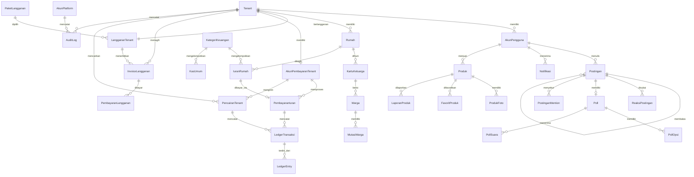

# Product Requirements Document (PRD) — SmartHub SaaS

| Atribut | Nilai |
|---|---|
| Nama Produk | SmartHub — Platform Manajemen Warga & Kas RT |
| Model Produk | SaaS multi-tenant, tenant dibuat oleh Ketua_RT/Sekretaris (tanpa self-serve publik) |
| Versi Dokumen | 2.4 (KYC & Payout di SmartHub via Hub; Fee Flat Rp2.500) |
| Tanggal | 2026-09-24 |
| Pemilik Dokumen | Pemilik Produk / Founder |
| Status | Disetujui untuk menjadi acuan implementasi |
| Dokumen Terkait | `Architecture.md` 2.3, `API-Contract.md` 2.1, `UI-UX-Design.md` 1.1, `docs/pilot/rencana-validasi-harga.md`, `docs/pilot/hasil-pilot.md`, `docs/logikraf/payment-hub-integration-guide.md`, `docs/logikraf/notifications-architecture.md` |

> **Sumber kebenaran.** Dokumen ini adalah acuan istilah, penomoran use case, dan matriks hak akses. Jika terjadi pertentangan dengan dokumen lain, dokumen ini yang berlaku dan dokumen lain yang diselaraskan.

---

## 1. Ringkasan Eksekutif & Tujuan

### 1.1 Masalah
Pengelolaan RT di Indonesia masih dijalankan dengan buku kas manual, grup WhatsApp tanpa arsip, dan spreadsheet yang berpindah-pindah antar pengurus. Akibatnya:

- Iuran warga sulit dilacak; tunggakan tidak terdeteksi dan laporan kas tidak transparan.
- Data kependudukan (KK, warga, mutasi) hilang atau kacau saat pergantian pengurus.
- Bendahara menghabiskan berjam-jam tiap bulan untuk menagih dan mencocokkan bukti transfer.
- Warga tidak punya cara mudah memverifikasi bahwa uangnya benar-benar masuk kas RT.

> **Catatan penamaan produk.** Dokumen ini mendeskripsikan **SmartHub v1** — repo ini — dengan stack **Node.js 22 + Express 5 + Prisma + Next.js 15**. Produk lama "SmartHub V3" (Hono/Bun/Drizzle) adalah produk terpisah dan **tidak boleh dijadikan acuan** arsitektur maupun kontrak pada dokumen ini.

### 1.2 Solusi
SmartHub adalah SaaS multi-tenant yang menyatukan administrasi kependudukan, keamanan, keuangan, komunikasi warga, dan marketplace lingkungan dalam satu aplikasi mobile-first berbahasa Indonesia. Setiap RT mendapat ruang kerja (tenant) sendiri yang terisolasi. **Tenant dibuat oleh akun ber-role `Ketua_RT` atau `Sekretaris`** (akun operator diseed, tanpa pendaftaran mandiri publik); setelah tenant ada, **Ketua atau Sekretaris membuat data warga dan akunnya** di dalam tenant tersebut.

### 1.3 Proposisi Nilai
1. **Untuk pengurus RT** — mengganti buku kas dan spreadsheet; laporan siap pakai untuk rapat, tanpa pekerjaan manual.
2. **Untuk bendahara** — tagihan terbit otomatis, pembayaran tercatat rapi (transfer manual dengan bukti, atau QRIS bila diaktifkan), dan pencocokan uang tidak lagi manual.
3. **Untuk warga** — transparansi kas, membayar iuran dari rumah dalam hitungan detik, dan ruang komunikasi yang terarsip.
4. **Untuk RT itu sendiri** — data tetap utuh saat kepengurusan berganti, karena tersimpan sebagai arsip yang tidak bisa dihapus.

### 1.4 Metrik Keberhasilan
| Kategori | Metrik | Target tahun pertama |
|---|---|---|
| Akuisisi | Tenant terdaftar / bulan | 30 |
| Aktivasi | Tenant yang menyelesaikan onboarding dalam 7 hari | ≥ 60% |
| **Pendapatan utama** | **Pendapatan berulang bulanan (langganan)** | **Rp7,5 juta** |
| **Retensi** | **Churn tenant bulanan** | **≤ 3%** |
| Keterlibatan | Rumah aktif memakai aplikasi per tenant (tagihan, pembayaran, diskusi) | ≥ 60% |
| Opsional — bila QRIS diaktifkan | Rumah membayar via QRIS · GMV iuran · success rate QRIS | ≥70% · dipantau · ≥99% |

---

## 2. Persona & Peran

### 2.1 Persona Pengguna RT
| Persona | Peran sistem | Kebutuhan utama | Kendala |
|---|---|---|---|
| Pak Hendra, Ketua RT | `Ketua_RT` | Melihat kondisi lingkungan, memverifikasi pengeluaran, memutuskan | Tidak teknis, waktu terbatas |
| Bu Siti, Sekretaris | `Sekretaris` | Mencatat warga & mutasi, mengumumkan informasi | Bekerja dari HP |
| Bu Dewi, Bendahara | `Bendahara` | Menagih iuran, mencatat kas, laporan transparan | Pekerjaan berulang tiap bulan |
| Pak Joko, Petugas Keamanan | `Keamanan` | Mencatat tamu dengan cepat, sering dalam posisi berdiri | Hanya pakai HP, cahaya redup |
| Budi, Warga | `Warga` | Membayar iuran, melihat kas, berkomunikasi | Tidak mau aplikasi rumit |

### 2.2 Persona Platform (internal SmartHub)
| Persona | Peran sistem | Kebutuhan utama |
|---|---|---|
| Operator platform | `Platform_Admin` | Melihat daftar tenant, memantau kesehatan pembayaran, menonaktifkan tenant bermasalah |
| Petugas dukungan | `Platform_Support` | Melihat detail tenant bermasalah, membaca audit log, membantu tanpa mengubah data warga |
| Pemilik produk | `Platform_Owner` | Metrik bisnis, konfigurasi paket langganan, melihat pendapatan fee |

### 2.3 Profil Pelanggan Ideal (ICP)
RT atau kawasan perumahan dengan **50–300 rumah**, memiliki iuran bulanan rutin ≥ Rp50.000 per rumah, sudah menggunakan WhatsApp untuk administrasi, dan pengurusnya berganti setiap 1–3 tahun.

---

## 3. Ruang Lingkup

### 3.1 Termasuk (Fase 1 — sudah terimplementasi)
Autentikasi & RBAC 5 peran tenant (`Ketua_RT`, `Sekretaris`, `Bendahara`, `Keamanan`, `Warga`) + akun **platform** terpisah (`AkunPlatform`: `Superadmin`/`Operator`), login tiga identitas, wilayah (rumah), kependudukan (KK, warga, mutasi), keamanan (log tamu), keuangan (kategori, iuran, kas, verifikasi, ringkasan), diskusi (postingan, balasan, suka, poll, sebut pengguna), marketplace katalog, dan notifikasi in-app.

**Pembayaran iuran pada Fase 1 memakai alur transfer manual + unggah bukti + verifikasi bendahara** dan **sudah terimplementasi penuh** (UC-10). Alur inilah baseline layanan: tercatat, transparan, dan memberi nilai penuh tanpa integrasi pembayaran apa pun. **QRIS iuran tidak termasuk Fase 1** dan bukan syarat agar RT dapat memakai SmartHub.

### 3.2 Termasuk (Fase 2 — lapisan SaaS)
Multi-tenancy dengan isolasi data, pembuatan tenant oleh Ketua_RT/Sekretaris, langganan berjenjang, penagihan langganan (transfer manual + verifikasi pada fase awal; pembayaran langganan lewat Hub menyusul di Fase 3), konsol admin platform, audit log tenant, autentikasi kelas SaaS (refresh token, MFA, reset via email), observability, backup & pemulihan, serta kepatuhan UU PDP dan PSE.

### 3.3 Termasuk (Fase 3 — opsional)
Integrasi **Logikraf Payment Hub** untuk pembayaran **iuran warga via QRIS** beserta ledger, rekonsiliasi, settlement, dan pencairan ke RT. Dikerjakan **hanya bila permintaan nyata muncul** dari pelanggan dan setelah tarif Hub dinegosiasikan. Skema fee-nya ada di Bab 4.3.

### 3.4 Tidak Termasuk (out of scope)
| Item | Alasan |
|---|---|
| Sistem akuntansi penuh (jurnal umum berpasangan untuk RT) | Bendahara tetap memakai Excel/Accurate; SmartHub cukup ekspor |
| Kartu kredit, cicilan, dan tokenisasi kartu di dalam aplikasi | Biaya MDR tinggi dan tidak dibutuhkan pasar per-RT |
| Menampung dana warga di rekening platform | Berisiko regulasi; dana langsung ke sub-akun per *client store* milik tenant yang dikelola Logikraf Hub |
| Booking fasilitas, CCTV IoT, absensi satpam berbasis perangkat | Menambah kompleksitas tanpa memperkuat nilai inti |
| Modul RW/agregasi multi-RT | Ditunda sampai ada permintaan nyata |
| Multi-bahasa selain Indonesia | Pasar fase ini hanya Indonesia |

---

## 4. Model Bisnis & Paket

### 4.1 Sumber Pendapatan: Langganan sebagai Penopang Utama
1. **Langganan tenant (utama, berulang)** — biaya tetap bulanan/tahunan per RT, ditagih langsung ke pengurus RT. **Ini mesin pendapatan utama** dan satu-satunya sumber yang tidak bergantung pada perilaku pembayaran warga.
2. **Fee transaksi iuran (opsional, tambahan)** — **flat Rp2.500 per transaksi**, ditagih **hanya bila tenant mengaktifkan QRIS** (dipotong via split saat pembayaran). Bila tenant memakai transfer manual, **tidak ada fee transaksi sama sekali** — baik untuk RT maupun SmartHub (Bab 4.3).

**Baseline pembayaran iuran adalah transfer manual**: warga mentransfer sendiri, mengunggah bukti, dan bendahara memverifikasi. Alur ini **sudah terimplementasi** dan memberi nilai penuh — tercatat, transparan, dan ada pengingat — tanpa memerlukan integrasi pembayaran.

**Pembayaran langganan** berjalan lewat Logikraf Payment Hub: SmartHub adalah *Client Store* Logikraf (prefix `sb-`) dan **bukan** integrator Xendit langsung; tidak ada API key Xendit di sisi SmartHub. Volume transaksi langganan rendah (satu tagihan per RT per bulan), sehingga biaya Hub tidak menjadi beban berarti.

**Mengapa urutannya demikian.** Tarif Hub 2% berbasis nilai transaksi (GMV). Pada iuran RT, uang itu dana *pass-through* milik warga — bukan pendapatan siapa pun — sehingga fee per transaksi memaksa RT menanggung ±3,7% dan justru menghambat adopsi di titik paling sensitif. Langganan memberi margin tinggi, dapat diprediksi, dan tidak bergantung pada adopsi QRIS. QRIS iuran tetap tersedia sebagai fitur **opsional** bagi RT yang memintanya (Bab 4.3).

### 4.2 Paket Langganan
| Paket | Batas rumah | Harga bulanan | Harga tahunan | Fitur tambahan |
|---|---|---|---|---|
| Basic | 100 | Rp75.000 | Rp750.000 | Kependudukan, keamanan, keuangan, diskusi |
| Pro | 300 | Rp150.000 | Rp1.500.000 | + Marketplace, notifikasi WhatsApp/email, laporan ekspor |
| Enterprise | Tidak dibatasi | Rp400.000 | Rp4.000.000 | + Multi-blok, SLA, pendampingan onboarding, ekspor data lanjutan |
| **Pilot** (6 bulan pertama) | 300 | **Rp37.500** | — | Setara Pro, dengan imbalan **testimoni + data umpan balik** |

- Pembayaran tahunan memberi **diskon 2 bulan** (10 × harga bulanan).
- Semua paket mendapat **trial 30 hari** dengan seluruh fitur Pro.
- **Harga pilot** ditawarkan kepada **3–5 RT pertama** selama **6 bulan**, dengan syarat bersedia memberi **testimoni** dan **data umpan balik** (jam kerja bendahara, tunggakan yang terdeteksi, alasan bertahan). Selama masa pilot, **diskon tahunan tidak berlaku** — tujuannya menguji kesediaan bayar bulanan, bukan mengunci komitmen tahunan. Detail penawaran dan kriteria go/no-go ada di `docs/pilot/rencana-validasi-harga.md`.
- **Selama pilot, penawaran difokuskan pada Basic dan Pro** untuk mengurangi keputusan di depan pembeli; **Enterprise** tetap tersedia untuk permintaan khusus (multi-blok/SLA).
- **QRIS iuran bersifat opsional dan tidak termasuk harga paket.** Bila tenant mengaktifkannya, berlaku biaya layanan Bab 4.3. Paket Pro tidak lagi menjadikan QRIS sebagai fitur wajib.
- Pembayaran **langganan** berjalan **transfer manual + verifikasi** pada fase awal; bila integrasi Logikraf Payment Hub diaktifkan, pembayaran langganan dapat memakai QRIS/VA lewat Hub untuk semua paket (PRD Bab 13.2–13.3).

> **Catatan biaya platform (COGS) — risiko operasional.** Logikraf Payment Hub membebankan biaya operasional bulanan dengan **minimum bulanan Rp100.000** (3 bulan pertama dibebaskan). Karena fee transaksi kini bersifat opsional, **biaya tetap ini ditutup oleh langganan**, sehingga jumlah tenant aktif menentukan kesehatan unit economics. Paket **Basic Rp75.000/bulan** hanya aman bila jumlah tenant per bulan cukup untuk menutup minimum Hub beserta biaya operasionalnya. Risiko ini dipantau di Bab 12.

### 4.3 Fee Transaksi (berlaku hanya bila tenant mengaktifkan QRIS)

> **Penting.** Seluruh sub-bab ini **hanya berlaku bila tenant mengaktifkan QRIS untuk iuran**. Pada alur baseline — transfer manual + unggah bukti + verifikasi bendahara — **tidak ada fee transaksi sama sekali**, baik untuk RT maupun SmartHub. QRIS adalah fitur opsional, bukan syarat layanan (Bab 3.3).

Bila QRIS diaktifkan, **fee layanan ke RT = flat Rp2.500 per transaksi**; dipotong saat pembayaran lewat mekanisme split dan dirutekan ke Logikraf.

**Komponen biaya:**

| Komponen | Nilai | Sifat | Catatan |
|---|---|---|---|
| **Fee layanan SmartHub** | **Flat Rp2.500 per transaksi** | **Pendapatan** — dirutekan ke Logikraf via split | Tetap di semua nominal tagihan |
| MDR QRIS | ±0,7% dari nilai transaksi | **Ditanggung Tenant (RT)** | Dipotong dari saldo sub-akun RT |
| Biaya transfer pencairan | Per transfer | **Ditanggung Tenant (RT)** | Mengurangi dana yang cair ke rekening RT |
| PPN atas fee platform | Sesuai ketentuan pajak | Ditangani **di level Logikraf** | Penagihan pajak berada di level Logikraf (satu entitas) |

**Keputusan 2026-09-24:** model fee memakai **flat Rp2.500** (bukan lagi berlapis `maksimum(Rp2.500, 3%)`). Biaya internal Logikraf/Hub ditanggung di level Logikraf, bukan dibebankan per transaksi ke SmartHub. MDR dan biaya transfer tetap ditanggung RT dan **wajib ditampilkan transparan** ke pengurus.

**Model margin (fee flat Rp2.500):**

| Nominal transaksi | Fee SmartHub (flat) | MDR ±0,7% (ditanggung RT) | Margin kotor SmartHub |
|---|---|---|---|
| Rp50.000 | Rp2.500 | ±Rp350 | Rp2.500 |
| Rp100.000 | Rp2.500 | ±Rp700 | Rp2.500 |
| Rp1.000.000 | Rp2.500 | ±Rp7.000 | Rp2.500 |

> **Catatan.** Margin di atas adalah margin kotor fee (pendapatan SmartHub), bukan setelah biaya internal Logikraf — biaya internal Hub ditanggung di level Logikraf, bukan dibebankan per transaksi ke SmartHub. Nilai fee tetap sama di semua nominal sehingga mudah dikomunikasikan ke pengurus.

**Simulasi satu RT (100 rumah, iuran Rp100.000/bulan):**

| Pihak / Komponen | Perhitungan | Hasil |
|---|---|---|
| Total iuran terkumpul | 100 rumah × Rp100.000 | Rp10.000.000 |
| Jumlah transaksi | 100 pembayaran | 100 |
| Fee SmartHub (flat) | 100 × Rp2.500 | +Rp250.000 |
| Langganan paket Pro | Bulanan | +Rp150.000 |
| **Kontribusi bulanan platform** | Fee + langganan | **±Rp400.000** |
| *Beban RT: MDR 0,7% + biaya transfer* | *ditanggung RT* | *±Rp70.000 + biaya transfer* |
| *Dana bersih ke kas RT* | *Rp10.000.000 − Rp250.000 fee − Rp70.000 MDR* | *±Rp9.680.000* |

> **Catatan komersial.** Beban RT ±**0,95%** dari iuran (Rp2.500 flat + MDR 0,7%), belum termasuk biaya transfer. Pada 100 rumah setara **±Rp320.000/bulan**. Angka ini harus dikomunikasikan terbuka ke pengurus; RT yang tidak ingin ada fee transaksi dapat tetap memakai transfer manual tanpa QRIS.

### 4.4 Aturan Paket & Kuota
1. Jumlah rumah dihitung dari data aktif tenant; melewati batas paket memicu tawaran upgrade.
2. Data tidak pernah dihapus karena penurunan paket — hanya fitur tambahan yang dinonaktifkan.
3. Masa tenggang 7 hari setelah jatuh tempo sebelum tenant dibatasi (hanya-baca), lalu penangguhan setelah 30 hari.
4. Karena QRIS tidak mendukung penagihan otomatis, langganan **diperpanjang manual** dengan pengingat H-7 dan H-1.
5. **Amortisasi minimum bulanan Hub (risiko operasional).** Minimum bulanan Logikraf Payment Hub Rp100.000 ditutup oleh **langganan** (bukan fee transaksi, karena QRIS opsional). Paket Basic Rp75.000/bulan tidak menutup minimum pada volume rendah; jumlah tenant aktif harus cukup agar total langganan menutup minimum + biaya operasional Hub.
6. **Iuran dapat berjalan penuh lewat transfer manual.** QRIS bersifat opsional per tenant dan **tidak menjadi syarat** layanan, aktivasi, maupun perpanjangan langganan.

---

## 5. Hierarki Tenant & Informasi

```
Platform SmartHub
└── Tenant (RT / kawasan perumahan)          ← unit pelanggan & pemilik data
    ├── Pengurus & Warga → AkunPengguna (milik tepat satu tenant)
    ├── Rumah → Kartu Keluarga → Warga → Mutasi Warga
    ├── Tamu Kunjungan (log keamanan)
    ├── Kategori Keuangan → Iuran Rumah → Pembayaran Iuran (transfer manual; QRIS opsional)
    │                     └→ Kas Umum (pemasukan/pengeluaran)
    ├── Diskusi → Postingan → Balasan, Reaksi, Poll, Sebutan
    ├── Marketplace → Produk, Favorit, Laporan
    ├── Notifikasi
    └── Akun Pembayaran Tenant (sub-akun per *client store*, dikelola Logikraf Hub) → Settlement/pencairan ke rekening RT

Platform (di luar tenant)
├── Client Store Logikraf (prefix `sb-`) → semua transaksi eksternal dirutekan oleh Logikraf Payment Hub
└── AkunPlatform (Platform_Owner / Platform_Admin / Platform_Support)
    ├── Paket Langganan, Invoice & Pembayaran Langganan
    ├── Webhook Event, Ledger Platform, Audit Log
    └── Konsol Admin
```

**Aturan hierarki:**
1. Setiap data domain **wajib** memiliki `id_tenant`. Tidak ada data lintas tenant yang boleh terbaca dalam satu query.
2. `id_tenant` diambil dari token JWT, bukan dari parameter yang dikirim klien.
3. Satu `AkunPengguna` milik tepat satu tenant. Warga yang pindah RT mendapat akun di tenant baru; data lamanya tetap sebagai arsip tenant lama.
4. Akun platform berada di tabel terpisah (`AkunPlatform`) dan tidak memiliki akses otomatis ke data warga — akses harus melalui fitur konsol yang tercatat audit.
5. **SmartHub adalah Client Store Logikraf** dengan prefix `sb-`. Seluruh transaksi eksternal (QRIS, VA, invoice, settlement) **dirutekan oleh Logikraf Payment Hub**; SmartHub tidak berintegrasi langsung dengan Xendit, dan sub-akun pembayaran per tenant **dikelola Hub**.

---

## 6. Matriks RBAC

### 6.1 Peran di Dalam Tenant
| Fitur / Modul | Ketua RT | Sekretaris | Bendahara | Keamanan | Warga |
|---|---|---|---|---|---|
| Manajemen Rumah & KK | Full Access | Full Access | Read-Only | No Access | No Access |
| Manajemen Biodata Warga | Full Access | Full Access | Read-Only | No Access | Read (keluarga sendiri) |
| Pencatatan Mutasi Warga | Verifikasi | Input/Edit | Read-Only | No Access | No Access |
| Log Tamu Kunjungan | Read-Only | Read-Only | No Access | Full Access | No Access |
| Konfigurasi Tagihan Iuran | Full Access | No Access | Full Access | No Access | No Access |
| Verifikasi Pembayaran Iuran | Read-Only | No Access | Full Access | No Access | Upload Bukti Bayar |
| Input Pengeluaran Kas RT | Verifikasi | No Access | Full Access | No Access | No Access |
| Melihat Laporan Kas & Transaksi | Read-Only | Read-Only | Read-Only | No Access | Read-Only |
| Manajemen Akun Pengguna | Full Access | Full Access | No Access | No Access | No Access |
| Ubah Status Akun | Full Access | No Access | No Access | No Access | No Access |
| Diskusi: baca & tulis | Full Access | Full Access | Full Access | Full Access | Full Access |
| Diskusi: beri suka & vote poll | Full Access | Full Access | Full Access | Full Access | Full Access |
| Diskusi: sebut pengguna | Full Access | Full Access | Full Access | Full Access | Full Access |
| Diskusi: moderasi | Full Access | Full Access | No Access | No Access | No Access |
| Notifikasi pribadi | Milik sendiri | Milik sendiri | Milik sendiri | Milik sendiri | Milik sendiri |
| Marketplace: katalog, jual, favorit, lapor | Full Access | Full Access | Full Access | Full Access | Full Access |
| Marketplace: kelola kategori | Full Access | Full Access | No Access | No Access | No Access |
| Marketplace: moderasi & laporan | Full Access | Full Access | No Access | No Access | No Access |
| **Langganan: lihat status & tagihan** | Full Access | Full Access | Full Access | No Access | No Access |
| **Langganan: bayar & ubah paket** | Full Access | No Access | Full Access | No Access | No Access |
| **Pembayaran iuran QRIS: buat tagihan QR** | Full Access | No Access | Full Access | No Access | Bayar tagihan sendiri |
| **Pencairan dana iuran ke rekening RT** | Full Access | No Access | Full Access | No Access | No Access |
| **Audit log tenant** | Full Access | Read-Only | No Access | No Access | No Access |

Keterangan: **Full Access** = buat, baca, ubah sesuai lingkup; **Read-Only** = hanya `GET`; **Verifikasi** = hanya menyetujui/menolak; **No Access** = 403.

### 6.2 Peran Platform
| Kemampuan | Platform_Owner | Platform_Admin | Platform_Support |
|---|---|---|---|
| Melihat daftar & detail tenant | ✅ | ✅ | ✅ |
| Menangguhkan / mengaktifkan tenant | ✅ | ✅ | – |
| Melihat metrik bisnis & pendapatan | ✅ | Read-Only | – |
| Mengelola paket & harga langganan | ✅ | – | – |
| Melihat audit log platform | ✅ | ✅ | ✅ |
| Membaca data warga (impersonasi terbatas) | ✅ | ✅ | ✅ (dengan jejak audit) |
| Mengubah data warga tanpa izin tenant | – | – | – |

**Impersonasi terbatas** hanya untuk diagnosis, berdurasi maksimum 60 menit, wajib mencatat alasan, dan setiap tindakan tercatat di audit log platform.

---

## 7. Cakupan Fitur & Use Case

### Modul 1 — Autentikasi & Akun (`modules/auth`)

**UC-01 Login Multi-Role** — Pengguna masuk dengan **email, nomor HP, atau username** + password. Klasifikasi otomatis: mengandung `@` = email; hanya digit = nomor HP; selain itu username. Username tidak case-sensitive dan tidak boleh seluruhnya angka. Pesan gagal selalu seragam.

**UC-02 Pembuatan Akun Pengguna** — Ketua RT/Sekretaris membuatkan akun untuk warga terdata. Satu NIK maksimal satu akun. Username dibuat otomatis dari nama warga bila tidak diisi.

**UC-03 Manajemen Akun oleh Pengurus** — Ketua RT/Sekretaris dapat mengubah role, email, dan username pengguna, serta membuat tautan reset password. Ketua RT dapat menonaktifkan akun tanpa menghapus warganya. Pengurus tidak dapat mengubah role akunnya sendiri.

**UC-13 Reset Password Mandiri** — Tautan reset berlaku 1 jam, sekali pakai, dan otomatis tidak berlaku setelah password berubah. Fase SaaS menambahkan pengiriman otomatis via email.

### Modul 2 — Wilayah & Kependudukan (`modules/wilayah`, `modules/kependudukan`)

**UC-04 Manajemen Data Rumah** — Inventaris rumah: nomor, blok, jalan, status kepemilikan, status hunian.

**UC-05 Manajemen Kartu Keluarga** — Nomor KK ditempelkan ke rumah; mendukung satu rumah dengan lebih dari satu KK.

**UC-06 Manajemen Biodata Warga (Anti-Hapus)** — Data individu sesuai KTP/KK. Penghapusan fisik dilarang; perubahan hanya lewat `status_aktif`.

**UC-07 Log Mutasi Warga** — Mencatat Lahir, Datang, Meninggal, Pindah Keluar dengan verifikasi Ketua RT. Mutasi terverifikasi otomatis menyesuaikan `status_aktif` warga.

### Modul 3 — Keamanan (`modules/keamanan`)

**UC-08 Log Tamu Masuk & Keluar** — Petugas keamanan mencatat identitas, jumlah, keperluan, dan rumah tujuan; memperbarui `tgl_pergi` saat tamu keluar.

### Modul 4 — Keuangan (`modules/keuangan`)

**UC-09 Otomatisasi Tagihan Iuran Bulanan** — Bendahara/Ketua RT menerbitkan tagihan untuk seluruh rumah berstatus Dihuni; idempoten terhadap kombinasi rumah–kategori–bulan–tahun.

**UC-10 Pembayaran Mandiri & Verifikasi** — Warga membayar dengan **transfer manual + unggah bukti** (baseline, sudah terimplementasi), atau **QRIS bila tenant mengaktifkannya** (Fase 3, opsional); Bendahara memverifikasi.

**UC-11 Buku Kas Umum** — Bendahara mencatat pemasukan non-iuran dan pengeluaran; Ketua RT memverifikasi.

**UC-12 Dasbor Laporan Keuangan Real-Time** — Saldo kas dihitung dari iuran lunas + kas masuk terverifikasi − kas keluar terverifikasi; tampil untuk semua peran kecuali Keamanan.

### Modul 5 — Diskusi (`modules/diskusi`)

**UC-14 Postingan & Balasan (Thread)** — Postingan teks maksimal 2.000 karakter, hingga 4 lampiran, balasan satu tingkat, pengubahan dan penghapusan lunak oleh penulis.

**UC-15 Tombol Suka** — Satu suka per pengguna per postingan, dikunci constraint unik.

**UC-16 Poll & Vote** — Poll 2–6 opsi, satu suara per pengguna, hasil tampil setelah memilih atau setelah poll ditutup.

**UC-17 Moderasi Diskusi** — Ketua RT/Sekretaris menyembunyikan atau menampilkan kembali postingan siapa pun.

**UC-22 Sebut Pengguna (Mention)** — `@username` di dalam teks menghasilkan sebutan tersimpan, tautan visual, dan notifikasi. Daftar kandidat mengecualikan diri sendiri dan tidak pernah mengekspos email, NIK, atau nomor HP.

### Modul 6 — Marketplace (`modules/marketplace`)

**UC-18 Katalog & Pencarian** — Pencarian teks, filter kategori/kondisi/rentang harga, urutan terbaru/termurah/termahal.

**UC-19 Jual Produk** — CRUD produk oleh semua peran; maksimal 5 foto; penjual dapat menandai Terjual dan menyembunyikan kontaknya.

**UC-20 Favorit & Kontak Penjual** — Favorit satu per pengguna per produk; tautan WhatsApp dibentuk dari nomor HP penjual.

**UC-21 Moderasi & Laporan** — Laporan produk dengan alasan terstruktur; satu laporan terbuka per pelapor per produk; Ketua RT/Sekretaris menangani laporan.

### Modul 7 — Notifikasi (`modules/notifikasi`)

**UC-23 Notifikasi Pribadi** — Notifikasi Mention dan Balasan, hanya dapat dibaca/ditandai oleh pemiliknya, dengan lencana jumlah belum dibaca. Notifikasi duplikat untuk satu peristiwa dicegah.

### Modul 8 — Tenant & Langganan (`modules/tenant`, `modules/langganan`) — BARU

**UC-24 Pembuatan Tenant oleh Ketua/Sekretaris** *(direvisi 2026-09-23 — self-serve dibatalkan)* — Akun ber-role `Ketua_RT` atau `Sekretaris` (akun operator diseed) membuat tenant lewat `POST /api/v1/tenant`: mengisi data RT (nama, wilayah, jumlah rumah) dan identitas pengurus pertama. Sistem membuat `Tenant` berstatus `Aktif`, akun `Ketua_RT` pertama, dan **langganan trial Pro 30 hari**. Setelah itu pengurus membuat data warga beserta akunnya. Tidak ada pendaftaran mandiri dari halaman publik.

**UC-25 Verifikasi Identitas Tenant (aktif kembali, 2026-09-24)** — **KYC dikelola di SmartHub dengan mode verify-on-behalf**: pengurus (`Ketua_RT`/`Sekretaris`/`Bendahara`) mengisi data, mengunggah dokumen KTP/selfie, mencentang persetujuan, dan mengirimkannya. **Eksekusi ke penyedia dilakukan Logikraf Payment Hub** (`POST /account_verification` atas nama sub-akun); Hub juga men-generate **service agreement PDF** dari record consent. **Dokumen KYC tidak disimpan di SmartHub** (hanya `file_id` + metadata). Status verifikasi disinkronkan lewat webhook `account.verification`.

**UC-26 Trial & Aktivasi Langganan** — Tenant terverifikasi mendapat trial 30 hari berfitur Pro. Setelah trial berakhir, tenant harus mengaktifkan langganan; tanpa aktivasi tenant menjadi hanya-baca.

**UC-27 Tagihan & Pembayaran Langganan** — Sistem menerbitkan invoice bulanan/tahunan, mengirim pengingat H-7 dan H-1, memberi masa tenggang 7 hari, lalu membatasi tenant setelah 30 hari menunggak.

**UC-28 Kuota & Perubahan Paket** — Tenant melihat pemakaian kuota rumah; upgrade berlaku segera dengan perhitungan prorata; downgrade berlaku pada periode berikutnya.

**UC-29 Penonaktifan & Pembatalan Tenant** — Ketua RT dapat membatalkan langganan dengan alasan wajib; data tetap tersimpan 90 hari sebelum penawaran ekspor akhir dan penghapusan permanen.

### Modul 9 — Billing Iuran & Pembayaran (`modules/billing`) — BARU

**UC-30 Onboarding Sub-Akun Pembayaran RT** *(revisi 2026-09-24)* — SmartHub membuat **sub-akun `MANAGED` (entity `INDIVIDUAL`)** untuk setiap RT melalui Logikraf Payment Hub; Hub yang memegang kredensial penyedia. QRIS baru dapat diterbitkan setelah sub-akun **`LIVE`** (atau setara) **dan kanal pembayaran diaktifkan** (aktivasi kanal per sub-akun bersifat operasional di sisi Logikraf). SmartHub tidak memegang API key penyedia dan tidak menyimpan dokumen KYC. Nama penyedia **tidak ditampilkan** ke pengguna (istilah UI: "Akun Pembayaran RT").

**UC-31 Tagihan Iuran QRIS & Pembayaran Warga** — Warga memilih tagihan lalu SmartHub meminta pembuatan QRIS ke **Logikraf Hub** (`POST /api/client-store-qris`) atas nama sub-akun tenant. Batas nominal **maksimal Rp10.000.000** per transaksi, dengan kedaluwarsa terbatas (Hub memakai masa berlaku terbatas; Xendit ≤48 jam). Warga memindai QRIS dari aplikasi bank/e-wallet. Ringkasan transaksi, kedaluwarsa, dan status ditampilkan di layar; **status belum final sebelum webhook Hub diterima**. QRIS hanya dibuat bila akun `LIVE` **dan kanal QRIS sudah diaktifkan**; bila belum, ditolak dengan pesan netral (Aturan Bisnis #17).

**UC-32 Fee Platform & Ledger** — Fee platform **flat Rp2.500 per transaksi** ditagih ke RT dan dirutekan ke Logikraf melalui mekanisme **split saat pembayaran**. Semua pergerakan dicatat pada ledger double-entry: tagihan, pembayaran, MDR (ditanggung RT), fee platform, dan net yang diterima RT. Refund **tidak mengembalikan** fee yang sudah dipisah (split), sehingga kebijakan refund harus mempertimbangkan hal ini.

**UC-33 Settlement & Pencairan Dana ke RT** — Dana iuran terkumpul pada sub-akun tenant yang dikelola Hub. Pencairan mengikuti **settlement Hub**: pengurus mengajukan di SmartHub → Hub memproses → Hub melakukan **transfer manual + mengunggah bukti** → SmartHub menampilkan status `paid` beserta buktinya. Pencairan dijadwalkan **sekali per bulan secara agregat** (bukan per transaksi) untuk menekan biaya transfer bank. SmartHub **tidak** memegang kredensial penyedia maupun memanggil API disbursement penyedia langsung. Bila sub-akun mendukung payout, SmartHub mengirim permintaan payout ke Hub (`POST /api/client-store/payouts`) dengan **`Idempotency-Key` stabil** (Aturan Bisnis #18), lalu status `payout.*` disinkronkan lewat webhook. Sebagai pelengkap, **bila QRIS iuran diaktifkan** SmartHub **wajib menyediakan Internal Finance API** yang dipanggil Hub (rincian kontrak di `API-Contract.md` 10.16–10.20): ringkasan keuangan, daftar settlement, penandaan `processing`, unggah bukti pada `paid`, dan `unlock` bila pencairan gagal. Alur transfer manual tidak memerlukan endpoint ini.

**UC-34 Refund & Sengketa Pembayaran** — Refund mengikuti alur Hub dan hanya untuk kasus salah bayar ganda atau pembatalan tagihan sebelum dana dicairkan. Refund QRIS memiliki **batasan per issuer** (tidak semua transaksi dapat direfund, dan eksposurnya di Hub belum tersedia). Fee dikoreksi lewat Hub (`POST /api/client-store-fee-reverse`); **refund tidak otomatis mengembalikan fee yang sudah ditagihkan**, sehingga kebijakan refund wajib menetapkan perlakuan fee secara eksplisit. Sengketa QRIS dari penerbit dapat muncul hingga 90 hari dan harus dapat ditelusuri ke transaksi asal.

**UC-35 Rekonsiliasi Harian** — **Logikraf Hub adalah sumber kebenaran transaksi.** Rekonsiliasi SmartHub berfokus pada kecocokan **ledger internal vs laporan Hub**, menandai selisih, dan memicu pemeriksaan bila pembayaran tidak tercatat. Bila webhook Hub gagal, SmartHub menanyakan status ke Hub sebagai cadangan.

### Modul 10 — Konsol Platform (`modules/admin`) — BARU

**UC-36 Konsol Admin Platform (Superadmin)** — Akun **platform** terpisah (`AkunPlatform`, role `Superadmin`/`Operator`, di luar 5 role tenant) login ke konsol web `/platform` (API `/api/v1/admin`): ringkasan, **perlu tindakan (alert operasional)**, daftar/detail tenant, **langganan**, **webhook Hub**, **audit log**, **CRUD akun platform**, **kelola paket**, **MFA TOTP**, dan **menangguhkan/mengaktifkan tenant** (tercatat). Terimplementasi (API + UI).

**UC-37 Dukungan & Audit Log** — Tim dukungan melihat audit log platform dan melakukan **impersonasi terbatas** untuk membantu pelanggan. **Terimplementasi (API + UI)**: `POST /admin/tenant/:id_tenant/impersonate` menerbitkan token tenant ber-`scope: "impersonation"` berbatas **60 menit**, **read-only** (semua aksi tulis diblokir `403` dan dicatat sebagai `impersonasi_akses_ditolak` di `AuditLog`). Konsol web menyediakan alur **"Masuk sebagai"** dan **banner mode impersonasi** di aplikasi tenant dengan tombol "Akhiri Impersonasi".

### Modul 11 — Kepatuhan Data (`modules/kepatuhan`) — BARU

**UC-38 Ekspor Data & Hak Subjek Data** — Pengurus dapat mengekspor seluruh data tenant (rumah, warga, iuran, kas, diskusi) dalam format terbuka; warga dapat meminta salinan datanya. Permintaan penghapusan diproses dengan mempertimbangkan kewajiban penyimpanan data keuangan.

---

## 8. Aturan Bisnis Utama

1. **Imutabilitas Riwayat Finansial** — Catatan iuran yang pernah dibayar tidak boleh berubah atau hilang meski warga pindah.
2. **Jangkar Finansial pada Rumah** — Penagihan diikat pada rumah, bukan individu, dikunci `@@unique([id_rumah, id_kategori, bulan, tahun])`.
3. **Keamanan Kredensial** — Password di-hash bcrypt; tidak ada password plaintext di mana pun, termasuk log.
4. **Anti Hard-Delete Kependudukan** — Warga tidak pernah dihapus fisik; hanya berubah status.
5. **Jejak Verifikasi** — Setiap verifikasi mencatat pelaku dan waktu.
6. **Pemisahan Marketplace dari Kas RT** — Transaksi marketplace tidak boleh memengaruhi iuran atau kas RT.
7. **Isolasi Tenant Mutlak** — Setiap query data domain wajib ter-scope `id_tenant`; pelanggaran ini adalah cacat tingkat tertinggi.
8. **Dana Non-Kustodial** — Dana warga mengalir langsung ke sub-akun per *client store* milik tenant yang dikelola **Logikraf Hub** (Hub §9). Platform SmartHub tidak pernah menampung dana pihak ketiga; pendapatannya berasal dari langganan dan fee transaksi yang ditagihkan Hub. Mode "dana masuk akun Logikraf" (Hub §7.1) **tidak dipakai** untuk SmartHub.
9. **Batas QRIS** — Nominal maksimal Rp10.000.000 per transaksi dan masa berlaku maksimal 48 jam; tagihan yang melewati batas harus dipecah atau diarahkan ke metode lain.
10. **Settlement T+1** — Dana tidak tersedia seketika; estimasi pencairan harus dikomunikasikan kepada pengurus dan tidak boleh dijanjikan instan.
11. **Refund Tidak Mengembalikan Fee** — Fee dan MDR yang sudah terjadi tidak otomatis kembali saat refund; pembalikan fee hanya lewat Hub (`POST /api/client-store-fee-reverse`) dan kebijakan refund wajib menyebut hal ini.
12. **Idempotensi Webhook** — Setiap event pembayaran diproses paling banyak sekali berdasarkan `event_id` unik.
13. **Langganan Tidak Auto-Renew** — Karena QRIS tanpa tokenisasi, perpanjangan bersifat manual dengan pengingat dan masa tenggang.
14. **Audit Log Tidak Dapat Diubah** — Catatan audit bersifat append-only.
15. **Semua Pembayaran Melalui Logikraf Payment Hub** — QRIS, VA, invoice, settlement, dan pembalikan fee dilakukan lewat Logikraf Payment Hub. SmartHub adalah *Client Store* (prefix `sb-`) dan tidak berintegrasi langsung dengan Xendit; webhook berasal dari Hub dan diverifikasi dengan `X-Logikraf-Signature`.
16. **Fee Transaksi (DIPUTUSKAN 2026-09-24: flat Rp2.500)** — Fee ditagih ke rumah sebagai **flat Rp2.500 per transaksi**, dipotong saat pembayaran melalui split dan dirutekan ke Logikraf. **MDR QRIS dan biaya transfer pencairan ditanggung Tenant (RT)**, bukan SmartHub. Fee transaksi hanya berlaku bila QRIS diaktifkan; transfer manual tanpa fee.
17. **Kanal Pembayaran Wajib Aktif (hardening 2026-09-24)** — Status akun `LIVE` saja tidak cukup; QRIS hanya dapat dibuat bila **kanal pembayaran QRIS sudah diaktifkan** untuk sub-akun tenant (aktivasi manual oleh Logikraf). Bila belum aktif, SmartHub menolak dengan pesan netral dan menandai "Kanal QRIS: Belum aktif" di UI.
18. **Idempotensi Payout (hardening 2026-09-24)** — Setiap pencairan memakai **kunci idempotensi stabil** (`sb-pencairan-<id>`, tanpa stempel waktu). Retry tidak boleh menghasilkan pencairan ganda; status duplikat dari Hub diperlakukan sebagai **sukses idempoten**, bukan kegagalan.

---

## 9. Model Data

Skema operasional yang mengikat adalah `apps/api/prisma/schema.prisma`. Bab ini mendefinisikan kontrak produknya.

### 9.1 Model Existing (22) — wajib mendapat `id_tenant`
| Kelompok | Model | Field kunci / constraint |
|---|---|---|
| Wilayah | `Rumah` | `@@unique([nomor_rumah, blok, jalan_gang])` |
| Kependudukan | `KartuKeluarga` | `no_kk` sebagai primary key |
| Kependudukan | `Warga` | `nik` @id, indeks `no_kk` & `status_aktif` |
| Kependudukan | `MutasiWarga` | `status_verifikasi`, `diverifikasi_oleh` |
| Keamanan | `TamuKunjungan` | indeks `tgl_pergi` |
| Keuangan | `KategoriKeuangan` | `@@unique([nama_kategori, jenis])` |
| Keuangan | `IuranRumah` | `@@unique([id_rumah, id_kategori, bulan, tahun])` |
| Keuangan | `KasUmum` | `status_verifikasi`, `diverifikasi_oleh` |
| Auth | `AkunPengguna` | `nik` & `email` unik, `username` unik opsional |
| Diskusi | `Postingan` | self-relation `id_induk`, `jumlah_suka`, `jumlah_balasan` |
| Diskusi | `PostinganLampiran`, `ReaksiPostingan` | `@@unique([id_postingan, id_pengguna])` |
| Diskusi | `Poll`, `PollOpsi`, `PollSuara` | `@@unique([id_poll, id_pengguna])` |
| Diskusi | `PostinganMention` | `@@unique([id_postingan, id_pengguna])` |
| Marketplace | `KategoriProduk` | `slug` unik |
| Marketplace | `Produk`, `ProdukFoto`, `FavoritProduk` | `@@unique([id_produk, id_pengguna])` |
| Marketplace | `LaporanProduk` | `status` laporan |
| Notifikasi | `Notifikasi` | indeks `(id_penerima, dibaca_pada)` |

### 9.2 Model Baru (Fase SaaS)
```prisma
enum StatusTenant { Menunggu_Verifikasi Terverifikasi Aktif Ditangguhkan Dibatalkan }
enum StatusLangganan { Trial Aktif Menunggak Berhenti }
enum MetodeLangganan { QRIS Virtual_Account }

model Tenant {
  id_tenant        Int           @id @default(autoincrement())
  nama             String
  slug             String        @unique
  provinsi         String
  kabupaten        String
  kecamatan        String
  jumlah_rumah     Int?
  kontak_email     String
  kontak_hp        String?
  status           StatusTenant  @default(Menung_Verifikasi)
  dokumen_ktp      String?
  dokumen_rt       String?
  catatan_verifikasi String?     @db.Text
  diverifikasi_oleh Int?
  diverifikasi_pada DateTime?
  createdAt        DateTime      @default(now())
  updatedAt        DateTime      @updatedAt
  @@index([status])
}

model PaketLangganan {
  kode           String   @id              // basic | pro | enterprise
  nama           String
  harga_bulanan  Decimal  @db.Decimal(12, 2)
  harga_tahunan  Decimal  @db.Decimal(12, 2)
  batas_rumah    Int?                       // null = tanpa batas
  fitur          Json
  aktif          Boolean  @default(true)
}

model LanggananTenant {
  id_langganan  Int             @id @default(autoincrement())
  id_tenant     Int             @unique
  kode_paket    String
  status        StatusLangganan @default(Trial)
  mulai         DateTime
  berakhir      DateTime
  trial_berakhir DateTime?
  createdAt     DateTime        @default(now())
  updatedAt     DateTime        @updatedAt
  paket         PaketLangganan  @relation(fields: [kode_paket], references: [kode])
  @@index([status, berakhir])
}

model InvoiceLangganan {
  id_invoice    Int              @id @default(autoincrement())
  id_tenant     Int
  id_langganan  Int
  periode_mulai DateTime
  periode_akhir DateTime
  jumlah        Decimal          @db.Decimal(12, 2)
  status        StatusBayar      @default(Belum_Bayar)
  jatuh_tempo   DateTime
  paid_at       DateTime?
  createdAt     DateTime         @default(now())
  @@index([id_tenant, status])
}

model PembayaranLangganan {
  id_pembayaran   Int              @id @default(autoincrement())
  id_invoice      Int
  metode          MetodeLangganan
  referensi_bayar String?          // id QRIS / nomor VA dari penyedia
  jumlah          Decimal          @db.Decimal(12, 2)
  status          StatusBayar      @default(Belum_Bayar)
  paid_at         DateTime?
  createdAt       DateTime         @default(now())
}

// Akun pembayaran RT (sub-akun MANAGED). KYC dikelola di SmartHub (mode
// verify-on-behalf); eksekusi ke penyedia lewat Logikraf Payment Hub.
model AkunPembayaranTenant {
  id_akun_pembayaran Int      @id @default(autoincrement())
  id_tenant          Int      @unique
  penyedia_account_id String  @unique            // ID sub-akun dari Hub/penyedia
  tipe               String   @default("MANAGED")
  entity_type        String   @default("INDIVIDUAL")
  status_kyc         String   @default("BELUM")
  money_out_enabled  Boolean  @default(false)
  payment_channels   Json?
  kyc_submitted_at   DateTime?
  kyc_verified_at    DateTime?
  failure_reasons    Json?
  createdAt          DateTime @default(now())
  updatedAt          DateTime @updatedAt
}

model RekeningBankTenant {
  id_rekening      Int      @id @default(autoincrement())
  id_tenant        Int
  bank_code        String
  bank_name        String
  account_number   String
  account_holder   String
  is_default       Boolean  @default(false)
  status_verifikasi String  @default("Belum_Diverifikasi")
  createdAt        DateTime @default(now())
  updatedAt        DateTime @updatedAt
}

model KycSubmission {
  id_kyc              Int      @id @default(autoincrement())
  id_tenant           Int
  entity_type         String   @default("INDIVIDUAL")
  legal_name          String
  email               String
  ktp_number_hash     String?
  ktp_number_masked   String?
  status              String   @default("DRAFT")
  failure_reasons     Json?
  consent_at          DateTime?
  consent_ip          String?
  consent_user_agent  String?
  consent_version     String?
  nama_penandatangan  String?
  file_ids            Json?
  createdAt           DateTime @default(now())
  updatedAt           DateTime @updatedAt
}

model PembayaranIuran {
  id_pembayaran_iuran Int      @id @default(autoincrement())
  id_tenant           Int
  id_iuran            Int      @unique
  referensi_bayar     String   @unique      // reference_id QRIS dari Logikraf Hub
  qr_string           String   @db.Text
  jumlah              Decimal  @db.Decimal(12, 2)
  kedaluwarsa_pada    DateTime
  status              String   @default("PENDING")  // PENDING|SUCCEEDED|EXPIRED|FAILED (final hanya setelah webhook Hub)
  paid_at             DateTime?
  mdr                 Decimal? @db.Decimal(12, 2)   // ditanggung RT (potongan saldo sub-akun), bukan COGS SmartHub
  biaya_hub           Decimal? @db.Decimal(12, 2)   // COGS: fee layanan Logikraf Hub (2% subtotal)
  fee_platform        Decimal? @db.Decimal(12, 2)   // pendapatan fee flat Rp2.500 yang ditagih ke RT
  net_ke_rt           Decimal? @db.Decimal(12, 2)
  createdAt           DateTime @default(now())
  @@index([id_tenant, status])
}

model LedgerTransaksi {
  id_ledger    Int      @id @default(autoincrement())
  id_tenant    Int?
  tipe         String                        // Pembayaran_Iuran | COGS_Hub | Fee_Platform | Pencairan | Invoice_Langganan
  id_referensi Int
  keterangan   String
  createdAt    DateTime @default(now())
  entries      LedgerEntry[]
  @@index([id_tenant, createdAt])
}

model LedgerEntry {
  id_entry     Int       @id @default(autoincrement())
  id_ledger    Int
  akun         String                        // Piutang_Iuran | Kas_RT | Fee_Platform | Utang_Pencairan
  debit        Decimal   @db.Decimal(12, 2) @default(0)
  kredit       Decimal   @db.Decimal(12, 2) @default(0)
  ledger       LedgerTransaksi @relation(fields: [id_ledger], references: [id_ledger], onDelete: Cascade)
  @@index([id_ledger])
}

model PencairanTenant {
  id_pencairan  Int      @id @default(autoincrement())
  id_tenant     Int
  jumlah        Decimal  @db.Decimal(12, 2)
  biaya_transfer Decimal @db.Decimal(12, 2) @default(0)
  status        String   @default("MENUNGGU")  // MENUNGGU|DIPROSES|BERHASIL|GAGAL — selaras settlement Hub (pending|processing|paid)
  referensi_payout String?                      // referensi transfer manual dari Hub
  bukti_transfer   String?                      // bukti transfer yang diunggah Hub
  dijadwalkan_pada DateTime
  selesai_pada  DateTime?
  createdAt     DateTime @default(now())
  @@index([id_tenant, status])
}

model WebhookEvent {
  id_event     Int      @id @default(autoincrement())
  penyedia     String   @default("logikraf")   // webhook berasal dari Logikraf Payment Hub
  event_id     String   @unique
  tipe         String
  payload      Json
  processed_at DateTime?
  error        String?
  createdAt    DateTime @default(now())
  @@index([penyedia, processed_at])
}

model SesiRefreshToken {
  id_sesi    Int      @id @default(autoincrement())
  id_pengguna Int
  token_hash String   @unique
  kedaluwarsa DateTime
  dicabut_pada DateTime?
  user_agent String?
  ip         String?
  createdAt  DateTime @default(now())
  @@index([id_pengguna, dicabut_pada])
}

model AuditLog {
  id_audit   Int      @id @default(autoincrement())
  id_tenant  Int?
  id_pelaku  Int?
  aktor_tipe String                       // AkunPengguna | AkunPlatform | Sistem
  aksi       String
  entitas    String
  id_entitas String?
  sebelum    Json?
  sesudah    Json?
  alasan     String?
  ip         String?
  createdAt  DateTime @default(now())
  @@index([id_tenant, createdAt])
  @@index([entitas, id_entitas])
}

model AkunPlatform {
  id_akun_platform Int      @id @default(autoincrement())
  email            String   @unique
  nama             String
  password_hash    String
  peran            String                     // Platform_Owner | Platform_Admin | Platform_Support
  status_akun      StatusAkun @default(Aktif)
  createdAt        DateTime   @default(now())
  updatedAt        DateTime   @updatedAt
}
```

### 9.3 Diagram Relasi Entitas (ERD)

Diagram ringkas relasi antar entitas inti. Entitas existing (Rumah sampai Notifikasi) sudah terimplementasi; entitas SaaS (Tenant sampai AkunPlatform) masih **TARGET**.



---

## 10. Non-Functional Requirements

| Aspek | Target |
|---|---|
| Ketersediaan | 99,5% per bulan (di luar jendela pemeliharaan terjadwal) |
| Latensi | Respons API p95 < 500 ms untuk endpoint baca umum; pembuatan QRIS < 2 detik |
| Skalabilitas | Rancangan mendukung 1.000 tenant / 200.000 rumah tanpa perubahan arsitektur dasar |
| Keamanan | TLS wajib, enkripsi at-rest, rahasia di secret manager, rate limit menyeluruh, MFA untuk Ketua RT & Bendahara |
| Pembayaran | Success rate QRIS ≥ 99%; tidak ada pembayaran yang hilang tanpa jejak rekonsiliasi |
| Pemulihan | RPO ≤ 24 jam; RTO ≤ 4 jam; uji restore minimal sebulan sekali |
| Observability | Log terstruktur, metrics, error tracking, uptime probe, alerting untuk kegagalan pembayaran |
| Aksesibilitas | Kontras memadai, navigasi keyboard, target sentuh ≥ 44px, teks dapat diperbesar |
| Kinerja HP | Halaman utama tampil < 3 detik pada jaringan 4G dan perangkat kelas menengah |
| Audit | Seluruh aksi sensitif (akun, keuangan, langganan, moderasi) tercatat pada audit log |

---

## 11. Kepatuhan & Legal

### 11.1 Kepatuhan Data (UU PDP No. 27/2022)
1. **Peran**: RT adalah pengendali data warga; **Logikraf (satu entitas) adalah prosesor** yang menaungi produk SmartHub. Perjanjian Pemrosesan Data (DPA) disusun dan ditandatangani **di level Logikraf**, bukan per produk.
2. **Dasar pemrosesan**: persetujuan warga dan/atau pelaksanaan layanan; disertai mekanisme persetujuan yang dapat dibuktikan.
3. **Hak subjek data**: akses, salinan, koreksi, penghapusan (dengan pengecualian kewajiban penyimpanan data keuangan), dan penarikan persetujuan — dilayani lewat UC-38.
4. **Notifikasi kebocoran**: maksimal 3×24 jam kepada subjek data dan lembaga terkait, melalui playbook insiden.
5. **Retensi**: data tenant yang dibatalkan disimpan 90 hari lalu dihapus setelah penawaran ekspor; **dokumen KYC tidak disimpan di SmartHub** (hanya `file_id` + metadata; berkas berada di penyedia via Hub).
6. **Petugas pelindungan data (DPO)**: ditunjuk saat skala pemrosesan menuntut, dengan kontak publik.

### 11.2 Kewajiban Penyelenggara Sistem Elektronik
Pendaftaran PSE Lingkup Privat ke Kementerian Komunikasi dilakukan **di level Logikraf** sebagai satu entitas penyelenggara yang mencakup seluruh produk, termasuk SmartHub, beserta penyediaan kanal pengaduan pengguna.

### 11.3 Perpajakan
1. **Penagihan pajak dilakukan di level Logikraf** (satu entitas). Fee platform dan langganan adalah pendapatan jasa; kewajiban PPN berlaku setelah status PKP.
2. Invoice langganan memuat identitas badan usaha dan keterangan jasa.
3. Perlakuan pajak atas fee transaksi dan biaya Hub dikonfirmasi ke konsultan pajak di level Logikraf sebelum pembukuan pertama.

### 11.4 Logikraf sebagai Sub-Prosesor
Logikraf Payment Hub (QRIS, VA, invoice, settlement) dan kanal notifikasi bersama **GoWA** (WhatsApp) serta **BillionMail** (email) diposisikan sebagai **sub-prosesor** dalam rantai pemrosesan data warga. Daftar sub-prosesor wajib dicantumkan pada Kebijakan Privasi dan DPA di level Logikraf.

### 11.5 Persetujuan Notifikasi (WhatsApp & Email)
Pengiriman notifikasi melalui GoWA dan BillionMail memerlukan **persetujuan (consent) pengguna** yang dapat dibuktikan, disertai mekanisme opt-out/penarikan persetujuan. Nomor WA dan email hanya dipakai untuk keperluan layanan (iuran, tagihan, langganan, keamanan akun) dan tidak untuk pemasaran tanpa persetujuan terpisah. Pengiriman dilakukan melalui **queue/outbox dengan retry dan dead-letter**, bukan fire-and-forget.

### 11.6 Dokumen Kontraktual yang Harus Tersedia
| Dokumen | Fungsi |
|---|---|
| Syarat & Ketentuan layanan | Dasar hubungan hukum dengan tenant |
| Kebijakan Privasi | Pemenuhan transparansi UU PDP |
| Perjanjian Pemrosesan Data (DPA) | Dituangkan **di level Logikraf**; memisahkan tanggung jawab RT sebagai pengendali |
| Perjanjian dengan Logikraf Payment Hub | Dasar perpindahan dana dan pembebanan fee Hub |
| Kebijakan Refund | Menjelaskan perlakuan fee, MDR, dan pembalikan fee lewat Hub |

### 11.7 Butir Terbuka
1. **Opini hukum — bertahap.** Tahap pertama: lingkup **model langganan** (tanpa aliran dana pihak ketiga) — lebih murah, cepat, dan menjadi syarat go-live. Tahap kedua: **aliran dana iuran**, **ditunda** sampai QRIS iuran benar-benar akan diaktifkan (opsional, setelah pilot), mencakup: (a) status penyelenggara jasa pembayaran, (b) perlakuan dana pihak ketiga pada saldo sub-akun, (c) KYC/AML pencairan ke rekening RT yang belum berbadan hukum, (d) peran prosesor vs pengendali data, (e) perlakuan PPN/PPh, (f) batas tanggung jawab bila pencairan gagal.
2. **Basis biaya setup Hub Rp1,5 juta** — dikenakan **sekali per *client store*** atau **per sub-akun RT**? Jika per sub-akun, 100 RT = Rp150 juta biaya awal sehingga model tidak layak untuk paket Rp75–150 ribu/bulan dan harus dinegosiasikan.
3. **Penanggung biaya operasional bulanan Hub** (Rp50 ribu, minimum Rp100 ribu) — SmartHub atau dialihkan ke tenant? Ini menentukan kesehatan paket Basic Rp75.000.
4. **Mekanisme penerimaan fee SmartHub** — apakah Hub menetapkan SmartHub sebagai tujuan split, Logikraf menagih 2% lalu menyetorkan porsi SmartHub, atau SmartHub menagih lewat invoice terpisah. Menentukan desain ledger & rekonsiliasi.
5. **Besaran biaya transfer pencairan** — belum ada tarif pasti; dibutuhkan agar baris "net ke RT" akurat.

> **Butir 2–5 tidak menghambat go-live.** Seluruh butir terbuka yang berkaitan dengan Logikraf Payment Hub (basis biaya setup, biaya operasional bulanan, mekanisme fee, biaya transfer) **bukan syarat go-live komersial**, karena baseline pembayaran adalah **transfer manual** yang sudah terimplementasi dan QRIS iuran bersifat opsional (Bab 3.3, Bab 4.1). Keputusan finalnya menunggu **hasil pilot 3–5 RT** dan **negosiasi tarif flat** dengan Logikraf. Yang menjadi syarat go-live hanyalah **opini hukum tahap pertama (model langganan)** pada butir 1.

> **Sudah diputuskan (tidak lagi butir terbuka):**
> - **Fee transaksi = flat Rp2.500 per transaksi** — Bab 4.3 dan Aturan Bisnis #16.
> - **MDR QRIS dan biaya transfer pencairan ditanggung Tenant (RT)**, bukan SmartHub.
> - **Mode uji Hub tersedia**, tetapi payout/settlement tidak dapat diuji karena dananya nominal palsu — `Architecture.md` 12.1.
> - **Urutan event `PAID`/`SETTLED`** di lingkungan uji dikonfirmasi benar.

---

## 12. Metrik & Analitik

| Kategori | Metrik | Sumber |
|---|---|---|
| Bisnis | GMV iuran, pendapatan fee, MRR langganan, ARPU per tenant | Ledger & invoice |
| Akuisisi | Tenant baru, sumber akuisisi, biaya akuisisi (CAC) | Tenant dibuat operator |
| Aktivasi | Waktu ke onboarding selesai, persentase menyelesaikan wizard | Event produk |
| Retensi | Churn tenant, churn setelah trial, penyebab berhenti | Status langganan |
| Keterlibatan | Rumah aktif, pembayaran per rumah, postingan diskusi, produk marketplace | Tabel domain |
| Biaya | Fee Hub (2%), MDR QRIS, biaya transfer settlement | Ledger & laporan Hub |
| Profitabilitas | Margin bersih per transaksi (fee flat Rp2.500 − COGS Hub); margin fee per tenant per bulan | Ledger |
| Profitabilitas | Rasio cakupan minimum bulanan Hub Rp100.000 terhadap total langganan | Ledger & invoice |
| Keandalan | Success rate QRIS, waktu settlement, selisih rekonsiliasi ledger internal vs laporan Hub | Ledger & webhook Hub |
| Dukungan | Jumlah tiket, waktu penyelesaian, topik tersering | Helpdesk |

---

## 13. Roadmap & Prioritas

> **Gate validasi pilot.** Sebelum investasi multi-tenancy dan integrasi pembayaran, jalankan **pilot 3–5 RT** (lihat `docs/pilot/rencana-validasi-harga.md`). Hasil pilot adalah **gate eksplisit**: retrofit `id_tenant` dan integrasi Hub penuh baru dikerjakan setelah pilot memberi sinyal positif (lihat kriteria go/no-go). Integrasi Hub **tidak berada di jalur kritis go-live** — baseline pembayaran adalah transfer manual yang sudah terimplementasi.

### 13.1 P0 — Validasi & Fondasi Go-Live (0–3 bulan)
| Item | Mengapa | Prioritas |
|---|---|---|
| **Pilot harga 3–5 RT** (kesediaan bayar, waktu onboarding, permintaan QRIS) | Gate sebelum investasi multi-tenancy; menguji hipotesis harga dengan uang nyata | P0 |
| Instansi terpisah per RT untuk pilot (jalur tercepat tanpa multi-tenancy) | Membuktikan nilai penuh tanpa menunggu retrofit `id_tenant` | P0 |
| **Onboarding manual yang layak**: impor Excel rumah/KK/warga, pembuatan akun pengurus & sebagian warga, **uji end-to-end alur transfer manual** (terbitkan tagihan → unggah bukti → verifikasi → kas terbarui) | Tanpa ini pelanggan pertama tidak bisa dilayani; jam kerja per RT diukur sebagai data keputusan | P0 |
| Kepatuhan dasar: T&C, Kebijakan Privasi + **consent PDP**, pendaftaran **PSE** (level Logikraf) | Syarat legal untuk menerima data warga | P0 |
| Opini hukum **lingkup model langganan** (tanpa aliran dana pihak ketiga) | Memastikan sumber pendapatan utama aman secara hukum; jauh lebih murah daripada opini aliran dana | P0 |
| Backup terenkripsi + **uji restore** terjadwal | Mencegah kehilangan data pelanggan; backup yang tak pernah diuji restore dianggap tidak ada | P0 |
| Observability minimum + alerting | Deteksi dini kegagalan layanan | P0 |

### 13.2 P1 — Multi-Tenancy & Komersial (setelah gate pilot positif)
| Item | Mengapa | Prioritas |
|---|---|---|
| Retrofit `id_tenant` + entitas `Tenant` + test isolasi tenant | Tanpa ini tidak ada pelanggan kedua | P1 |
| Pembuatan tenant oleh Ketua_RT/Sekretaris + pengaturan awal (bukan self-serve) | Onboarding tenant pertama | P1 |
| Langganan + invoice + penagihan langganan (transfer manual/verifikasi pada fase awal) | **Mesin pendapatan utama** | P1 |
| Notifikasi WhatsApp/email (outbox + retry) + pengingat iuran otomatis (H-7/H-1) | Retensi, pengingat iuran, pemulihan akun | P1 |
| Laporan ekspor PDF/Excel, kuota & prorata paket, portal billing tenant, audit log tenant | Kelengkapan komersial | P1 |
| Refresh token + revocation, MFA pengurus, rate limit | Akun pengurus memegang data & uang warga | P1 |
| Konsol admin platform dasar | Operasi & dukungan; tanpa ini tim buta | P1 |
| Helpdesk, analitik produk, uji penetrasi lanjutan | Operasi & kepercayaan pelanggan | P1 |

### 13.3 P2 — Opsional: Integrasi Hub Penuh & QRIS Iuran (berbasis permintaan)
| Item | Mengapa | Prioritas |
|---|---|---|
| Negosiasi **tarif flat per transaksi** dengan Logikraf | Menjaga margin bila volume iuran besar | P2 |
| Opini hukum aliran dana iuran | Prasyarat **bila** QRIS iuran akan diproses | P2 |
| Onboarding sub-akun pembayaran RT (disediakan & dikelola Hub) | Prasyarat teknis QRIS | P2 |
| QRIS per tagihan lewat Hub + webhook idempoten + ledger + settlement/pencairan | Fitur opsional bernilai tambah | P2 |
| Rekonsiliasi harian + **Internal Finance API** | Wajib **bila** QRIS diaktifkan | P2 |
| Konsol admin lanjutan + impersonasi terbatas | Dukungan lanjutan untuk basis tenant besar | P2 |

### 13.4 P3 — Skala (6–18 bulan)
Multi-blok, mode RW, SSO/Google untuk warga, API publik & webhook, integrasi akuntansi, ekspor lanjutan, program referral, opsi database khusus untuk pelanggan besar.

---

## Lampiran A — Status Implementasi Saat Ini

### A.1 Sudah Terimplementasi
| Area | Kondisi |
|---|---|
| Monorepo & tooling | pnpm workspaces, TypeScript strict, ESLint, Prettier, CI GitHub Actions |
| API | 16 modul, **145 endpoint**, 40 model Prisma, 19 migrasi, 90 test lolos |
| Web | Next.js 15 App Router, Tailwind + ShadcnUI, BFF cookie httpOnly, 30+ layar |
| Fitur Fase 1 | Seluruh UC-01…UC-23 (autentikasi 3 identitas, kependudukan, keamanan, keuangan, diskusi + poll + sebut + notifikasi, marketplace katalog) |
| **Pembayaran iuran (baseline)** | **Transfer manual + unggah bukti + verifikasi bendahara — SUDAH ADA** (UC-10). Berfungsi penuh tanpa integrasi pembayaran, menjadi dasar layanan, dan **tidak menunggu Hub** |
| Operasional dasar | Dockerfile multi-stage, docker-compose (Postgres 18), pino logging, upload berabstraksi |
| Dokumentasi | PRD 2.3, Architecture 2.3, API-Contract 2.1, UI-UX-Design 1.1, kit pilot `docs/pilot/` |

### A.2 Belum Ada (menjadi pekerjaan Fase SaaS)
| Area | Kondisi | Cakupan UC |
|---|---|---|
| Tenant | **Sebagian besar selesai.** Model `Tenant` + `id_tenant` **NOT NULL** (FK RESTRICT) di 14 tabel domain root, backfill tenant default, scoping otomatis dari JWT, guard `requireTenant`, dan test isolasi tenant. Unique per-tenant untuk `Rumah` & `KategoriKeuangan`. Self-serve dibatalkan: tenant dibuat Ketua_RT/Sekretaris (`POST /api/v1/tenant`, `AkunPengguna.nik` opsional untuk pengurus tanpa data warga); sisa unique per-tenant `username`/`slug` produk | UC-24, UC-25 |
| Langganan & invoice | **Sedang dikerjakan (manual).** Modul `langganan` + model `PaketLangganan`/`LanggananTenant`/`InvoiceLangganan`/`PembayaranLangganan` sudah ada: trial, status, pembuatan invoice, unggah bukti transfer, verifikasi → aktivasi. Belum: worker pengingat H-7/H-1 + masa tenggang otomatis, pembayaran via Hub | UC-26…UC-29 |
| Verifikasi Identitas (KYC) | **Ada:** modul `kyc` + `AkunPembayaranTenant`/`KycSubmission` (mode verify-on-behalf), webhook `account.verification`, konsen + service agreement dibuat Hub; dokumen tidak disimpan di SmartHub; UI `/verifikasi` | Uji ke penyedia nyata via Hub | UC-25 |
| Pembayaran iuran via QRIS — **opsional** | **Ada (kode):** modul `billing` + klien Hub + webhook HMAC + QRIS/status/pencairan + saldo & rekening + Internal Finance API; `503` bila Hub belum dikonfigurasi (`LOGIKRAF_HUB_MOCK` untuk dev/test). **Bukan syarat go-live**: baseline transfer manual | Aktivasi kanal per sub-akun + kredensial Hub | UC-30…UC-35 |
| Integrasi Logikraf Payment Hub | **Ada (kode):** klien Hub (accounts, KYC files/submit, QRIS, saldo, payout), verifikasi HMAC, pemetaan status | Sub-akun/kanal aktif + payout otomatis + uji pilot | UC-30…UC-35 |
| Ledger & rekonsiliasi | **Sebagian:** `LedgerTransaksi`/`LedgerEntry` double-entry saat webhook PAID; `WebhookEvent` idempoten. Job rekonsiliasi harian belum | UC-32, UC-35 |
| Impor data awal | **Ada:** endpoint impor rumah/KK/warga (JSON atau CSV) dengan laporan per baris | Impor XLSX langsung + pratinjau UI |
| Konsol admin | **Ada (API + UI):** `AkunPlatform` + `AuditLog`, auth platform terpisah, MFA TOTP, modul `admin` (ringkasan, alert, daftar/detail tenant, ubah status, langganan, webhook, audit, CRUD akun platform, kelola paket), konsol web `/platform` (+ `/platform/paket`, `/platform/tenant/[id]`), **impersonasi 60 menit read-only + banner + audit** | Rute `/platform/metrik` & `/platform/rekonsiliasi`, notifikasi alert proaktif | UC-36, UC-37 |
| Kepatuhan data | **Ada (API + UI):** `GET /kepatuhan/ekspor` (JSON data tenant), `GET /kepatuhan/subjek/:nik` (akses data pribadi), `POST /kepatuhan/subjek/:nik/anonymize` (anonimisasi PII + nonaktifkan akun + cabut sesi, tercatat audit); unduh dari `/laporan` | Ekspor asinkron berkas besar + kebijakan retensi terjadwal | UC-38 |
| Refresh token, MFA | **Ada:** access token 15 menit + `SesiRefreshToken` (rotasi, revocation, logout & logout-all, cabut saat ganti password) + **MFA TOTP pengurus** (opsional, `/auth/mfa/*`). Sisa: worker `token-cleanup` | NFR Keamanan |
| Email & WhatsApp | **Ada (kode siap):** `NotificationOutbox` + worker `notifikasi-dispatch` + adapter GoWA/BillionMail (mode **dry** bila kredensial kosong), preferensi kanal + opt-out, pengingat iuran H-7/H-1, masa tenggang langganan otomatis, `token-cleanup`. Sisa: template resmi & uji kirim nyata | Fase 1 |
| Object storage & backup | Upload di disk VPS; **skrip backup terenkripsi + uji restore ada**, penjadwalan/uji berkala belum | P0 |
| Observability | **Ada minimum:** `GET /health` (probe DB) + `GET /metrics` + rate limiting; tracing, error tracking, alerting belum | P0 |

---

## Lampiran B — Glosarium

| Istilah | Arti |
|---|---|
| **Tenant** | Satu RT atau kawasan perumahan sebagai pelanggan; pemilik data |
| **Langganan** | Hak penggunaan SmartHub oleh tenant untuk suatu periode |
| **Paket** | Tingkatan langganan (Basic, Pro, Enterprise) yang menentukan harga dan kuota |
| **Iuran** | Kewajiban pembayaran berkala warga untuk kas RT |
| **Tagihan** | Dokumen kewajiban pembayaran untuk rumah pada periode tertentu |
| **Sub-akun** | Akun pembayaran milik tenant yang **dikelola Logikraf Hub** per *client store* (Xendit sebagai penyedia di balik Hub) |
| **Logikraf Payment Hub** | Pintu tunggal seluruh pembayaran (QRIS, VA, invoice, settlement) dengan satu key Xendit dan satu webhook |
| **Client Store** | Registrasi produk di Logikraf Hub dengan prefix unik; SmartHub memakai prefix `sb-` |
| **MDR** | Biaya layanan penyedia pembayaran; **ditanggung Tenant (RT)** dan dipotong dari saldo sub-akun — bukan COGS SmartHub |
| **Ledger** | Catatan berpasangan (double-entry) atas seluruh pergerakan nilai |
| **Pencairan** | Pemindahan saldo sub-akun tenant ke rekening bank RT melalui settlement Hub (transfer manual + bukti) |
| **Settlement** | Penyelesaian dana di level Hub dengan status `pending → processing → paid` beserta bukti transfer |
| **Impersonasi** | Akses sementara tim platform ke tenant untuk diagnosis, dengan jejak audit |
