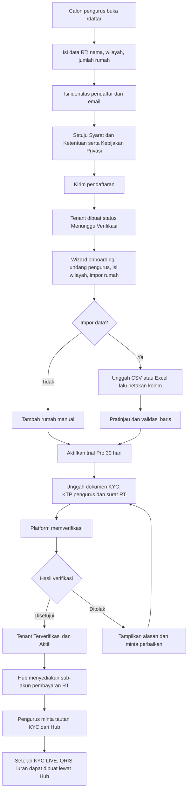
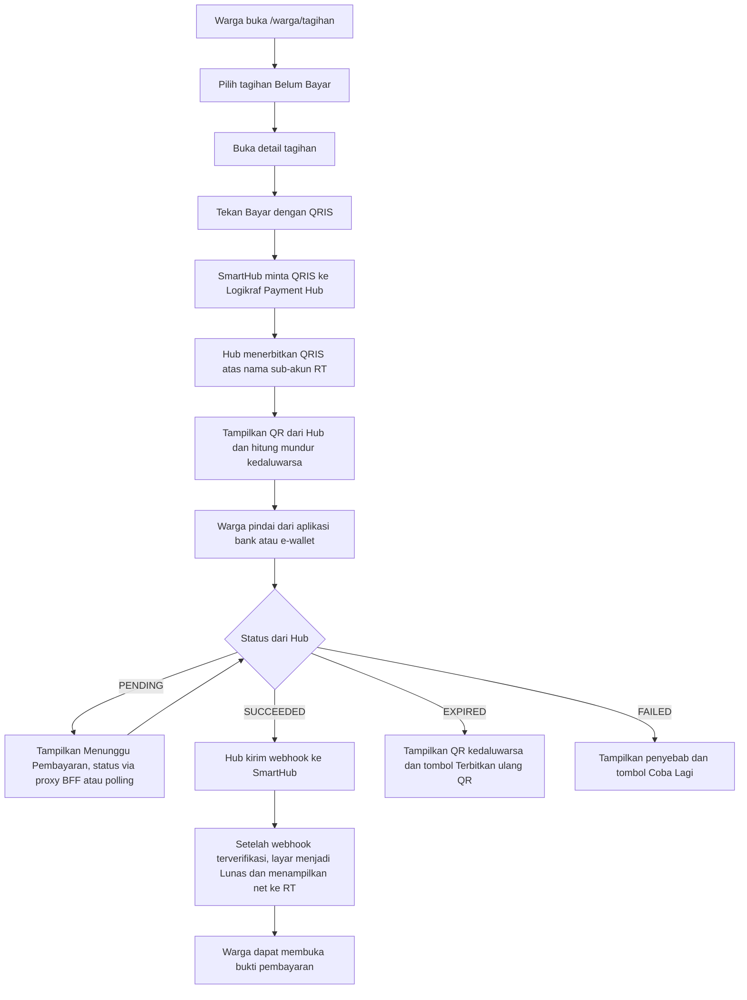
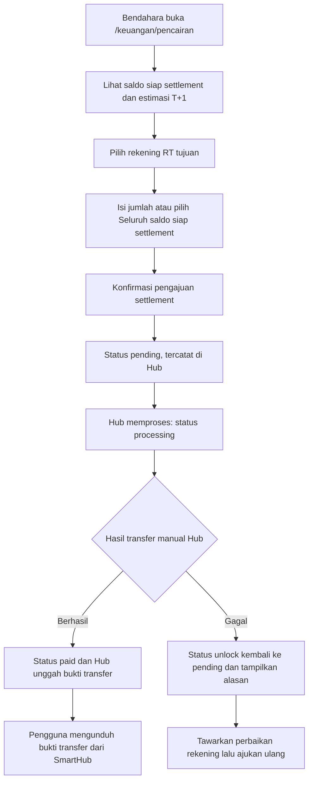
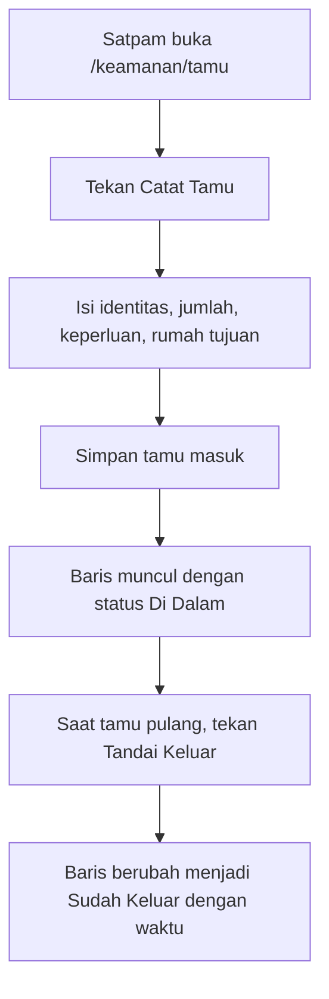
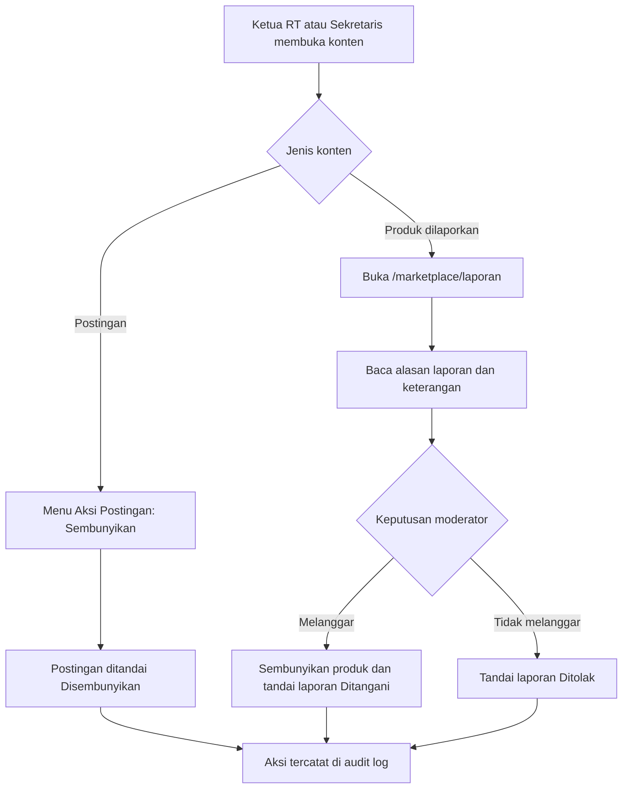
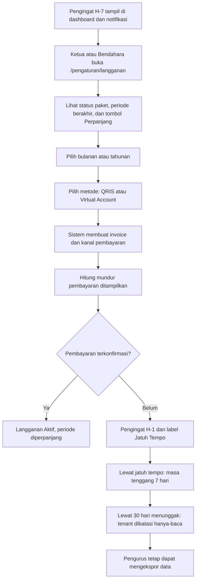
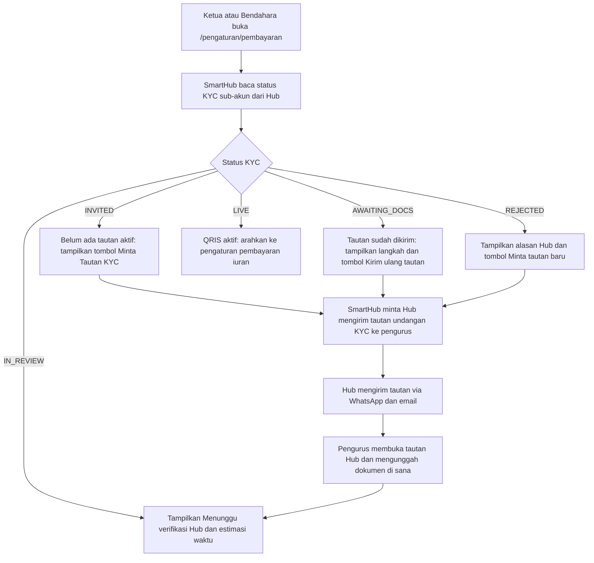
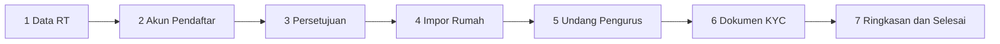
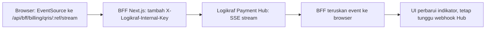

# UI/UX Design — SmartHub SaaS

| Atribut | Nilai |
|---|---|
| Nama Dokumen | Panduan Desain Antarmuka & Pengalaman Pengguna SmartHub |
| Versi Dokumen | 1.3 (KYC & Payout di SmartHub via Hub; Fee Flat Rp2.500) |
| Tanggal | 2026-09-24 |
| Pemilik Dokumen | Desain Produk / Frontend Lead |
| Status | Disetujui sebagai acuan implementasi antarmuka |
| Dokumen Terkait | `PRD.md` 2.3 (sumber kebenaran istilah, peran, UC-01…UC-38), `Architecture.md` 2.3, `API-Contract.md` 2.1, `docs/pilot/rencana-validasi-harga.md`, `docs/logikraf/payment-hub-integration-guide.md`, `docs/logikraf/notifications-architecture.md` |

> **Cara membaca dokumen ini.** Dokumen ini adalah lapisan *to-be* untuk antarmuka SmartHub pada skala SaaS. Apa pun yang **sudah ada di repo** disebutkan dengan **path file nyata**; apa pun yang **belum dibangun** ditandai tebal **TARGET**. Istilah, peran, dan nomor use case mengikuti `PRD.md` 2.0 tanpa perubahan. Setiap layar penting dipetakan ke minimal satu UC (UC-01…UC-38).

> **Batas lingkup dokumen ini.** Desain **tidak** memperkenalkan bahasa visual baru. Seluruh keputusan dibangun di atas Next.js 15 App Router + React 19, TailwindCSS, komponen bergaya ShadcnUI, aksen **biru-teal** di `apps/web/src/app/globals.css`, dan token `--radius: 0.75rem`. Yang baru hanyalah **pola layar** untuk lapisan SaaS (tenant, langganan, pembayaran QRIS, pencairan, konsol platform, kepatuhan data).

> **Revisi 1.3 — KYC kembali ke SmartHub (2026-09-24).** Pengurus (`Ketua_RT`/`Sekretaris`/`Bendahara`) menyelesaikan **Verifikasi Identitas** di dalam SmartHub (mode verify-on-behalf). Eksekusi ke penyedia dilakukan **Logikraf Payment Hub**; dokumen **tidak disimpan** di SmartHub. Layar terkait: **`/verifikasi`** (wizard + status), **`/pengaturan/rekening`** (rekening pencairan), **`/pencairan`** (saldo + pencairan). **Nama penyedia tidak ditampilkan** — gunakan istilah netral ("Verifikasi Identitas", "Akun Pembayaran RT", "Biaya layanan", "Pencairan Dana", "Rekening Pencairan").

> **Keselarasan Platform Logikraf (revisi 1.1).** SmartHub v1 **bukan** integrator Xendit langsung. Seluruh pembayaran melewati **Logikraf Payment Hub** sebagai satu pintu: sub-akun dikelola Hub (SmartHub menyimpan `penyedia_account_id` + status verifikasi), QRIS iuran diterbitkan Hub, dan **status pembayaran tidak pernah final sebelum webhook Hub diterima**. Pencairan mengikuti **settlement Hub** (pengajuan di SmartHub → diproses Hub → Hub mentransfer manual dan mengunggah bukti → pengguna mengunduh bukti). Notifikasi memakai layanan bersama **GoWA** (WhatsApp) dan **BillionMail** (email). Karena `EventSource` tidak dapat mengirim header `X-Logikraf-Internal-Key`, **stream SSE Hub tidak boleh dipanggil langsung dari browser** — semua status melewati **proxy BFF Next.js** atau polling. Rincian kontrak ada di `docs/logikraf/payment-hub-integration-guide.md`; dokumen ini hanya mengatur **permukaan UI**-nya.
>
> **Penamaan produk.** Dokumen ini mendeskripsikan **SmartHub v1** (Node 22 + Express 5 + Prisma + Next.js 15). "Smarthub V3" (Hono/Bun/Drizzle) adalah **produk lama**; jangan memakai contoh kode atau komponennya sebagai acuan.

---

## 1. Prinsip Desain

Sepuluh prinsip di bawah ini mengikat setiap keputusan layar, komponen, dan mikro-konten. Jika dua prinsip bertabrakan, urutan prioritasnya: **kejelasan uang** → **kejelasan data warga** → **kecepatan tugas** → **estetika**.

### 1.1 Mobile-first, tetapi tetap desktop-layak

Mayoritas pengguna adalah warga dan petugas keamanan yang hanya memakai HP. Karena itu:

- Semua tata letak dirancang untuk kolom tunggal pada 360–430px, lalu ditingkatkan (`sm:`, `lg:`, `xl:`) untuk tablet dan desktop pengurus.
- Aksi utama selalu berada di **bawah** dan selebar layar pada mobile (mis. tombol "Unggah Bukti & Bayar" di `apps/web/src/app/(app)/warga/tagihan/page.tsx:152`), sehingga dapat dijangkau ibu jari.
- Tabel berubah menjadi daftar kartu di mobile (lihat Bab 7 dan Bab 10).
- App shell sudah mobile-first: sidebar hanya muncul pada `lg` (`apps/web/src/components/layout/app-shell.tsx:75`), sedangkan mobile memakai tombol menu yang membuka **Sheet** (`app-shell.tsx:92`).

### 1.2 Bahasa Indonesia sebagai bahasa utama, tanpa jargon

- Seluruh label, judul, tombol, pesan kesalahan, dan notifikasi memakai Bahasa Indonesia.
- Istilah teknis diterjemahkan atau dijelaskan saat pertama muncul (lihat Bab 11). Contoh: "Settlement T+1" ditulis **"Dana masuk ke rekening RT pada hari kerja berikutnya"**.
- Nama entitas mengikuti PRD: **Tenant**, **Langganan**, **Iuran**, **Tagihan**, **Pencairan** (bukan *Withdrawal* di teks Indonesia), **Masa tenggang**.
- Nama variabel/enum tetap boleh Inggris di kode, tetapi **tidak pernah** ditampilkan mentah ke pengguna. Label ramah sudah tersedia di `packages/shared/src/enums.ts` (mis. `STATUS_BAYAR_LABELS`, `ROLE_LABELS`) — gunakan itu, jangan cetak enum.

### 1.3 Dirancang untuk pengurus non-teknis

Pak Hendra (Ketua RT), Bu Siti (Sekretaris), dan Bu Dewi (Bendahara) bukan pengguna teknis dan pekerjaannya berulang. Konsekuensi desain:

- **Satu layar = satu pekerjaan.** Layar iuran untuk pengurus tidak mencampur verifikasi dengan pengaturan kategori.
- **Tidak ada istilah "API", "sync", "token", "webhook", "idempotent"** di permukaan pengguna.
- Setiap aksi destruktif atau tidak dapat dibatalkan wajib memakai konfirmasi eksplisit dan menjelaskan akibatnya.
- Aksi yang bisa diotomatiskan tidak boleh diserahkan ke pengurus: terbitkan tagihan massal, kirim pengingat, tandai tunggakan.

### 1.4 Target aksesibilitas WCAG 2.1 AA

Dokumen ini menargetkan **WCAG 2.1 level AA** untuk seluruh layar (selaras NFR PRD Bab 10: kontras memadai, navigasi keyboard, target sentuh ≥44px, teks dapat diperbesar). Rincian teknis ada di Bab 9. Prinsipnya:

- Kontras teks minimal **4,5:1** untuk teks normal dan **3:1** untuk teks besar/ikon fungsional.
- **Tidak ada** informasi yang disampaikan hanya lewat warna. Status pembayaran selalu memakai warna **dan** teks label, bukan titik hijau tanpa keterangan.
- Fokus keyboard selalu terlihat (`focus-visible:ring-2` sudah ada di `apps/web/src/components/ui/button.tsx:7`).
- Semua kontrol punya label programatik (`<Label htmlFor>` / `aria-label`).

### 1.5 Hemat data dan ringan di HP kelas bawah

Warga sering berada di jaringan 4G lemah dengan kuota terbatas. Aturan:

- Target waktu tampil halaman utama **< 3 detik** di 4G kelas menengah (NFR PRD).
- **Tidak ada autoplay video, tidak ada peta, tidak ada grafik berat di dashboard warga.** Grafik (recharts) hanya di layar pengurus/platform yang memang memerlukan.
- Gambar selalu diberi dimensi eksplisit dan di-*lazy load*; unggahan dibatasi (4 lampiran diskusi, 5 foto produk) agar tidak memakan kuota tanpa kendali.
- Skeleton, bukan spinner penuh layar, sehingga tata letak tidak melompat.
- Notifikasi hanya di-*poll* tiap 60 detik (`apps/web/src/components/notifikasi/notification-bell.tsx:17`), bukan streaming.

### 1.6 Transparansi uang adalah fitur, bukan halaman tambahan

Karena model **non-kustodial** (PRD Aturan Bisnis #8), antarmuka harus membuat aliran dana **dapat dipahami orang awam**:

- Setiap nominal yang ditampilkan menyebut **milik siapa** (RT vs platform) dan **statusnya** (belum dibayar / menunggu konfirmasi / lunas / dana sudah cair).
- Platform **tidak pernah** menampilkan saldo dana warga seolah milik platform.
- Perbedaan **"lunas"** (webhook Hub sudah terkonfirmasi) dan **"menunggu konfirmasi"** (belum ada konfirmasi) harus terlihat jelas dan tidak pernah disamarkan. PRD Aturan Bisnis #12 menegaskan status pembayaran tidak boleh difinalkan sebelum webhook. Karena sumber kebenaran adalah **Logikraf Payment Hub**, kalimat UI menyebut "konfirmasi penyedia pembayaran" — bukan nama vendor.

### 1.7 Konsistensi lebih penting daripada variasi

Komponen yang sudah ada wajib dipakai ulang. Layar baru harus menyusun ulang primitif yang sama (`Card`, `Table`, `Dialog`, `DataState`, `PageHeader`, `StatCard`, `StatusBayarBadge`) alih-alih membuat gaya baru.

### 1.8 Selalu ada jalan keluar

Setiap state buntu (kosong, error, akses ditolak, pembayaran gagal) menyediakan minimal satu aksi lanjut: "Coba lagi", "Kembali ke beranda", "Unduh bukti", atau "Hubungi pengurus".

### 1.9 Privasi secara default

Kandidat sebutan, daftar warga, dan pencarian **tidak boleh mengekspos** email, NIK, atau nomor HP orang lain (PRD UC-22). Layar publik (pendaftaran tenant) hanya meminta data yang benar-benar diperlukan.

### 1.10 Uang dan status tidak boleh mengejutkan

Karena langganan **tidak auto-renew** (PRD Aturan Bisnis #13), pengingat, masa tenggang, dan konsekuensi nonaktif harus **terlihat di muka**, bukan muncul mendadak saat akun dikunci.

---

## 2. Design System

Design system SmartHub sudah hidup di repo. Bab ini mendokumentasikannya agar layar baru tetap konsisten.

### 2.1 Token warna

Token didefinisikan sebagai CSS variable HSL di `apps/web/src/app/globals.css:6` (light) dan `.dark` di `globals.css:44`, lalu dipetakan ke kelas Tailwind di `apps/web/tailwind.config.ts:13`. Aksen utama adalah **biru-teal** (`--primary: 190 90% 30%` pada light, `187 80% 45%` pada dark).

| Token | Light (`globals.css`) | Dark (`globals.css`) | Pemakaian |
|---|---|---|---|
| `--background` | `0 0% 100%` | `222 24% 8%` | Latar halaman |
| `--foreground` | `222 22% 12%` | `210 20% 96%` | Teks utama |
| `--card` / `--card-foreground` | `0 0% 100%` / `222 22% 12%` | `222 22% 11%` / `210 20% 96%` | Permukaan kartu |
| `--primary` | `190 90% 30%` (biru-teal) | `187 80% 45%` | Aksi utama, tautan, fokus |
| `--primary-foreground` | `0 0% 100%` | `222 30% 10%` | Teks di atas primary |
| `--secondary` | `190 30% 96%` | `217 20% 18%` | Tombol sekunder, badge netral |
| `--muted` / `--muted-foreground` | `210 20% 96%` / `215 16% 46%` | `217 20% 16%` / `215 16% 65%` | Teks bantu, latar tenang |
| `--accent` | `174 60% 94%` | `190 30% 20%` | Hover, sorotan lembut |
| `--destructive` | `0 74% 46%` | `0 62% 48%` | Aksi hapus, error |
| `--success` | `152 62% 36%` | `152 50% 42%` | Lunas, terverifikasi, berhasil |
| `--warning` | `36 92% 45%` | `36 88% 52%` | Menunggu konfirmasi, jatuh tempo |
| `--border` / `--input` | `214 20% 90%` | `217 20% 20%` | Garis dan bidang input |
| `--ring` | `190 90% 30%` | `187 80% 45%` | Cincin fokus |

**Aturan warna:**

1. **Hijau (`success`) hanya untuk hal yang benar-benar selesai/terverifikasi.** Pembayaran QRIS `PENDING` tidak boleh hijau — pakai `warning`/netral sampai webhook terkonfirmasi.
2. **Merah (`destructive`) hanya untuk aksi merusak atau kegagalan**, bukan untuk "belum bayar".
3. Jangan menambah warna baru tanpa menambah token di `globals.css`; hindari nilai warna lepas (`#...`/`text-green-500`) agar dark mode tidak rusak.

### 2.2 Tipografi

- **Keluarga huruf:** font sans bawaan (Tailwind `font-sans`); belum ada font kustom. Tidak menambah webfont baru demi hemat data (Prinsip 1.5).
- **Skala yang dipakai saat ini** (dari komponen nyata):

| Peran | Kelas | Contoh pemakaian |
|---|---|---|
| Judul halaman | `text-xl sm:text-2xl font-semibold tracking-tight` | `apps/web/src/components/page-header.tsx:14` |
| Judul kartu / section | `text-base font-semibold` | `warga/tagihan/page.tsx:136` |
| Angka KPI besar | `text-2xl font-semibold tracking-tight` | `apps/web/src/components/stat-card.tsx:29` |
| Teks isi | `text-sm` | mayoritas |
| Metadata/bantuan | `text-xs text-muted-foreground` | `stat-card.tsx:31` |
| Badge | `text-xs font-semibold` | `apps/web/src/components/ui/badge.tsx:7` |

- Panjang baris teks diskusi dibatasi wadah `max-w-2xl` (`apps/web/src/app/(app)/diskusi/page.tsx:153`) agar nyaman dibaca di desktop.
- **Aturan:** jangan mengubah ukuran font per halaman; gunakan salah satu peran di atas.

### 2.3 Spacing, radius, dan elevasi

- **Spacing:** skala Tailwind 4px (`gap-1`…`gap-6`). Jarak antar-kartu list memakai `space-y-2`/`space-y-3`; grid KPI memakai `gap-4` (`dashboard/page.tsx:86`).
- **Radius:** `--radius: 0.75rem` (`globals.css:41`). Pemetaan di `tailwind.config.ts:56` → `rounded-lg` = 12px, `rounded-md` = 10px, `rounded-sm` = 8px. Kartu memakai `rounded-lg`, tombol/input `rounded-md`, badge `rounded-full`.
- **Elevasi:** sistem ini **tidak** memakai `shadow-*` untuk kartu; kedalaman dibangun lewat `border` + `bg-card`. Pertahankan itu; jangan menambah shadow agar konsisten dan hemat render.
- **Lebar konten:** halaman pengurus `mx-auto max-w-6xl`, halaman warga `max-w-4xl` (`warga/tagihan/page.tsx:100`), notifikasi `max-w-3xl` (`notifikasi/page.tsx:69`), diskusi `max-w-2xl`.

### 2.4 Ikon

- **Pustaka:** `lucide-react`. Ikon diimpor per-nama, contoh di `apps/web/src/lib/navigation.ts:2` dan `dashboard/page.tsx:5`.
- Ukuran ikon mengikuti konteks: `h-4 w-4` di tombol (default via `[&_svg]:size-4` pada `button.tsx:7`), `h-5 w-5` di header (`app-shell.tsx:95`), `h-8 w-8` di empty state (`apps/web/src/components/data-state.tsx:20`).
- Ikon dekoratif tidak perlu label tambahan karena teks sudah ada. **Ikon-only selalu punya `aria-label`**, contoh tombol menu (`app-shell.tsx:94`), lonceng notifikasi (`notification-bell.tsx:29`), toggle tema (`theme-toggle.tsx:14`).
- **Aturan:** ikon selalu mendampingi teks pada aksi utama; jangan mengganti label teks dengan ikon saja kecuali tombol ikon standar (tutup, menu, lonceng).

### 2.5 Inventaris komponen dasar yang sudah ada

Seluruh berkas berikut ada di `apps/web/src/components/ui/` (kecuali disebut lain). Kolom "Catatan" menjelaskan varian yang sudah tersedia agar tidak ditulis ulang.

| Komponen | Path | Varian / catatan |
|---|---|---|
| `button` | `ui/button.tsx` | varian `default`, `destructive`, `outline`, `secondary`, `ghost`, `link`; ukuran `sm`, `default`, `lg`, `icon`; mendukung `asChild` |
| `badge` | `ui/badge.tsx` | varian `default`, `secondary`, `destructive`, `success`, `warning`, `outline` |
| `card` | `ui/card.tsx` | `CardHeader/Content/Title/Description` |
| `input` | `ui/input.tsx` | — |
| `textarea` | `ui/textarea.tsx` | — |
| `label` | `ui/label.tsx` | — |
| `table` | `ui/table.tsx` | `TableHeader/Row/Head/Body/Cell` |
| `dialog` | `ui/dialog.tsx` | dipakai untuk form & konfirmasi |
| `sheet` | `ui/sheet.tsx` | panel samping mobile |
| `select` | `ui/select.tsx` | berbasis Radix Select |
| `dropdown-menu` | `ui/dropdown-menu.tsx` | menu aksi baris ("…") |
| `popover` | `ui/popover.tsx` | dasar combobox |
| `command` | `ui/command.tsx` | dasar combobox & pencarian (cmdk) |
| `alert` | `ui/alert.tsx` | varian `default`, `destructive`, `warning`, `success`; `role="alert"` |
| `separator` | `ui/separator.tsx` | — |
| `skeleton` | `ui/skeleton.tsx` | dasar loading |
| `sonner` | `ui/sonner.tsx` | host toast |
| `tabs` | `ui/tabs.tsx` | tersedia, belum banyak dipakai |
| `pagination` | `components/pagination.tsx` | offset pagination, menyembunyikan diri bila ≤1 halaman |
| `stat-card` | `components/stat-card.tsx` | KPI + state loading |
| `page-header` | `components/page-header.tsx` | judul + deskripsi + slot aksi |
| `data-state` | `components/data-state.tsx` | `TableSkeleton`, `EmptyState`, `ErrorState`, `DataState` |
| `status-badge` | `components/status-badge.tsx` | `StatusBayarBadge`, `StatusVerifikasiBadge`, `StatusAktifBadge`, `TamuStatusBadge` |
| `theme-toggle` | `components/layout/theme-toggle.tsx` | light/dark via `next-themes` |
| `notification-bell` | `components/notifikasi/notification-bell.tsx` | lencana belum dibaca, poll 60 detik |
| `providers` | `components/providers.tsx` | QueryClient + ThemeProvider + Toaster |
| `warga-nik-combobox` | `components/warga-nik-combobox.tsx` | combobox cari warga (Command + Popover) |

### 2.6 Inventaris komponen domain yang sudah ada

| Komponen | Path | Fungsi |
|---|---|---|
| `PostCard` | `components/diskusi/post-card.tsx` | Kartu postingan: penulis, badge peran, lampiran, poll, suka, balasan, menu moderasi |
| `PostComposer` | `components/diskusi/post-composer.tsx` | Editor postingan/balasan: teks 2.000 karakter, 4 lampiran, poll, **mention** dengan keyboard |
| `PollCard` | `components/diskusi/poll-card.tsx` | Opsi poll, hasil persentase, status tertutup |
| `types` | `components/diskusi/types.ts` | Tipe `DiskusiItem`, `PollItem`, `Mention` |
| `ProductCard` | `components/marketplace/product-card.tsx` | Kartu produk, favorit aktif (optimistic), badge status, menu moderasi/hapus |
| `ProductForm` | `components/marketplace/product-form.tsx` | Dialog buat/ubah produk, 5 foto, kategori |
| `ReportDialog` | `components/marketplace/report-dialog.tsx` | Dialog lapor produk dengan alasan terstruktur |

### 2.7 Aturan pemakaian komponen

1. **Satu sumber status.** Jangan membuat badge status ad-hoc; selalu pakai `status-badge.tsx` agar warna dan label konsisten.
2. **Satu pola loading.** Pembungkus data wajib memakai `DataState` (`data-state.tsx:41`) agar urutan loading → error → empty → konten seragam. Skeleton dapat diganti `TableSkeleton` (list/tabel) atau `Skeleton` kustom (KPI).
3. **Form selalu react-hook-form + zod.** Contoh: `login/page.tsx:31`, `keuangan/iuran/page.tsx:125`, `marketplace/report-dialog.tsx:54`.
4. **Toast hanya untuk hasil aksi**, bukan untuk progres loading (progres memakai `isPending`/`Loader2`).
5. **Jangan menambah state ganda.** Data server selalu lewat TanStack Query dengan `queryKeys` dari `packages/shared/src/query-keys.ts`.

---

## 3. Pola Layout & Navigasi

### 3.1 App shell (existing)

Komponen `AppShell` (`apps/web/src/components/layout/app-shell.tsx`) adalah kerangka seluruh halaman terautentikasi, dan dipasang oleh route group `(app)` melalui `apps/web/src/app/(app)/layout.tsx`.

```
Desktop (lg >= 1024px)
+--------------+-------------------------------------------+
| Sidebar      | Header sticky: menu/brand   bell  tema  user
| 16rem        +-------------------------------------------+
| Brand        |                                           |
| ----------   |   <main> px-4 py-6 lg:px-8                |
| Menu peran   |                                           |
| ----------   |                                           |
| Masuk sbg    |                                           |
+--------------+-------------------------------------------+
Mobile (<1024px): header + brand + Sheet menu kiri (w-72)
```

**Detail existing:**

- Grid desktop `lg:grid-cols-[16rem_1fr]` (`app-shell.tsx:74`); sidebar `hidden … lg:flex`.
- Brand = kotak "SH" berlatar `bg-primary` + wordmark "SmartHub" (`app-shell.tsx:24`).
- Item menu aktif memakai `bg-primary/10 text-primary`; tidak aktif `text-muted-foreground hover:bg-accent` (`app-shell.tsx:50`).
- Header `sticky top-0 z-30 border-b bg-background/95 backdrop-blur` (`app-shell.tsx:90`).
- Mobile membuka `Sheet side="left" w-72` berisi `NavList` yang sama (`app-shell.tsx:92`).
- Dropdown pengguna berisi nama, label peran, "Profil & Password", "Keluar" (`app-shell.tsx:121`).

### 3.2 Header

Header memuat, dari kiri ke kanan: tombol menu (mobile), brand (mobile), lalu di kanan: **lonceng notifikasi**, **toggle tema**, **menu pengguna**. Urutan ini tidak boleh berubah karena refleks pengguna sudah terbentuk.

**TARGET — tambahan header untuk SaaS:**

- **Pemilih tenant** (hanya untuk `Platform_Owner`/`Platform_Admin` saat berada di konteks tenant) dengan badge "Mode Dukungan" bila sedang impersonasi.
- **Indikator status langganan** berupa `Badge` kecil di sidebar (mis. "Trial 12 hari lagi", "Masa tenggang H-3") yang mengarah ke halaman langganan.
- **Banner sistem** (Bab 8.6) di bawah header, bukan di dalam header.

### 3.3 Bottom navigation (TARGET)

Untuk warga dan petugas keamanan yang beraktivitas sambil berdiri (persona Pak Joko), **TARGET**: bottom tab bar pada mobile dengan 4 slot:

| Slot | Ikon | Rute | Peran |
|---|---|---|---|
| Beranda | `LayoutDashboard` | `/dashboard` | semua tenant |
| Diskusi | `MessageSquare` | `/diskusi` | semua tenant |
| Tagihan / Tamu | `ReceiptText` / `ShieldCheck` | `/warga/tagihan` atau `/keamanan/tamu` | Warga / Keamanan |
| Akun | `UserRound` | `/profil` | semua tenant |

Aturan: bottom nav hanya menampilkan rute yang **diizinkan peran**, tinggi ≥56px, menonjolkan state aktif, dan disembunyikan saat keyboard maya terbuka. Sheet sidebar tetap ada untuk menu lengkap. Ini melengkapi (bukan menggantikan) `navigation.ts`.

### 3.4 Halaman publik

Halaman publik **tidak** memakai `AppShell`, memakai latar `bg-muted/40` dan kartu `max-w-md` terpusat:

- **Login** — `apps/web/src/app/login/page.tsx:68` (kartu `max-w-md`, brand "SH").
- **Reset Password** — `apps/web/src/app/reset-password/page.tsx:130` (penanganan token hilang/valid, state sukses).
- **403** — `apps/web/src/app/403/page.tsx` (kunci `min-h-dvh`, pesan "Role akun Anda tidak memiliki izin…").
- **404** — `apps/web/src/app/not-found.tsx` (pesan "Halaman tidak ditemukan…").
- **`/`** — hanya pengalih cerdas: tanpa cookie → `/login`, dengan cookie → `HOME_BY_ROLE` peran (`apps/web/src/app/page.tsx:5`).

**TARGET — halaman publik SaaS baru:**

- `/daftar` — pendaftaran tenant self-serve (UC-24).
- `/verifikasi` — **Verifikasi Identitas** (wizard data + dokumen + persetujuan + status). Saat status **Terverifikasi (`LIVE`)**, kartu Status menampilkan badge **"Kanal QRIS: Aktif / Belum aktif"** beserta pesan netral bahwa aktivasi kanal dilakukan tim dukungan; QRIS tidak dapat dibuat sampai kanal aktif. **SUDAH ADA.**
- `/masuk-platform` — login terpisah untuk `AkunPlatform` (`Platform_Owner`/`Platform_Admin`/`Platform_Support`).
- `/status` — status sistem & jadwal pemeliharaan (Bab 8.6).
- `/panduan` — pusat bantuan ringkas (FAQ QRIS, langganan, PDP).

### 3.5 Aturan menu per peran

Menu difilter oleh `navItemsForRole` di `apps/web/src/lib/navigation.ts:124`, yang menyaring `NAV_ITEMS` berdasarkan `roles`. Ini adalah **single source of truth** menu tenant dan harus tetap sinkron dengan Matriks RBAC PRD Bab 6.1.

| Label menu | Rute | Ketua_RT | Sekretaris | Bendahara | Keamanan | Warga |
|---|---|:--:|:--:|:--:|:--:|:--:|
| Dasbor | `/dashboard` | ✅ | ✅ | ✅ | – | ✅ |
| Diskusi | `/diskusi` | ✅ | ✅ | ✅ | ✅ | ✅ |
| Marketplace | `/marketplace` | ✅ | ✅ | ✅ | ✅ | ✅ |
| Jualan Saya | `/marketplace/jual` | ✅ | ✅ | ✅ | ✅ | ✅ |
| Rumah | `/wilayah/rumah` | ✅ | ✅ | ✅ | – | – |
| Kartu Keluarga | `/kependudukan/kk` | ✅ | ✅ | ✅ | – | – |
| Warga | `/kependudukan/warga` | ✅ | ✅ | ✅ | – | – |
| Mutasi Warga | `/kependudukan/mutasi` | ✅ | ✅ | ✅ | – | – |
| Tamu | `/keamanan/tamu` | ✅ | ✅ | – | ✅ | – |
| Kategori Kas | `/keuangan/kategori` | ✅ | – | ✅ | – | – |
| Iuran | `/keuangan/iuran` | ✅ | ✅ | ✅ | – | – |
| Buku Kas | `/keuangan/kas` | ✅ | ✅ | ✅ | – | ✅ |
| Transparansi | `/keuangan/ringkasan` | ✅ | ✅ | ✅ | – | ✅ |
| Tagihan Saya | `/warga/tagihan` | – | – | – | – | ✅ |
| Keluarga Saya | `/warga/keluarga` | – | – | – | – | ✅ |
| Akun | `/pengaturan/akun` | ✅ | ✅ | – | – | – |

Catatan penting:

- **Keamanan tidak melihat kas** (konsisten PRD: laporan kas "No Access" untuk Keamanan). Karena itu Dasbor untuk Keamanan hanya menampilkan kartu tamu, bukan kartu saldo.
- **Warga hanya melihat Buku Kas & Transparansi** secara baca, dan halaman "Tagihan Saya"/"Keluarga Saya".
- Menu **tidak** menyembunyikan data; ia hanya memandu. Backend tetap menegakkan RBAC dan men-scope `id_tenant` dari JWT. Menu yang disembunyikan tetapi URL diakses langsung harus berakhir di **403** — lihat `apps/web/src/app/403/page.tsx`.

**TARGET — grup menu baru (belum ada di `navigation.ts`):**

| Label menu | Rute | Peran | UC |
|---|---|---|---|
| Langganan | `/pengaturan/langganan` | Ketua_RT, Sekretaris, Bendahara | UC-26, UC-27, UC-28 |
| Status Sub-akun Pembayaran | `/pengaturan/pembayaran` | Ketua_RT, Bendahara | UC-30 |
| Preferensi Notifikasi | `/pengaturan/notifikasi` | semua tenant | UC-23 |
| Pencairan Dana | `/keuangan/pencairan` | Ketua_RT, Bendahara | UC-33 |
| Rekonsiliasi | `/keuangan/rekonsiliasi` | Bendahara, Ketua_RT | UC-35 |
| Audit Log | `/audit-log` | Ketua_RT (full), Sekretaris (read) | UC-37 |
| Keamanan Akun | `/pengaturan/keamanan` | Ketua_RT, Bendahara | NFR Keamanan |
| Privasi & Data | `/pengaturan/privasi` | Ketua_RT | UC-38 |
| Konsol Platform | `/platform/*` | Platform_Owner, Platform_Admin, Platform_Support | UC-36, UC-37 |

### 3.6 Penjaga rute dan pola error

- Route group `(app)` memanggil `useMe()`; bila gagal memuat identitas, pengguna dialihkan ke `/login` (`apps/web/src/app/(app)/layout.tsx:13`).
- Halaman dengan izin terbatas menyembunyikan aksi (mis. tombol "Terbitkan Tagihan" hanya untuk Bendahara/Ketua_RT di `keuangan/iuran/page.tsx:79`).
- Bila pengguna tetap mengakses rute terlarang, tampilkan **403** dengan tombol kembali; jangan tampilkan layar putih.
- **TARGET:** halaman 403 kontekstual — sebutkan peran yang dibutuhkan ("Halaman ini hanya untuk Bendahara").

### 3.7 Konvensi rute

- Segmen huruf kecil, dipisah `-` bila perlu, memakai istilah Indonesia (`/kependudukan/mutasi`, bukan `/citizen-mutation`).
- Parameter dinamis memakai nama domain: `[id_rumah]`, `[no_kk]`, `[nik]`, `[id_postingan]`, `[id_produk]`.
- **TARGET** memakai pola serupa: `[id_invoice]`, `[id_pencairan]`, `[id_tenant]`.

---

## 4. Inventaris Layar Lengkap

Legenda status: **Sudah** = ada di repo saat ini; **TARGET** = belum dibangun, dirancang di dokumen ini. Kolom UC mengacu `PRD.md` 2.0.

### 4.1 Layar publik & sistem

| Rute | Nama layar | Peran | Tujuan | UC | Status |
|---|---|---|---|---|---|
| `/` | Pengalih akar | publik | Arahkan ke login atau beranda sesuai peran | — | Sudah (`app/page.tsx`) |
| `/login` | Masuk | semua | Login 3 identitas + pesan gagal seragam | UC-01 | Sudah (`app/login/page.tsx`) |
| `/reset-password` | Reset Password | publik | Buat password baru via token | UC-13 | Sudah (`app/reset-password/page.tsx`) |
| `403` | Akses Ditolak | semua | Peran tidak punya izin | — | Sudah (`app/403/page.tsx`) |
| `404` | Halaman Tidak Ditemukan | semua | Rute tidak ada | — | Sudah (`app/not-found.tsx`) |
| `/daftar` | Pendaftaran RT (tenant) | publik | Daftar tenant self-serve | UC-24 | **TARGET** |
| ~~`/daftar/verifikasi`~~ | ~~Verifikasi & KYC~~ | — | **DIHAPUS (revisi 1.2):** KYC di portal partner | UC-25 | **OUT OF SCOPE** |
| `/masuk-platform` | Masuk Platform | platform | Login `AkunPlatform` | UC-36 | **TARGET** |
| `/status` | Status Sistem | publik | Kesehatan layanan & jadwal pemeliharaan | — | **TARGET** |
| `/panduan` | Pusat Bantuan | publik | FAQ QRIS, langganan, PDP | — | **TARGET** |

### 4.2 Layar dalam tenant (route group `(app)`)

| Rute | Nama layar | Peran | Tujuan | UC | Status |
|---|---|---|---|---|---|
| `/dashboard` | Dasbor | semua tenant | KPI ringkas sesuai peran | UC-12, UC-23 | Sudah (`(app)/dashboard/page.tsx`) |
| `/profil` | Profil & Password | semua tenant | Data akun + ubah password | UC-03 | Sudah (`(app)/profil/page.tsx`) |
| `/notifikasi` | Pusat Notifikasi | semua tenant | Mention & balasan, tandai dibaca | UC-23 | Sudah (`(app)/notifikasi/page.tsx`) |
| `/diskusi` | Feed Diskusi | semua tenant | Thread, suka, poll, moderasi | UC-14, UC-15, UC-16, UC-17, UC-22 | Sudah (`(app)/diskusi/page.tsx`) |
| `/diskusi/[id_postingan]` | Detail Postingan | semua tenant | Baca & balas satu tingkat | UC-14–16, UC-22 | Sudah (`(app)/diskusi/[id_postingan]/page.tsx`) |
| `/wilayah/rumah` | Daftar Rumah | Ketua, Sekretaris, Bendahara | Inventaris rumah | UC-04 | Sudah (`(app)/wilayah/rumah/page.tsx`) |
| `/wilayah/rumah/[id_rumah]` | Detail Rumah | Ketua, Sekretaris, Bendahara | Rumah + KK + riwayat | UC-04, UC-05 | Sudah (`(app)/wilayah/rumah/[id_rumah]/page.tsx`) |
| `/kependudukan/kk` | Daftar Kartu Keluarga | Ketua, Sekretaris, Bendahara | Daftar KK per rumah | UC-05 | Sudah (`(app)/kependudukan/kk/page.tsx`) |
| `/kependudukan/kk/[no_kk]` | Detail KK | Ketua, Sekretaris, Bendahara | Anggota keluarga | UC-05, UC-06 | Sudah (`(app)/kependudukan/kk/[no_kk]/page.tsx`) |
| `/kependudukan/warga` | Daftar Warga | Ketua, Sekretaris, Bendahara | Biodata warga | UC-06 | Sudah (`(app)/kependudukan/warga/page.tsx`) |
| `/kependudukan/warga/[nik]` | Detail Warga | Ketua, Sekretaris, Bendahara, Warga (keluarga) | Biodata + mutasi | UC-06 | Sudah (`(app)/kependudukan/warga/[nik]/page.tsx`) |
| `/kependudukan/mutasi` | Log Mutasi | Ketua, Sekretaris, Bendahara | Lahir/datang/meninggal/pindah | UC-07 | Sudah (`(app)/kependudukan/mutasi/page.tsx`) |
| `/keamanan/tamu` | Log Tamu | Keamanan, Ketua, Sekretaris | Catat tamu masuk/keluar | UC-08 | Sudah (`(app)/keamanan/tamu/page.tsx`) |
| `/keuangan/kategori` | Kategori Keuangan | Bendahara, Ketua | Kategori pemasukan/pengeluaran | UC-09 | Sudah (`(app)/keuangan/kategori/page.tsx`) |
| `/keuangan/iuran` | Iuran Warga | Bendahara, Ketua, Sekretaris (read) | Terbitkan & verifikasi iuran | UC-09, UC-10 | Sudah (`(app)/keuangan/iuran/page.tsx`) |
| `/keuangan/kas` | Buku Kas | Bendahara, Ketua, Sekretaris, Warga (read) | Kas masuk/keluar + verifikasi | UC-11 | Sudah (`(app)/keuangan/kas/page.tsx`) |
| `/keuangan/ringkasan` | Transparansi | semua kecuali Keamanan | Laporan kas real-time | UC-12 | Sudah (`(app)/keuangan/ringkasan/page.tsx`) |
| `/warga/tagihan` | Tagihan Saya | Warga | Lihat & bayar tagihan sendiri | UC-10, UC-31 | Sudah (`(app)/warga/tagihan/page.tsx`) |
| `/warga/keluarga` | Keluarga Saya | Warga | Data keluarga sendiri | UC-06 | Sudah (`(app)/warga/keluarga/page.tsx`) |
| `/pengaturan/akun` | Kelola Akun | Ketua, Sekretaris | Buat/ubah akun & reset tautan | UC-02, UC-03 | Sudah (`(app)/pengaturan/akun/page.tsx`) |
| `/marketplace` | Katalog | semua tenant | Cari & filter produk | UC-18 | Sudah (`(app)/marketplace/page.tsx`) |
| `/marketplace/produk/[id_produk]` | Detail Produk | semua tenant | Detail, favorit, kontak WA, lapor | UC-18, UC-20, UC-21 | Sudah (`(app)/marketplace/produk/[id_produk]/page.tsx`) |
| `/marketplace/jual` | Jualan Saya | semua tenant | Kelola produk sendiri | UC-19 | Sudah (`(app)/marketplace/jual/page.tsx`) |
| `/marketplace/favorit` | Favorit Saya | semua tenant | Produk yang disimpan | UC-20 | Sudah (`(app)/marketplace/favorit/page.tsx`) |
| `/marketplace/kategori` | Kelola Kategori | Ketua, Sekretaris | Kelola kategori produk | UC-18 | Sudah (`(app)/marketplace/kategori/page.tsx`) |
| `/marketplace/laporan` | Moderasi Laporan | Ketua, Sekretaris | Tangani laporan produk | UC-21 | Sudah (`(app)/marketplace/laporan/page.tsx`) |

### 4.3 Layar baru lapisan SaaS (semua TARGET)

| Rute | Nama layar | Peran | Tujuan | UC |
|---|---|---|---|---|
| `/pengaturan/langganan` | Ringkasan Langganan | Ketua, Sekretaris, Bendahara | Status paket, kuota, masa tenggang, perpanjang | UC-26, UC-28 |
| `/pengaturan/langganan/paket` | Pilih Paket | Ketua, Bendahara | Bandingkan & ubah paket, prorata | UC-28 |
| `/pengaturan/langganan/tagihan` | Daftar Invoice | Ketua, Sekretaris, Bendahara | Riwayat tagihan langganan | UC-27 |
| `/pengaturan/langganan/tagihan/[id_invoice]` | Detail & Bayar Invoice | Ketua, Bendahara | QRIS/VA + hitung mundur + status | UC-27 |
| ~~`/pengaturan/pembayaran`~~ | ~~Status Sub-akun Pembayaran~~ | — | **DIHAPUS (revisi 1.2):** onboarding sub-akun & KYC di portal partner `https://partners.logikraf.id/` | UC-30 |
| ~~`/pengaturan/pembayaran/kyc`~~ | ~~Permintaan Tautan KYC~~ | — | **DIHAPUS (revisi 1.2)** | UC-30 |
| `/pengaturan/notifikasi` | Preferensi Notifikasi | semua tenant | Preferensi kanal WA/email + opt-out & status kirim | UC-23 |
| `/pengaturan/keamanan` | Keamanan Akun | Ketua, Bendahara | MFA + sesi/perangkat | NFR Keamanan |
| `/pengaturan/privasi` | Privasi & Data | Ketua | Ekspor data tenant & hak subjek data | UC-38 |
| `/keuangan/pencairan` | Pencairan Dana | Ketua, Bendahara | Ajukan settlement Hub & pantau status | UC-33 |
| `/keuangan/pencairan/[id_pencairan]` | Detail Pencairan | Ketua, Bendahara | Status settlement Hub, unduh bukti transfer, fee | UC-33 |
| `/keuangan/rekonsiliasi` | Rekonsiliasi | Bendahara, Ketua | Selisih ledger vs Hub, fallback polling status | UC-35 |
| `/keuangan/iuran/[id_iuran]` | Detail Tagihan & QRIS | Warga / Bendahara / Ketua | QRIS dari Hub + hitung mundur + status (final hanya setelah webhook Hub) | UC-31, UC-34 |
| `/audit-log` | Audit Log Tenant | Ketua (full), Sekretaris (read) | Jejak aksi sensitif | UC-37 |
| `/platform` | Ringkasan Konsol | Platform_Owner, Admin, Support | KPI tenant & pembayaran | UC-36 |
| `/platform/tenant` | Daftar Tenant | platform | Cari, filter status & langganan | UC-36 |
| `/platform/tenant/[id_tenant]` | Detail Tenant | Superadmin | Status, langganan, audit, suspend (tab KYC dihapus — KYC di portal partner) | UC-36, UC-37 |
| `/platform/tenant/[id_tenant]/dukungan` | Mode Dukungan | platform | Impersonasi 60 menit **read-only** (akses ditolak + audit) + banner di app tenant | UC-37 |
| `/platform/paket` | Kelola Paket | Platform_Owner | Harga & fitur paket | UC-28 |
| `/platform/metrik` | Metrik Bisnis | Platform_Owner, Admin (read) | GMV, fee, MRR, churn | UC-36 |
| `/platform/audit` | Audit Log Platform | semua platform | Log platform append-only | UC-37 |
| `/platform/rekonsiliasi` | Rekonsiliasi Platform | Platform_Owner, Admin | Selisih lintas tenant | UC-35 |
| `/platform/webhook` | Pemantau Webhook | Platform_Admin, Support | Event Hub gagal, signature & retry | UC-32, UC-35 |

> **Status implementasi (revisi 1.3):** aplikasi tenant sudah punya **`/verifikasi`** (Verifikasi Identitas), **`/pengaturan/rekening`**, **`/pencairan`** (dengan saldo), **`/pengaturan/tenant`** (identitas & operasional RT), **`/pengaturan/notifikasi`**, **`/laporan`**, **`/audit-log`**, dan **`/langganan`**. Konsol platform: `/platform` (tab **Perlu Tindakan**, **Tenant**, **Langganan**, **Webhook**, **Audit**, **Akun Platform**, **Keamanan/MFA**), `/platform/paket`, `/platform/metrik`, `/platform/rekonsiliasi`, `/platform/tenant/[id_tenant]` (detail + suspend/aktifkan + "Masuk sebagai"), dan `/platform/login` (langkah **kode MFA**). Saat impersonasi aktif, aplikasi tenant menampilkan **banner read-only**. Auth platform memakai cookie terpisah (`smarthub_platform_token`) dan BFF `/api/platform-bff`.

**Jumlah inventaris:** **31 layar existing** (5 halaman publik/sistem di 4.1 + 26 layar tenant di 4.2) + **28 layar TARGET** (5 halaman publik/lapisan platform di 4.1 + 23 layar SaaS di 4.3) = **59 layar** yang dipetakan ke UC. Dua berkas tambahan (`app/layout.tsx` dan `app/(app)/layout.tsx`) adalah kerangka, bukan layar. Penambahan pada revisi 1.1: `/pengaturan/notifikasi` (preferensi kanal & opt-out notifikasi).

Catatan pemetaan UC:

- Seluruh UC-01…UC-23 sudah punya minimal satu layar existing.
- UC-24…UC-38 (lapisan SaaS) punya minimal satu layar TARGET di tabel 4.3.
- UC-29 (penonaktifan/pembatalan tenant) ditangani di `/pengaturan/langganan` (aksi "Batalkan langganan") dan `/pengaturan/privasi` (ekspor akhir sebelum penghapusan); belum dipisah menjadi layar tersendiri.

---

## 5. Alur Pengguna Kunci

Setiap alur di bawah memakai **Mermaid** dan narasi langkah. Diagram sengaja memakai label berbahasa Indonesia dan menghindari karakter yang merusak parser.

### 5.1 ~~Onboarding tenant self-serve (UC-24 → UC-26)~~ DIBATALKAN (revisi 1.2)

> **Keputusan 2026-09-23:** self-serve publik **dibatalkan**. Tenant dibuat oleh akun ber-role **`Ketua_RT`/`Sekretaris`** via `POST /api/v1/tenant` (lihat PRD UC-24); data warga & akunnya dibuat pengurus. KYC sub-akun kini dilakukan di **`/verifikasi`** (eksekusi lewat Logikraf Payment Hub). Diagram di bawah hanya catatan historis.



**Narasi.** Calon pengurus tiba dari tautan pemasaran ke `/daftar`. Formulir dibagi menjadi langkah singkat (identitas RT → identitas pendaftar → persetujuan) agar tidak membebani pengguna non-teknis. Setelah kirim, **wizard onboarding** (Bab 6.5) langsung memandu menyiapkan data minimum yang membuat aplikasi berguna: undang minimal satu pengurus lain, impor atau isi rumah, lalu aktifkan **trial Pro 30 hari** (PRD UC-26). KYC tenant dikirim dari layar yang sama; sampai platform menyetujui, tenant tetap boleh menyiapkan data (**Menunggu Verifikasi**), tetapi pembuatan QRIS menunggu sub-akun `LIVE` (UC-30). Kegagalan verifikasi tidak mematikan akun — hanya menampilkan alasan dan tombol "Perbaiki dokumen".

**Peran Logikraf Payment Hub (UC-30).** SmartHub **tidak** membuat sub-akun pembayaran sendiri dan **tidak** memegang kredensial Xendit. Sub-akun (XenPlatform) dikelola sepenuhnya oleh **Logikraf Payment Hub**. Setelah tenant terverifikasi, Hub membuat sub-akun untuk RT dan SmartHub hanya:
1. menampilkan **status KYC sub-akun** (`INVITED`, `AWAITING_DOCS`, `IN_REVIEW`, `LIVE`, `REJECTED`) yang dibaca dari Hub via Internal Finance API;
2. menyediakan tombol **"Minta Tautan KYC"** yang meminta Hub mengirim tautan undangan ke pengurus (bukan mengunggah dokumen langsung ke SmartHub);
3. menampilkan alasan bila `REJECTED` dan tombol "Minta tautan baru".

Alur ini dijelaskan di Bab 5.7 dan layarnya di Bab 6.11.

### 5.2 Warga membayar iuran via QRIS (UC-31 → UC-32)



**Narasi.** Ini alur paling sensitif secara kepercayaan. Aturan yang **tidak boleh dilanggar**:

1. Layar **tidak pernah** menampilkan "Lunas" berdasarkan polling atau stream optimistis. Status berubah menjadi **Lunas** hanya setelah backend SmartHub menerima **webhook terverifikasi dari Logikraf Payment Hub** (PRD Aturan Bisnis #12). Selama menunggu, label adalah **"Menunggu Pembayaran"** dengan indikator `warning`. Status yang ditampilkan mengikuti Hub: `PENDING`, `SUCCEEDED`, `EXPIRED`, `FAILED`.
2. **Sumber status = Hub, disalurkan lewat proxy BFF.** Stream SSE Hub (`GET /api/payment/qris/:reference_id/stream`) **tidak boleh dipanggil langsung dari browser** karena `EventSource` tidak dapat mengirim header `X-Logikraf-Internal-Key` dan memaparkan kunci internal ke klien. Frontend hanya boleh memanggil endpoint milik SmartHub sendiri (`/api/bff/billing/qris/:refId/stream` di BFF Next.js) yang menambahkan header internal, atau memakai **polling** `GET /api/payment/qris/:reference_id` sebagai fallback (Bab 10.6). SSE/stream hanya untuk kenyamanan tampilan; **status final tetap webhook Hub**.
3. Hitung mundur kedaluwarsa **selalu terlihat** dan tidak boleh menyesatkan: bila QR kedaluwarsa, tampilkan kartu "QR sudah tidak berlaku" + tombol **"Terbitkan ulang QR"** (meminta Hub membuat `reference_id`/`referensi_bayar` baru).
4. Setelah berhasil, tampilkan rincian **net ke RT** dan **"Biaya layanan"** secara ringkas agar warga memahami bahwa tidak seluruh nominal menjadi kas RT. **Angka fee sudah final**: `flat Rp2.500 per transaksi` (PRD Bab 4.3). Nilai **wajib diambil dari API** — jangan menghitung di klien agar angka tampilan dan ledger tidak pernah berbeda. **MDR ±0,7% dan biaya transfer pencairan ditanggung kas RT** (bukan SmartHub), jadi keduanya **wajib tampil sebagai potongan** pada rincian; hanya **besaran biaya transfer** yang ditandai "±" karena tarifnya belum pasti. Rumus yang ditampilkan: `iuran − biaya layanan − MDR − biaya transfer = net ke kas RT`. Ini pengejawantahan prinsip transparansi (Bab 1.6).
5. Nominal maksimal QRIS **Rp10.000.000** dan kedaluwarsa **≤48 jam**. Bila tagihan melewati batas, layar tidak menawarkan QRIS dan mengarahkan ke pencatatan manual (Bab 6.3).

### 5.3 Pengurus mencairkan dana terkumpul (UC-33)



**Narasi.** Dana berada di saldo sub-akun RT yang dikelola **Logikraf Payment Hub** (non-kustodial, PRD Aturan Bisnis #8) — SmartHub tidak menampung dana dan tidak memegang kredensial penyedia. Layar harus:

- Menampilkan **"Saldo siap settlement"** secara eksplisit, bukan "saldo platform".
- Menjelaskan **settlement T+1** dalam bahasa manusia: *"Dana dari pembayaran QRIS hari ini baru dapat dicairkan pada hari kerja berikutnya."*
- Menolak jumlah melebihi saldo siap settlement dengan pesan manusiawi, bukan error 422 mentah.
- Menampilkan riwayat dan detail dengan status **`pending` → `processing` → `paid`** (dan kembalinya `unlock` → `pending` bila gagal). Status ini adalah status **settlement Hub**, bukan disbursement Xendit; UI menampilkan label ramah "Menunggu diproses", "Sedang ditransfer", "Dana sudah diterima" (lihat enum PRD `PencairanTenant`).
- Menyediakan **"Unduh bukti transfer"** yang aktif hanya saat status `paid`; berkas diunggah **oleh Hub**, SmartHub hanya menampilkan dan menyediakan tautan unduhan (Bab 6.9).
- Menjelaskan bahwa pencairan **diproses manual oleh Hub** dan dijadwalkan **sekali per bulan secara agregat** — jelaskan ke Bendahara agar tidak mengira aplikasi rusak.

### 5.4 Satpam mencatat tamu (UC-08)



**Narasi.** Pak Joko berdiri, cahaya redup, hanya HP. Layar harus:

- Form singkat (3–5 field) dengan keyboard numerik untuk jumlah tamu.
- Tombol "Catat Tamu" sebagai aksi utama di atas daftar, atau **bottom nav "Tamu"** selalu satu ketukan.
- Umpan balik instan lewat toast dan baris baru muncul di atas (optimistic bila memungkinkan; lihat Bab 7.4).
- Aksi "Tandai Keluar" cukup satu ketukan per baris, tanpa dialog konfirmasi karena tidak destruktif.
- Filter tanggal default **hari ini** agar daftar pendek (pola sama dipakai dashboard: `tamu?tanggal=${today}` di `dashboard/page.tsx:61`).

### 5.5 Moderasi diskusi & marketplace (UC-17, UC-21)



**Narasi.** Moderasi hari ini memakai `DropdownMenu` di `PostCard` (`post-card.tsx:93`) dan `ProductCard` (`product-card.tsx:211`), dengan konfirmasi destruktif memakai `window.confirm` di feed (`diskusi/page.tsx:142`). Dokumen ini menetapkan arah **TARGET**:

- Ganti `window.confirm` dengan dialog konfirmasi yang dapat diakses (Bab 7.5) agar fokus keyboard dan pembaca layar benar.
- Setiap tindakan moderasi menyertakan alasan singkat opsional dan otomatis tercatat di audit log (PRD Aturan Bisnis #14).
- Aksi "Tampilkan kembali" adalah kebalikan yang aman, tanpa konfirmasi.

### 5.6 Pengurus memperpanjang langganan (UC-27)



**Narasi.** Karena **tidak ada auto-renew** (PRD Aturan Bisnis #13), situs harus proaktif:

- Pengingat **H-7 dan H-1** muncul sebagai `Alert` di dashboard dan notifikasi, bukan hanya email.
- **Masa tenggang 7 hari** dan **pembatasan setelah 30 hari** dijelaskan sebelum terjadi, dengan tanggal konkret.
- Setelah dibatasi, warga tetap bisa membaca dan pengurus tetap bisa membayar serta mengekspor data (UC-29/UC-38) — jangan mengunci semuanya.
- Status pembayaran langganan juga tidak boleh difinalkan sebelum webhook Hub; simpan state "menunggu verifikasi Hub" bila sinyal sudah ada.

### 5.7 ~~Pengurus meminta tautan KYC sub-akun (UC-30)~~ DIHAPUS (revisi 1.2)

> **Revisi 1.3 (2026-09-24):** layar KYC **dikembalikan ke SmartHub** sebagai **`/verifikasi`** (mode verify-on-behalf) dan rekening di **`/pengaturan/rekening`**. Isi lama di bawah hanya catatan historis.



**Narasi.** Status sub-akun **tidak dibuat di SmartHub**. Layar ini adalah jendela baca (read-only) atas status Hub plus satu aksi tulis tunggal: **"Minta Tautan KYC"**. Aturan yang harus dipatuhi:

1. Data KYC (KTP, dokumen RT, rekening) diunggah **di halaman Hub**, bukan di SmartHub — karena Hub pihak yang memegang akun XenPlatform dan memverifikasi dokumen. SmartHub tidak menyimpan salinan dokumen identitas.
2. Status yang ditampilkan persis lima: `INVITED`, `AWAITING_DOCS`, `IN_REVIEW`, `LIVE`, `REJECTED`, selalu dengan label Bahasa Indonesia + ikon, bukan enum mentah (Bab 11.5).
3. Tombol "Minta Tautan KYC" memanggil BFF SmartHub yang meneruskan permintaan ke Hub; hasilnya **tanpa jaminan waktu** — tampilkan "Kami sudah meminta Hub mengirim tautan. Cek WhatsApp dan email pengurus." Bila `REJECTED`, sertakan alasan dari Hub.
4. Sub-akun belum `LIVE` bukan error: jelaskan bahwa QRIS baru aktif setelah KYC disetujui, dan arahkan pengurus untuk memakai pencatatan manual iuran sementara (Bab 6.3).

---

## 6. Detail Layar Prioritas

Bab ini adalah inti dokumen. Setiap layar dijelaskan dengan: **tujuan**, **urutan elemen**, **aksi utama**, **state loading/kosong/error**, **aturan validasi tampilan**, **perilaku mobile**, dan **catatan aksesibilitas**.

### 6.1 Login tiga identitas (existing — UC-01)

**Berkas:** `apps/web/src/app/login/page.tsx`. **Peran:** semua pengguna tenant. **TARGET:** varian untuk `AkunPlatform` di `/masuk-platform`.

**Tujuan.** Satu pintu masuk yang menerima **email, nomor HP, atau username**, tanpa memaksa pengguna tahu mana yang mereka punya.

**Urutan elemen (atas → bawah):**

1. Brand: kotak "SH" + wordmark "SmartHub".
2. Judul "Masuk ke akun Anda".
3. Deskripsi: "Masuk memakai email, nomor HP, atau username yang diberikan pengurus RT."
4. `Alert` destructive bila ada error (judul "Login gagal").
5. Field **"Email, Nomor HP, atau Username"** dengan placeholder contoh ketiga format (`login/page.tsx:97`).
6. Field **Password** (`autoComplete="current-password"`).
7. Tombol **Masuk** selebar kartu, ikon `LogIn`, label berubah "Memproses..." saat pending.

**Aksi utama:** Masuk. **Aksi sekunder (TARGET):** "Lupa password?" dan "Daftarkan RT Anda".

**State:**

| State | Perilaku |
|---|---|
| Idle | Form kosong, tombol aktif |
| Submitting | Tombol `disabled` + teks "Memproses..." (`login/page.tsx:121`) |
| Error | `Alert` destructive dengan pesan seragam; field tidak dikosongkan |
| Redirect | `?redirect=` dihormati hanya bila dimulai dengan `/` (`login/page.tsx:56`) |
| Sukses | `router.replace(HOME_BY_ROLE[role])` — semua peran tenant diarahkan ke `/dashboard` |

**Validasi tampilan:**

- **Pesan gagal harus seragam** untuk semua kasus (identifier tidak ada / password salah) agar tidak membocorkan keberadaan akun (UC-01).
- Klasifikasi identifier dilakukan otomatis di shared: `jenisIdentifier()` (`packages/shared/src/format.ts:96`) — mengandung `@` = email, hanya digit = telepon, selain itu username. UI **tidak** meminta pengguna memilih tipe.
- Setelah beberapa kali gagal, **TARGET**: tampilkan jeda/peringatan rate-limit dengan kalimat manusiawi.
- Bila akun nonaktif, pesan **TARGET**: "Akun Anda dinonaktifkan. Hubungi pengurus RT." tanpa membocorkan detail.

**Mobile:** kartu penuh dengan padding `px-4 py-10`, tombol setinggi ≥44px (`h-10`/`h-11`). Input memakai `type="text"` agar format identifier apa pun diterima.

**Aksesibilitas:**

- `noValidate` pada form, error per-field teks merah **dan** `aria-invalid` (TARGET untuk login; pola sudah dipakai di `warga-nik-combobox.tsx:76`).
- Label programatik via `htmlFor`/`id` (`login/page.tsx:92`).
- Autofocus pada field identifier.
- Username **tidak case-sensitive** (UC-01) — tampilkan nilai apa adanya.

### 6.2 Dashboard per peran (existing + TARGET)

**Berkas:** `apps/web/src/app/(app)/dashboard/page.tsx`. **Peran:** semua tenant. **UC:** UC-12 (ringkasan kas), UC-23 (notifikasi).

**Tujuan.** Satu halaman yang menjawab "apa yang perlu saya kerjakan hari ini?" untuk masing-masing peran, tanpa memuat data yang tidak boleh dilihat.

Dashboard saat ini menyusun **grup kartu KPI** secara kondisional: `isPengurus` (Ketua/Sekretaris/Bendahara) dan `isWarga` melihat kartu saldo; pengurus juga melihat "Total Rumah" dan "Total Warga"; pihak yang boleh melihat keamanan (`Keamanan`/`Ketua_RT`/`Sekretaris`) melihat "Tamu Hari Ini"; Warga melihat "Tagihan Belum Lunas" (`dashboard/page.tsx:86`–`129`).

**Urutan elemen:**

1. `PageHeader` "Halo, {nama}" + deskripsi ringkas.
2. Grid KPI `gap-4 sm:grid-cols-2 xl:grid-cols-4`.
3. Kartu **"Aksi Cepat"** berisi tombol pintasan sesuai peran.
4. Kartu **"Ringkasan Kas"** (iuran lunas / pemasukan lain / pengeluaran).

**Matriks kartu & aksi per peran:**

| Peran | KPI yang tampil | Aksi cepat |
|---|---|---|
| Ketua_RT | Saldo Kas, Total Rumah, Total Warga, Tamu Hari Ini | Kelola Warga, Kelola Iuran |
| Sekretaris | Saldo Kas, Total Rumah, Total Warga, Tamu Hari Ini | Kelola Warga, Kelola Iuran |
| Bendahara | Saldo Kas, Total Rumah, Total Warga | Kelola Warga, Kelola Iuran |
| Keamanan | Tamu Hari Ini saja | Catat Tamu Masuk |
| Warga | Saldo Kas, Tagihan Belum Lunas | Bayar Iuran |

**TARGET — tambahan dashboard:**

- **Ketua_RT:** kartu "Menunggu Verifikasi" (mutasi & kas), kartu "Langganan: trial berakhir H-N", kartu "Pencairan terakhir".
- **Bendahara:** kartu "QRIS menunggu konfirmasi Hub", kartu "Saldo siap settlement", pintasan "Ajukan Pencairan".
- **Sekretaris:** kartu "Warga belum berakun", pintasan "Impor Data".
- **Warga:** kartu "Iuran bulan ini" dengan tombol besar "Bayar dengan QRIS" bila tagihan tersedia.
- **Keamanan:** hanya tamu; tombol utama "Catat Tamu Masuk" selalu di posisi bawah.

**State:**

| State | Perilaku |
|---|---|
| Loading | Setiap `StatCard` menampilkan `Skeleton` sendiri (`stat-card.tsx:26`) — paralel, bukan satu skeleton penuh |
| Kosong | N/A (KPI selalu angka; 0 berarti 0) |
| Error | **TARGET:** kartu KPI gagal memuat diberi teks "Gagal memuat" + ikon `AlertTriangle`, sisanya tetap tampil (jangan jatuhkan seluruh dashboard karena satu query) |
| Tanpa akses | Kartu tidak dirender sama sekali (bukan disabled) |

**Validasi tampilan:**

- Saldo memakai pewarnaan kondisional dari `saldoValueClassName` (`apps/web/src/lib/saldo.ts`, dipakai di `dashboard/page.tsx:94`); tetap sediakan makna non-warna.
- "Halo, {nama}" memakai `nama_lengkap ?? "Warga"` agar tidak menampilkan `null`.

**Mobile:** KPI satu kolom penuh; grid `sm:grid-cols-2 xl:grid-cols-4`. Tombol aksi membungkus (`flex-wrap gap-2`).

**Aksesibilitas:** setiap kartu KPI punya label teks (bukan hanya ikon). Nilai loading `Skeleton` diberi `aria-busy` (TARGET).

### 6.3 Daftar & Detail Tagihan + tampilan QRIS (existing sebagian + TARGET — UC-10, UC-31, UC-34)

**Berkas existing:** daftar warga `apps/web/src/app/(app)/warga/tagihan/page.tsx`; daftar pengurus `apps/web/src/app/(app)/keuangan/iuran/page.tsx`. **TARGET:** detail + QRIS `apps/web/src/app/(app)/keuangan/iuran/[id_iuran]/page.tsx`.

**Tujuan.** Warga melihat kewajibannya dan membayar; pengurus menerbitkan dan memverifikasi. Ini layar dengan ekspektasi kepercayaan tertinggi.

#### 6.3.1 Daftar "Tagihan Saya" (existing)

- **Urutan:** `PageHeader` → dua `StatCard` (Total Tunggakan, Jumlah Tagihan) → daftar `Card` per tagihan → dialog unggah bukti.
- **Per kartu:** kategori + status badge, periode + rumah, nominal besar, lalu **satu aksi primer** sesuai status:
  - `Belum_Bayar` → tombol **"Unggah Bukti & Bayar"** selebar kartu (`warga/tagihan/page.tsx:152`).
  - `Menunggu_Konfirmasi` → `Alert variant="warning"` "Menunggu konfirmasi bendahara", tanpa tombol unggah ulang (`warga/tagihan/page.tsx:163`).
  - `Lunas` → teks tanggal bayar.
- **State:** `DataState` → `TableSkeleton` (loading), `ErrorState` (error), `EmptyState` "Belum ada tagihan iuran".
- **Validasi tampilan:** tombol unggah hanya muncul pada `Belum_Bayar`; dialog memfilter berkas `image/*,application/pdf`.

**TARGET — tambahan pada kartu:** tombol **"Bayar dengan QRIS"** di sebelah "Unggah Bukti" bila **status sub-akun dari Hub sudah `LIVE`** dan nominal ≤ Rp10.000.000. Bila tidak memenuhi syarat, tampilkan **alasan** ("Nominal melebihi batas QRIS; silakan transfer manual" atau "Verifikasi sub-akun RT masih diproses Hub"), bukan sekadar menyembunyikan tombol.

#### 6.3.2 Detail Tagihan & tampilan QRIS (TARGET)

**Tujuan.** Menampilkan QRIS yang diterbitkan **Logikraf Payment Hub** yang bisa dipindai, hitung mundur kedaluwarsa, dan status pembayaran yang jujur — dengan penegasan bahwa status final hanya datang dari webhook Hub.

**Urutan elemen:**

1. Header: kategori + periode + status badge (contoh "Menunggu Pembayaran" berwarna `warning`).
2. **Baris sumber status**: "Status pembayaran dari Logikraf Payment Hub" dengan stempel waktu pembaruan terakhir ("Diperbarui 10.15.30") dan indikator koneksi (`Live`/`Polling`/`Terputus`). Ini memberi tahu pengguna bahwa angka yang mereka lihat bukan tebakan aplikasi.
3. Ringkasan: rumah, kategori, periode, **nominal tagihan** (paling menonjol).
4. **Kartu QRIS:**
   - Gambar QR besar (min. 240×240px) di tengah, dengan area putih di sekelilingnya agar mudah dipindai. QR string berasal dari Hub (`POST /api/client-store-qris`), bukan dibuat SmartHub.
   - Nominal terformat di bawah QR.
   - **Hitung mundur**: "Berlaku 47 menit 12 detik lagi" (`mm:ss` / `HH:mm:ss`) yang diperbarui tiap detik, **tanpa** membacakan setiap detik ke pembaca layar (lihat aksesibilitas).
   - Tombol **"Salin kode QR"** / **"Unduh QR"** sebagai alternatif pemindaian.
   - Indikator status: "Menunggu Pembayaran" + ikon `Clock`/`Loader2`.
5. **Peringatan status final**: `Alert` netral/informasi: *"Status pembayaran baru final setelah dikonfirmasi penyedia pembayaran. Jangan bayar ulang selama status masih menunggu."* Saat kedaluwarsa, `Alert` berubah menjadi aksi dengan tombol **"Terbitkan ulang QR"**.
6. Instruksi ringkas: buka aplikasi bank/e-wallet → pindai → konfirmasi nominal.
7. Rincian transparansi: tagihan, **Biaya layanan** (fee), **MDR/biaya penyedia**, **net ke kas RT**. Baris "Biaya layanan" menampilkan nilai dari API sesuai rumus **`flat Rp2.500 per transaksi`** (PRD Bab 4.3) — **jangan** menghitung sendiri di klien. MDR dan biaya transfer adalah **potongan yang ditanggung kas RT** (bukan SmartHub) sehingga harus terlihat eksplisit; hanya **besaran biaya transfer** yang ditandai "±" karena tarifnya belum pasti.
8. Tombol **"Cek Status Pembayaran"** (polling manual) dan **"Batal"** (hanya sebelum pembayaran masuk). Sumber pembaruan otomatis adalah **proxy BFF** ke Hub (SSE) atau polling; browser tidak pernah memanggil Hub/`EventSource` Hub secara langsung.
9. Riwayat percobaan pembayaran untuk tagihan ini (bila pernah kedaluwarsa), termasuk `reference_id` Hub agar dapat ditelusuri saat sengketa (UC-34).

**Aksi utama:** pindai QR (di luar aplikasi) lalu sistem mengonfirmasi otomatis; tombol "Cek Status" sebagai cadangan.

**State (wajib, karena uang):**

| State | Tampilan |
|---|---|
| Menyiapkan QR | Skeleton kotak QR + teks "Menyiapkan QR dari Hub…"; tombol nonaktif |
| Menunggu (`PENDING`) | QR + hitung mundur + "Menunggu Pembayaran" (`warning`); baris sumber status "Hub" + waktu pembaruan |
| Menunggu verifikasi Hub | `Alert` informasi: "Kami menerima sinyal pembayaran dari Hub. Menunggu konfirmasi akhir." — di sini belum boleh "Lunas" |
| Berhasil (`SUCCEEDED`) | Hanya setelah webhook Hub terverifikasi: ganti seluruh kartu QR dengan panel `success`: "Pembayaran berhasil" + waktu + net ke RT; tampilkan tombol "Unduh bukti" |
| Kedaluwarsa (`EXPIRED`) | Panel netral: "QR sudah tidak berlaku" + tombol **"Terbitkan ulang QR"** |
| Gagal (`FAILED`) | `Alert destructive` + penyebab spesifik dari Hub + tombol "Coba Lagi" |
| Batas nominal | Tidak ada QR; pesan batas Rp10 juta + arahan metode lain |
| Sub-akun belum `LIVE` | Pesan "Pembayaran QRIS belum aktif untuk RT ini" + status KYC dari Hub + tautan ke `/pengaturan/pembayaran` |

**Aturan validasi tampilan (kritikal):**

1. **Status bukan final sebelum webhook Hub.** Jangan pernah melabeli "Lunas" dari polling atau SSE; gunakan status dari server (`PENDING`/`SUCCEEDED`/`EXPIRED`/`FAILED`, PRD `PembayaranIuran`) yang berasal dari Hub.
2. **Tidak ada panggilan langsung ke Hub dari browser.** `EventSource` tidak dapat mengirim `X-Logikraf-Internal-Key`; seluruh status lewat **proxy BFF Next.js** (`/api/bff/billing/...`) atau polling. Ini aturan implementasi wajib, bukan preferensi.
3. Kedaluwarsa maksimum **48 jam**; hitung mundur tidak boleh melewati itu. Tombol "Terbitkan ulang QR" meminta Hub membuat `reference_id` baru dan mengosongkan hitung mundur.
4. Karena fee yang sudah ditagih tidak otomatis kembali saat refund (PRD Aturan Bisnis #11), layar refund **TARGET** wajib menyatakan "Biaya layanan tidak dikembalikan".
5. Sengketa QRIS hingga 90 hari: riwayat transaksi harus dapat ditelusuri dari tagihan ke `reference_id` Hub (UC-34).

**Mobile:** QR selalu terlihat tanpa perlu zoom; kartu QR `max-w-sm mx-auto`. Tombol utama di bawah, `sticky` bila memungkinkan. Hitung mundur besar (`text-lg font-semibold tabular-nums`) agar terbaca sambil memindai.

**Aksesibilitas:**

- **Pembaca layar:** QR diberi `alt`/`aria-label` deskriptif ("Kode QRIS pembayaran iuran Januari 2026 sebesar Rp100.000"). Perubahan status diumumkan lewat satu region `aria-live="assertive"` yang menyebutkan **hasil akhir** ("Pembayaran berhasil dikonfirmasi"), bukan setiap tik hitung mundur.
- Hitung mundur visual memakai `aria-hidden="true"`; versi teks statis ("Berlaku hingga 14.30") tersedia untuk pembaca layar.
- Tombol "Terbitkan ulang QR", "Cek Status", "Unduh bukti" dapat dijangkau keyboard dan memiliki label tegas.
- **Jangan** menyampaikan status hanya melalui warna hijau/kuning/merah — selalu sertakan teks.

### 6.4 Billing langganan (TARGET — UC-26, UC-27, UC-28)

**Rute:** `/pengaturan/langganan`, `/pengaturan/langganan/paket`, `/pengaturan/langganan/tagihan`, `/pengaturan/langganan/tagihan/[id_invoice]`. **Peran:** Ketua_RT, Sekretaris, Bendahara.

**Tujuan.** Membuat status langganan, konsekuensi, dan cara membayar terlihat sebelum masalah muncul.

**Urutan elemen — Ringkasan Langganan:**

1. `PageHeader` "Langganan" + slot aksi "Perpanjang".
2. **Kartu status**: nama paket, status (`Trial`/`Aktif`/`Menunggak`/`Berhenti`), periode berakhir, dan **badge hari tersisa**.
3. **Bilah kuota rumah**: "84 dari 100 rumah terpakai" dengan progress bar; mendekati batas memunculkan tombol "Lihat paket".
4. **Panel masa tenggang** (bila relevan): tanggal jatuh tempo, sisa masa tenggang, dan akibat jika lewat.
5. **Tombol Perpanjang** (bulanan/tahunan) + catatan "Tidak diperpanjang otomatis".
6. Tabel ringkas invoice terakhir + tautan "Lihat semua tagihan".

**Urutan elemen — Pilih Paket:**

- Tiga kartu paket Basic/Pro/Enterprise dengan batas rumah, harga bulanan/tahunan, daftar fitur tambahan (PRD Bab 4.2).
- Penanda paket saat ini; tombol "Pilih" nonaktif pada paket aktif.
- **Upgrade** berlaku segera dengan perhitungan **prorata** yang **ditampilkan sebelum konfirmasi** ("Anda membayar Rp75.000 untuk sisa 15 hari").
- **Downgrade** diberi catatan "berlaku pada periode berikutnya" (UC-28).
- Data tidak dihapus karena penurunan paket — tuliskan eksplisit.

**Urutan elemen — Detail Invoice:**

- Nomor invoice, periode, jumlah, status (`Belum_Bayar`/`Lunas`), jatuh tempo.
- Pilihan metode: **QRIS** atau **Virtual Account** (PRD merekomendasikan VA untuk langganan). Keduanya diterbitkan **Logikraf Payment Hub**.
- Bila QRIS: komponen QR yang sama dengan Bab 6.3.2 (termasuk `PaymentCountdown` & `PaymentStatusPanel`), tanpa rincian net-RT karena dana ini ke platform; status final tetap menunggu webhook Hub.
- Bila VA: nomor VA dari Hub + tombol salin + instruksi; status dari Hub.
- Hitung mundur pembayaran + status (dari Hub, lewat BFF).
- Riwayat pembayaran invoice.

**State:** loading (skeleton kartu status + baris tabel), kosong ("Belum ada tagihan. Invoice pertama akan muncul saat trial berakhir"), error (retry), menunggak (panel `warning` dengan tanggal pembatasan).

**Validasi tampilan:**

- **Jangan** tampilkan "Langganan aktif" bila status `Menunggak`.
- Hitung mundur invoice dan status tidak boleh final sebelum webhook Hub (langganan juga melewati Hub).
- Tampilkan **PPN** secara terpisah bila berlaku, jangan digabung diam-diam (PRD Bab 11.3).

**Mobile:** kartu paket menumpuk vertikal; tabel invoice berubah menjadi kartu; tombol bayar selebar layar.

**Aksesibilitas:** progress bar kuota diberi `role="progressbar"` dengan `aria-valuenow/min/max` dan teks alternatif; badge hari tersisa tidak hanya warna.

### 6.5 Wizard onboarding tenant (TARGET — UC-24, UC-25, UC-26)

**Rute:** `/daftar` → `/daftar/verifikasi`. **Peran:** calon pengurus (publik sampai akun pertama dibuat).

**Tujuan.** Membawa RT dari nol menjadi siap pakai tanpa bantuan tim SmartHub, dalam beberapa langkah pendek.

**Struktur langkah (stepper):**



**Detail tiap langkah:**

1. **Data RT** — nama RT/lingkungan, provinsi, kabupaten, kecamatan, perkiraan jumlah rumah, email kontak, nomor HP. Validasi: wilayah bertingkat (bukan teks bebas) agar data konsisten.
2. **Akun Pendaftar** — nama, email, nomor HP, password + konfirmasi. Email divalidasi format; nomor HP dinormalisasi memakai `normalizePhone` (`packages/shared/src/format.ts:81`).
3. **Persetujuan** — centang Syarat & Ketentuan + Kebijakan Privasi (dan penjelasan peran RT sebagai pengendali data, PRD Bab 11.1). Tombol "Daftar" nonaktif sampai dicentang.
4. **Impor Rumah** — lihat Bab 6.8; boleh dilewati.
5. **Undang Pengurus** — tambahkan minimal Sekretaris/Bendahara lewat email atau tautan undangan; dapat dilewati.
6. **Dokumen KYC** — unggah KTP pengurus + dokumen/surat RT; multi-unggah dengan pratinjau.
7. **Ringkasan** — tampilkan apa yang sudah diisi, tombol "Aktifkan Trial Pro 30 hari".

**State/feedback:**

| State | Perilaku |
|---|---|
| Progres | Stepper di atas, langkah selesai diberi centang; pengguna boleh mundur |
| Validasi | Error per-field; tidak boleh lanjut sebelum field wajib valid |
| Menyimpan | Tombol "Lanjut" `disabled` + "Menyimpan..." |
| Gagal unggah | Pesan jelas + tombol coba lagi; langkah lain tetap tersimpan |
| Selesai | Layar sukses dengan tombol "Masuk ke ruang kerja RT" |

**Validasi tampilan:**

- **Satu pertanyaan per layar** untuk langkah yang berat; jangan menumpuk 15 field.
- Tampilkan **progres tersimpan** ("Langkah 4 dari 7") dan izinkan lanjut lain waktu.
- Trial 30 hari berfitur **Pro** harus dinyatakan eksplisit, termasuk tanggal berakhirnya.

**Mobile:** stepper sebagai bilah horizontal yang dapat digeser; tombol "Kembali"/"Lanjut" `sticky` di bawah.

**Aksesibilitas:** stepper diberi `aria-label` dan menandai langkah aktif via `aria-current="step"`; setiap perubahan langkah memindahkan fokus ke judul langkah.

### 6.6 Konsol admin platform (TARGET — UC-36, UC-37)

**Rute:** `/platform`, `/platform/tenant`, `/platform/tenant/[id_tenant]`, `/platform/audit`, `/platform/webhook`, `/platform/metrik`, `/platform/paket`. **Peran:** `Platform_Owner`, `Platform_Admin`, `Platform_Support` (`AkunPlatform`, tabel terpisah dari `AkunPengguna`).

**Tujuan.** Memberi tim internal visibilitas operasional dan kemampuan menolong tenant tanpa melanggar isolasi data.

**Urutan elemen — Ringkasan Konsol:**

1. Baris KPI: jumlah tenant aktif, tenant menunggu verifikasi, tenant menunggak, pembayaran gagal 24 jam, selisih rekonsiliasi.
2. Daftar "Perlu tindakan": webhook gagal, pembayaran menggantung, langganan lewat jatuh tempo. (KYC tidak lagi dipantau di sini.)
3. Grafik tren (recharts) tenant baru & GMV — hanya di sini, tidak di aplikasi warga.

**Urutan elemen — Daftar Tenant:**

- Filter bar: pencarian nama/slug, status tenant (`Menunggu_Verifikasi`…`Dibatalkan`), status langganan, paket.
- Tabel: nama tenant + slug, wilayah, jumlah rumah, status, paket, berakhir pada, aksi (`DropdownMenu`: Lihat, Suspend, Aktifkan, Mode Dukungan).
- Pagination offset memakai `Pagination`.

**Urutan elemen — Detail Tenant:**

- Header identitas + status + badge peran platform.
- Tab: Ringkasan, Langganan, Pembayaran, Audit, Dukungan. (Tagihan/status verifikasi ditangani di sisi tenant; konsol platform tidak lagi punya tab KYC.)
- Aksi sensitif (**Suspend**, **Aktifkan**) wajib memakai dialog konfirmasi dengan **field alasan wajib** — alasan masuk `AuditLog`.
- **Mode Dukungan** (impersonasi terbatas): dialog menjelaskan batas 60 menit, wajib isi alasan, dan setelah aktif memunculkan **banner merah persisten** di seluruh layar tenant ("Mode Dukungan aktif — berakhir dalam 60 menit"). Setiap tindakan tercatat (PRD Bab 6.2).

**State:**

| State | Perilaku |
|---|---|
| Loading | `TableSkeleton` untuk tabel, `Skeleton` untuk KPI |
| Kosong | "Tidak ada tenant pada filter ini" + tombol reset filter |
| Error | `ErrorState` + tombol "Coba lagi" |
| Aksi sukses | Toast + baris diperbarui |
| Aksi gagal | Toast destructive + alasan dari server |

**Validasi tampilan:**

- `Platform_Support` **tidak melihat** tombol Suspend/Aktifkan (PRD Bab 6.2).
- Data warga hanya terlihat lewat mode dukungan dan diberi watermark "Mode Dukungan".
- Jangan pernah menampilkan tautan langsung ke data warga tanpa jejak audit.

**Mobile:** tabel tenant menjadi daftar kartu; detail tenant memakai `Tabs` yang dapat digeser; aksi sensitif tetap butuh dialog (jangan disederhanakan menjadi satu ketukan).

**Aksesibilitas:** banner mode dukungan memakai `role="status"` dan kontras tinggi; tabel diberi `<caption>` atau `aria-label`; tombol suspend berlabel tegas ("Tangguhkan tenant", bukan "Suspend").

### 6.7 Pusat notifikasi (existing — UC-23)

**Berkas:** `apps/web/src/app/(app)/notifikasi/page.tsx` dan `apps/web/src/components/notifikasi/notification-bell.tsx`.

**Tujuan.** Menampilkan mention dan balasan milik pengguna, dengan lencana belum dibaca.

**Urutan elemen:**

1. `PageHeader` "Notifikasi" + aksi "Tandai semua dibaca" (muncul hanya bila ada yang belum dibaca, `notifikasi/page.tsx:73`).
2. Daftar kartu notifikasi: ikon per tipe (`Reply`/`MessageSquare`), badge tipe ("Sebutan"/"Balasan"), badge "Baru", waktu, pesan, tombol "Buka diskusi" dan "Tandai dibaca".
3. Kartu belum dibaca dibedakan `border-primary/40 bg-primary/5` (`notifikasi/page.tsx:101`).
4. `Pagination` offset.

**State:** loading skeleton, kosong "Belum ada notifikasi", error retry. Lencana lonceng menampilkan angka dan berubah "9+" di atas sembilan (`notification-bell.tsx:35`).

**Validasi tampilan:** notifikasi hanya milik penerima; tombol "Tandai dibaca" hilang setelah dibaca.

**Mobile:** satu kolom; tombol "Buka diskusi" mudah dijangkau.

**Aksesibilitas:** lencana punya `aria-label` dengan jumlah (`notification-bell.tsx:29`); item belum dibaca tidak hanya dibedakan warna — ada badge "Baru".

### 6.8 Langkah impor Excel/CSV (TARGET — UC-24)

**Tempat:** langkah 4 wizard onboarding; **TARGET** juga sebagai alat "Impor Data" di `/wilayah/rumah`.

**Tujuan.** Memindahkan data rumah/KK/warga dari spreadsheet pengurus lama tanpa entri ulang, dengan validasi yang tidak menghukum.

**Urutan elemen:**

1. Unduh template (`.xlsx`/`.csv`) sesuai jenis data (Rumah, KK, Warga).
2. Area unggah drag-and-drop + tombol pilih berkas (`accept=".csv,.xlsx,.xls"`).
3. Setelah berkas terbaca: **pemetaan kolom** — kolom file di kiri, field SmartHub di kanan (`Select` per kolom), dengan deteksi otomatis header yang mirip.
4. **Pratinjau** 5–10 baris pertama dengan penanda: hijau = valid, kuning = peringatan (mis. blok kosong), merah = galat (mis. nomor rumah duplikat).
5. Ringkasan: "120 baris siap diimpor, 6 perlu diperbaiki, 2 dilewati".
6. Pilihan: "Impor baris valid saja" atau "Perbaiki dulu".
7. Hasil: laporan pasca-impor yang dapat diunduh (baris gagal + alasannya).
8. **Idempotensi:** bila diulang, baris yang sudah ada harus dikenali (berdasarkan kunci unik rumah) dan tidak menggandakan data.

**State/feedback:**

| State | Perilaku |
|---|---|
| Membaca berkas | Progress bar / spinner + nama berkas |
| Format salah | `Alert destructive` "Berkas tidak dapat dibaca. Pastikan format CSV atau XLSX." + tombol unduh template |
| Terlalu besar | Batas baris (mis. 2.000) dengan pesan jelas |
| Sebagian gagal | **Jangan blokir semua**; izinkan impor baris valid, tampilkan baris gagal |
| Sukses | "120 rumah berhasil diimpor" + tombol "Lanjut" |

**Validasi tampilan:**

- Maksimal kesalahan ditampilkan sekaligus sebagai tabel, bukan satu per satu.
- Selalu sediakan "Lewati langkah ini" — impor tidak boleh menjadi gerbang wajib.
- Jangan menampilkan pesan teknis parser; terjemahkan ke Bahasa Indonesia.

**Mobile:** pemetaan kolom vertikal per kolom; pratinjau memakai kartu per baris, bukan tabel lebar. Unggah memungkinkan **file picker** (bukan harus drag-drop).

**Aksesibilitas:** area unggah dapat difokus keyboard dan diaktifkan Enter/Space; ringkasan hasil memakai `aria-live="polite"`; penanda valid/peringatan/galat punya ikon + teks, bukan hanya warna.

### 6.9 Pencairan dana (TARGET — UC-33)

**Rute:** `/keuangan/pencairan` dan `/keuangan/pencairan/[id_pencairan]`. **Peran:** Ketua_RT, Bendahara.

**Tujuan.** Mengajukan **settlement Hub** atas dana yang sudah tersedia di sub-akun RT, lalu memantau status sampai Hub mentransfer manual dan mengunggah bukti.

**Urutan elemen (daftar):**
1. Kartu **"Saldo siap settlement"** + "Dana menunggu settlement (T+1)" — angka berasal dari **Finance Summary Hub**.
2. Pilihan **rekening RT tujuan** (dari data sub-akun Hub; SmartHub hanya menampilkan, tidak mengubahnya di sini).
3. Input jumlah dengan pintasan "Seluruh saldo siap settlement".
4. Catatan **biaya transfer** (dan biaya lain yang belum dipastikan) — tandai "menunggu konfirmasi penyedia" bila belum pasti; jangan menyajikan angka sebagai janji. Fee layanan sendiri **sudah pasti** (flat Rp2.500) dan diambil dari API.
5. Tombol **"Ajukan Pencairan"** dan penjelasan "Pengajuan diteruskan ke Logikraf Payment Hub untuk diproses".
6. Tabel riwayat: jumlah, biaya, status, tanggal, dan aksi **"Unduh bukti"**.

**Urutan elemen (detail `[id_pencairan]`):**
- Header: nomor pengajuan + nominal + status badge (`pending`/`processing`/`paid`).
- **Timeline status**: `Pending` (menunggu diproses Hub) → `Processing` (sedang ditransfer, tidak dapat dibatalkan) → `Paid` (dana diterima). Bila gagal, tunjukkan langkah `unlock` kembali ke `pending`.
- Rekening tujuan, waktu pengajuan, waktu pembaruan dari Hub.
- **SettlementProofViewer**: pratinjau bukti transfer yang **diunggah Hub** + tombol "Unduh bukti". Bila belum ada, tampilkan "Bukti akan tersedia setelah Hub mentransfer".
- Catatan fee dan pemotongan (bila ada) dengan label jelas.

**State:** loading, tanpa rekening ("Rekening RT belum terdaftar di Hub — minta tautan KYC terlebih dahulu"), saldo nol ("Belum ada dana yang siap di-settle"), `pending` (menunggu Hub), `processing` (locked, tombol ajukan nonaktif), `paid` (bukti tersedia), gagal/"unlock" (alasan dari Hub + tombol perbaiki rekening lalu ajukan ulang).

**Validasi tampilan:** jumlah ≤ saldo siap settlement; tolak dengan pesan manusiawi; jangan izinkan dua pengajuan bersamaan (tombol `disabled` saat `pending`/`processing`); konfirmasi eksplisit karena menyangkut uang; **jangan** menjanjikan pencairan instan — Hub mentransfer manual.

**Mobile:** input jumlah dengan `inputMode="numeric"`; tombol selebar layar; timeline vertikal.

**Aksesibilitas:** format Rupiah dibacakan dengan label ("Jumlah pencairan, Rp1.200.000"); status memakai teks + ikon; tombol "Unduh bukti" menyebut nomor pengajuan; timeline memakai daftar berurut dengan `aria-current="step"` pada tahap aktif.

### 6.10 MFA & manajemen sesi (TARGET — NFR Keamanan)

**Rute:** `/pengaturan/keamanan`. **Peran:** Ketua_RT, Bendahara (PRD NFR mewajibkan MFA untuk pengurus yang memegang uang).

**Elemen:** kartu status MFA (aktif/belum) + tombol "Aktifkan MFA"; langkah setup (scan QR TOTP, masukkan 6 digit, tampilkan kode pemulihan sekali); daftar **sesi & perangkat aktif** (user agent ringkas, IP tersamar, waktu masuk, tombol "Cabut sesi"); tombol "Cabut semua sesi lain".

**Validasi tampilan:** kode pemulihan hanya tampil sekali dan harus disalin/diunduh; pencabutan sesi tidak memengaruhi sesi saat ini kecuali diminta; semua aksi masuk audit log.

**Aksesibilitas:** input kode OTP `inputMode="numeric"`, `autoComplete="one-time-code"`; tombol "Cabut sesi" per baris punya label yang menyebut perangkat.

### 6.11 ~~Status sub-akun pembayaran & permintaan tautan KYC (TARGET — UC-30)~~ DIHAPUS (revisi 1.2)

> **Revisi 1.3 (2026-09-24):** verifikasi & rekening kini ada di **`/verifikasi`** dan **`/pengaturan/rekening`**. Isi lama di bawah hanya catatan historis.

**Rute:** `/pengaturan/pembayaran` (+ `/pengaturan/pembayaran/kyc` sebagai layar penjelasan/langkah). **Peran:** Ketua_RT, Bendahara.

**Tujuan.** Menampilkan **status sub-akun dari Hub** dan memberi satu aksi: **meminta tautan undangan KYC**. SmartHub **tidak** membuat, mengaktifkan, atau memverifikasi sub-akun sendiri.

**Urutan elemen:**
1. `PageHeader` "Pembayaran Iuran RT" + deskripsi "Sub-akun pembayaran dikelola Logikraf Payment Hub".
2. **Kartu status KYC**: badge status (`INVITED`/`AWAITING_DOCS`/`IN_REVIEW`/`LIVE`/`REJECTED`) + label Bahasa Indonesia + ikon + waktu pembaruan dari Hub.
3. **Penjelasan langkah** sesuai status (lihat Bab 5.7), termasuk bila `REJECTED` menampilkan alasan dari Hub.
4. Tombol utama **"Minta Tautan KYC"** (atau "Kirim ulang tautan"), dan saat `LIVE` tombol berubah menjadi "Lihat pengaturan QRIS".
5. Catatan privasi: "Dokumen KYC diunggah di halaman Hub. SmartHub tidak menyimpan salinan KTP/dokumen." + tautan ke `docs/logikraf/payment-hub-integration-guide.md` untuk tim internal (bukan untuk pengguna akhir).
6. Bila akun pembayaran `LIVE`, tampilkan ringkas nomor akun (`penyedia_account_id` tersamar) dan status kanal QRIS.

**Aksi yang DIHAPUS dari versi lama:** tombol "Buat sub-akun", "Aktivasi sub-akun", form unggah dokumen langsung, dan pemilihan rekening payout manual di SmartHub.

**State:**

| State | Perilaku |
|---|---|
| Loading | Skeleton kartu status |
| `INVITED` | "Tautan KYC belum dikirim" + tombol "Minta Tautan KYC" |
| `AWAITING_DOCS` | "Tautan sudah dikirim. Selesaikan dokumen di halaman Hub." + tombol "Kirim ulang tautan" |
| `IN_REVIEW` | "Menunggu verifikasi Hub" + estimasi waktu, tanpa aksi selain bantuan |
| `LIVE` | Status hijau + tautan ke pengaturan QRIS iuran |
| `REJECTED` | `Alert destructive` + alasan Hub + tombol "Minta tautan baru" |
| Error Hub tidak terjangkau | "Status pembayaran sedang tidak dapat dimuat." + tombol "Coba lagi"; jangan menampilkan status palsu |

**Validasi tampilan:** status hanya dari Hub, tidak pernah dihitung lokal; pesan menunggu tidak memakai kata "gagal"; tidak menampilkan kredensial/ID internal mentah.

**Mobile:** kartu status di atas, tombol utama `sticky` di bawah.

**Aksesibilitas:** badge status + teks (bukan warna saja); tombol menyebut aksinya; perubahan status baru diumumkan lewat `aria-live="polite"`.

### 6.12 Preferensi notifikasi & opt-out (TARGET — UC-23)

**Rute:** `/pengaturan/notifikasi`. **Peran:** semua pengguna tenant (pengurus & warga).

**Tujuan.** Memberi kontrol kanal **WhatsApp (GoWA)** dan **email (BillionMail)** — layanan bersama Logikraf — per pengguna, sekaligus **menampilkan status pengiriman** agar pengguna tahu pesan benar-benar sampai.

**Urutan elemen:**
1. `PageHeader` "Preferensi Notifikasi".
2. **Kartu kanal**: dua baris (WhatsApp, Email) dengan `Switch` aktif/nonaktif, kolom kontak (nomor HP/email, hanya-baca; perubahan lewat Profil), dan label "Biaya ditanggung platform".
3. **Matriks preferensi per jenis pesan**: tagihan & pengingat, notifikasi pembayaran, diskusi/sebutan, pengumuman RT — pilihan "WhatsApp / Email / Keduanya / Tidak ada".
4. **Opt-out** jelas: tuliskan pesan apa yang **tetap dikirim meski opt-out** (mis. keamanan akun, reset password, bukti pembayaran) agar tidak menyesatkan.
5. **Daftar status pengiriman terakhir**: pesan, kanal, waktu, dan status (`Menunggu`, `Terkirim`, `Gagal`) dengan tombol "Kirim ulang" untuk yang gagal.
6. Bila nomor/email belum valid: `Alert warning` + tautan ke `/profil`.

**State:** loading skeleton, kosong ("Belum ada notifikasi terkirim"), error retry, sukses simpan (toast) — jangan pernah fire-and-forget diam-diam di UI.

**Validasi tampilan:** opt-out tidak boleh mematikan pesan transaksional wajib; status pengiriman harus menyatakan kanal; jangan menampilkan nomor lengkap orang lain.

**Catatan implementasi:** pengiriman sesungguhnya lewat **queue/outbox** di backend (retry + dead-letter), selaras `docs/logikraf/notifications-architecture.md`. UI hanya membaca status hasil outbox, bukan memanggil GoWA/BillionMail langsung dari browser.

**Aksesibilitas:** `Switch` punya label programatik; status pengiriman memakai teks + ikon; matriks preferensi memakai `fieldset`/`legend` per jenis pesan.

---

## 7. Pola Komponen Domain & Interaksi

### 7.1 Tabel vs kartu di mobile

Pola yang berlaku:

- **Pengurus, desktop-first:** tabel untuk data padat (iuran, akun, rumah) — contoh `keuangan/iuran/page.tsx:362` dan `pengaturan/akun/page.tsx:353`.
- **Warga/petugas, mobile-first:** kartu vertikal — contoh `warga/tagihan/page.tsx:132` dan marketplace.
- **Transisi:** bila harus memakai tabel di mobile, sembunyikan kolom sekunder dengan `hidden sm:table-cell` / `hidden lg:table-cell` (pola nyata di `keuangan/iuran/page.tsx:367`), bukan mengecilkan semua kolom.
- **TARGET standar:** di bawah `md`, render `Card` per baris dengan **judul = kolom primer**, **sub-teks = kolom sekunder**, dan **aksi di kanan bawah**. Satu komponen logis, dua presentasi.

### 7.2 Filter bar

- Diletakkan **di bawah** `PageHeader` dan **di atas** konten, dalam grid responsif `grid gap-2 sm:grid-cols-3` (pola `keuangan/iuran/page.tsx:301`).
- Setiap perubahan filter **mereset halaman ke 1** (pola konsisten di `iuran/page.tsx:306`, `marketplace/page.tsx:96`).
- Pencarian teks memakai **debounce** 300–400ms (`marketplace/page.tsx:45`, `warga-nik-combobox.tsx:43`).
- Filter memakai `Select` dengan opsi "Semua ..." sebagai default, bukan kosong.
- **TARGET:** tampilkan chip filter aktif + tombol "Reset filter" saat ada filter yang tidak default.

### 7.3 Pagination vs infinite scroll

| Konteks | Pola | Alasan |
|---|---|---|
| Tabel pengurus (iuran, akun, rumah) | **Offset pagination** (`Pagination`) | Pengguna perlu melompat dan tahu posisi |
| Notifikasi | Offset pagination | Riwayat terbatas, mudah ditandai |
| Feed diskusi | **Infinite scroll** + tombol "Muat lebih banyak" sebagai cadangan (`diskusi/page.tsx:43`) | Membaca kronologis; `IntersectionObserver` dengan `rootMargin: 200px` |
| Katalog marketplace | Offset pagination (grid) | Hasil bisa difilter & diurutkan berulang |
| Konsol platform | Offset pagination | Audit & operasi butuh nomor halaman |

Aturan infinite scroll: sediakan teks akhir ("Semua diskusi sudah ditampilkan", `diskusi/page.tsx:196`) dan **selalu** tombol manual agar pengguna keyboard/pembaca layar tidak terjebak (mereka tidak bisa memicu `IntersectionObserver`).

### 7.4 Optimistic update

Optimistic hanya untuk aksi **idempoten, sering dipakai, dan berisiko rendah**:

| Aksi | Optimistic? | Bukti kode |
|---|---|---|
| Suka postingan (UC-15) | **Ya** (update lalu rollback) | `diskusi/page.tsx:63` |
| Favorit produk | **Ya** (patch semua cache lalu rollback) | `product-card.tsx:140` |
| Vote poll (UC-16) | Tidak (menunggu server) | `diskusi/page.tsx:98` |
| Verifikasi/terbitkan iuran | **Tidak** — uang, wajib server | `keuangan/iuran/page.tsx:130` |
| Pencairan, pembayaran, moderasi | **Tidak** | — |

Pola wajib optimistic: `onMutate` membatalkan query, menyimpan snapshot, mengubah cache; `onError` mengembalikan snapshot **dan** memberi toast; `onSettled` invalidasi. Contoh persis di `diskusi/page.tsx:63–96`.

### 7.5 Konfirmasi destruktif

Aksi destruktif: hapus postingan/produk, batalkan iuran, suspend tenant, cabut sesi, gunakan impersonasi.

Aturan:

1. **Selalu** dialog (bukan satu ketukan), kecuali aksi yang dapat dibatalkan/mengubah kontak.
2. Judul menyebut objek, isi menyebut akibat, tombol destruktif memakai varian `destructive`.
3. Contoh kalimat: "Hapus postingan ini? Postingan dan balasannya tidak akan terlihat lagi oleh warga."
4. **TARGET:** ganti `window.confirm` (`diskusi/page.tsx:143`) dengan `Dialog` agar fokus dan pembaca layar benar.
5. Untuk aksi berdampak luas (suspend tenant, mode dukungan), **wajib** field alasan yang masuk audit log.

### 7.6 Unggah foto/berkas

Pola nyata: `PostComposer` (4 lampiran, `post-composer.tsx:176`), `ProductForm` (5 foto, `product-form.tsx:136`), dan dialog bukti bayar (`warga/tagihan/page.tsx:60`).

Aturan:

- Batas jumlah dinyatakan di label ("Foto produk (maksimal 5)").
- Tombol unggah `disabled` saat mencapai batas **atau** sedang mengunggah, dengan `Loader2` pengganti ikon.
- Pratinjau thumbnail + tombol hapus kecil dengan `aria-label="Hapus foto"`.
- Format yang diterima dibatasi di input (`accept`).
- Bila ada sisa slot, unggahan berikutnya memakai sisa itu (`product-form.tsx:138`).
- **TARGET:** kompresi gambar di klien sebelum unggah demi hemat kuota (Prinsip 1.5) dan indikator progres per berkas.

### 7.7 Input uang

- Mata uang Rupiah, tanpa desimal untuk input pengguna; tampilkan terformat via `formatRupiah` (`packages/shared/src/format.ts:12`).
- Gunakan `inputMode="numeric"`; idealnya komponen **TARGET** `CurrencyInput` yang memformat ribuan saat mengetik dan menyimpan angka murni.
- Tampilkan nilai batas secara kontekstual: "Maksimal Rp10.000.000 per transaksi QRIS".
- Untuk nominal besar, sertakan pembacaan kata ("Rp10.000.000" → "sepuluh juta rupiah") agar tidak salah nol.
- Konsisten memakai `tabular-nums` pada tabel keuangan agar kolom angka rata.

### 7.8 Chip sebutan `@username` + navigasi keyboard (existing — UC-22)

Sudah diimplementasikan di `post-composer.tsx`:

- Token mention dideteksi lewat regex saat mengetik (`post-composer.tsx:30`).
- Popover `Command` muncul, pencarian di-debounce 250ms, maksimal 8 kandidat (`post-composer.tsx:73`).
- **Keyboard:** `↑`/`↓` mengubah indeks, `Enter`/`Tab` memilih, `Escape` menutup (`post-composer.tsx:92`).
- `onMouseDown` dicegah agar fokus textarea tidak hilang (`post-composer.tsx:242`).
- Setelah memilih, kursor dipindah ke akhir mention (`post-composer.tsx:135`).
- Di `PostCard`, mention dikenal diberi chip `bg-primary/10 text-primary` dengan `title` nama (`post-card.tsx:35`).
- Privasi: kandidat hanya menampilkan nama + username, tanpa email/NIK/HP (UC-22).

**TARGET:** perbaiki celah aksesibilitas — combobox mention belum memakai `role="combobox"`/`aria-activedescendant`; tambahkan agar pembaca layar mengumumkan kandidat terpilih. Instruksi visual yang sudah ada (`post-composer.tsx:257`) tetap dipertahankan.

### 7.9 Hasil poll (UC-16)

`PollCard` (`poll-card.tsx`):

- Sebelum vote: opsi berupa tombol; teks bantuan "Pilih salah satu opsi. Suara tidak dapat diubah."
- Setelah vote atau poll tertutup: tampilkan bilah persentase, jumlah suara, dan penanda pilihan sendiri (`•`).
- Badge "Ditutup" saat berakhir; header menampilkan total suara.
- Vote **tidak** optimistic; tombol `disabled` selama pending.
- **TARGET:** tambahkan pola `radiogroup`/`radio` untuk aksesibilitas dan `aria-live` yang mengumumkan "Suara Anda tercatat".

### 7.10 Komponen domain pembayaran & notifikasi (TARGET)

Semua komponen di bawah **belum ada di repo** dan wajib dibangun sebagai komponen domain, bukan disusun ulang per layar. Penanda **TARGET** tegas karena tidak satu pun dari alur Hub ini sudah terimplementasi.

| Komponen | Tujuan | Dipakai di | Catatan kunci |
|---|---|---|---|
| `QrisDisplay` | Menampilkan QR dari Hub | Detail tagihan & QRIS (6.3.2), detail invoice (6.4), permintaan tautan KYC | QR `qr_string` dari Hub, area putih untuk pemindaian, `alt` deskriptif, aman dark mode, blokir render bila string <150 karakter (placeholder) |
| `PaymentCountdown` | Hitung mundur kedaluwarsa (≤48 jam) | QRIS & invoice | `aria-hidden` visual; sediakan teks absolut ("Berlaku hingga 22 Sep 2026, 14.30"); berhenti di 0 dan memicu state kedaluwarsa |
| `PaymentStatusPanel` | Satu sumber tampilan status pembayaran | QRIS, invoice, tagihan | Status = `PENDING`/`SUCCEEDED`/`EXPIRED`/`FAILED` **dari Hub**; state "menunggu verifikasi Hub"; `aria-live` hanya saat status berubah; tidak pernah "Lunas" dari polling |
| `ChannelPreference` | Preferensi kanal WA/email + opt-out per pengguna | `/pengaturan/notifikasi` (6.12) | `Switch` berlabel; matriks per jenis pesan; menyatakan pesan wajib yang tidak bisa di-opt-out; membaca status dari outbox |
| `SettlementProofViewer` | Melihat & mengunduh bukti transfer yang diunggah Hub | Detail pencairan (6.9) | Hanya aktif saat status `paid`; pratinjau PDF/gambar + tombol "Unduh bukti"; sumber berkas Hub, bukan unggahan SmartHub |

**Aturan pemakaian:**
1. Status pembayaran **selalu** melewati `PaymentStatusPanel`; jangan membuat badge status ad-hoc untuk pembayaran (melengkapi aturan 2.7).
2. `QrisDisplay`, `PaymentCountdown`, dan `PaymentStatusPanel` **selalu berpasangan** pada layar QRIS — jangan menampilkan QR tanpa hitung mundur dan status.
3. Data status diambil lewat **proxy BFF Next.js** (atau polling), **tidak pernah** langsung dari Hub di browser (Bab 5.2 butir 2).
4. `SettlementProofViewer` tidak boleh menampilkan berkas yang tidak berasal dari Hub.

---

## 8. State & Feedback

### 8.1 Skeletons

| Konteks | Skeleton |
|---|---|
| Tabel/list | `TableSkeleton rows={n}` (`data-state.tsx:9`) |
| Kartu KPI | `Skeleton h-7 w-28` di dalam `StatCard` (`stat-card.tsx:26`) |
| Halaman shell | `TableSkeleton rows={6}` saat `useMe` memuat (`(app)/layout.tsx:18`) |
| QRIS | Skeleton kotak QR (TARGET) |

Aturan: skeleton mengikuti **bentuk akhir** (jumlah baris/kartu mirip), bukan satu blok abu-abu besar, agar tidak terjadi layout shift.

### 8.2 Empty state dengan ajakan aksi

`EmptyState` (`data-state.tsx:17`) menampilkan ikon `Inbox` + pesan. Contoh pesan nyata: "Belum ada tagihan iuran", "Belum ada diskusi. Jadilah yang pertama memulai." (`diskusi/page.tsx:171`).

**TARGET:** empty state harus punya **aksi**. Mis. "Belum ada produk. Pasang barang pertama Anda." + tombol "Pasang Produk". Untuk pengurus: "Belum ada rumah terdata. Tambah manual atau impor dari Excel." + dua tombol.

### 8.3 Error state + retry

`ErrorState` (`data-state.tsx:24`) memakai `Alert destructive` dengan judul "Gagal memuat data" dan pesan dari `ApiError`. **TARGET:** tambahkan tombol "Coba lagi" yang memanggil `refetch()`.

Pemetaan pesan error (gunakan `message` ramah dari server; jangan cetak stack):

| Kondisi | Pesan UI |
|---|---|
| 401 | "Sesi Anda berakhir. Silakan masuk kembali." → arahkan ke `/login` |
| 403 | Halaman 403: "Role akun Anda tidak memiliki izin…" |
| 404 data | "Data tidak ditemukan." |
| 422 validasi | Error per-field di form + toast ringkas |
| 429 | "Terlalu banyak percobaan. Coba lagi dalam beberapa saat." |
| 5xx | "Terjadi gangguan di server. Coba lagi." |

### 8.4 Toast

`Toaster` dipasang global di `providers.tsx:26`. Aturan:

- `toast.success` hanya untuk aksi yang **benar-benar selesai di server** (mis. `keuangan/iuran/page.tsx:134`).
- `toast.error` menyertakan penyebab singkat.
- Untuk galat validasi form, toast boleh ditambah, tetapi error field wajib muncul inline (`setError` + teks `text-destructive`).
- Jangan memakai toast untuk state menetap (mis. "sedang memuat") — gunakan komponen skeleton/disabled.

### 8.5 Disabled saat pending

Setiap mutasi mengikat `disabled={mutation.isPending}` (contoh `warga/tagihan/page.tsx:224`, `product-form.tsx:357`) dan mengganti label "Menyimpan...", "Mengunggah...", "Memproses...". Ini mencegah double-submit uang. **Aturan tambahan TARGET:** sertakan `aria-busy="true"` pada tombol yang pending.

### 8.6 Banner pemeliharaan & status sistem (TARGET)

- Banner di bawah header, `Alert variant="warning"` atau `default`, teks: "SmartHub sedang dalam pemeliharaan terjadwal pukul 02.00–03.00 WIB. Beberapa fitur mungkin tidak tersedia."
- Bila **pembayaran** sedang terganggu, tampilkan banner berbeda dengan nada tegas: "Pembayaran QRIS sedang tidak dapat dibuat. Jangan mengirim pembayaran sampai layanan pulih." — mencegah uang nyasar.
- Halaman `/status` memuat riwayat insiden dan jendela pemeliharaan.

### 8.7 State "pembayaran tertunda" (payment-pending)

Ini state khusus yang harus dirancang hati-hati:

- Label: **"Menunggu Pembayaran"** (bukan "Lunas", bukan "Gagal").
- Ikon `Clock`/`Loader2`; warna `warning`/netral.
- Teks: "Pembayaran belum terkonfirmasi. Jika Anda sudah membayar, tunggu beberapa saat — status diperbarui otomatis."
- Sediakan tombol "Cek Status Pembayaran" dan jangan minta pengguna membayar ulang saat status belum pasti (mencegah pembayaran ganda).
- Bila status menggantung melewati ambang (mis. rekonsiliasi mendeteksi), tampilkan pesan berbeda dengan tautan ke bantuan/dukungan.

### 8.8 State "menunggu verifikasi Hub" (TARGET)

State ini muncul ketika SmartHub mengetahui ada **sinyal** pembayaran (dari SSE proxy/polling) tetapi **webhook Hub yang otoritatif belum diterima**, atau ketika sebuah aksi menunggu Hub (permintaan tautan KYC, pengajuan settlement).

| Konteks | Tampilan | Larangan |
|---|---|---|
| Pembayaran (sinyal diterima, webhook belum) | `Alert` informasi + ikon `Clock`: "Kami menerima sinyal pembayaran. Menunggu konfirmasi akhir penyedia pembayaran." + tombol "Cek Status" | Jangan tulis "Lunas"; jangan minta bayar ulang |
| Permintaan tautan KYC | Panel "Menunggu Hub mengirim tautan" + estimasi | Jangan klaim "tautan terkirim" sebelum status Hub berubah |
| Pengajuan settlement | Badge `pending` + teks "Menunggu diproses Hub" | Jangan menampilkan tombol batal setelah `processing` |
| Sumber status terputus | Badge "Terputus" + "Status mungkin tidak terbaru. Menyambung ulang…" + tombol "Muat ulang" | Jangan menampilkan status lama seolah masih live |

**Pesan kegagalan spesifik Hub (guardrail konten):** semua pesan di bawah berasal dari kode/alasan Hub dan diterjemahkan ke Bahasa Indonesia; jangan menampilkan pesan mentah.

| Kode/alasan Hub | Pesan UI |
|---|---|
| Sub-akun belum `LIVE` | "Pembayaran QRIS belum aktif karena verifikasi sub-akun RT masih diproses Hub." |
| Sub-akun `REJECTED` | "Verifikasi sub-akun ditolak. Perbaiki dokumen melalui tautan Hub, lalu minta tautan baru." |
| QR kedaluwarsa | "Kode QR sudah tidak berlaku. Terbitkan ulang QR untuk melanjutkan pembayaran." |
| Nominal di atas batas | "Nominal melebihi batas QRIS (Rp10.000.000). Gunakan metode lain atau pecah tagihan." |
| Settlement gagal / `unlock` | "Transfer pencairan gagal di Hub dan saldo dikembalikan ke antrean. Periksa rekening lalu ajukan ulang." |
| Hub tidak terjangkau | "Layanan pembayaran sedang tidak dapat dihubungi. Coba lagi beberapa saat lagi." |
| Signature webhook tidak valid | Tidak ditampilkan ke pengguna; catat di audit log platform (UC-37). |
| Event webhook duplikat | Tidak ditampilkan ke pengguna; diproses idempoten (ledger tidak berubah). |

**Aturan:** state "menunggu verifikasi Hub" **selalu** menyediakan tombol tindak lanjut ("Cek Status", "Minta tautan", "Muat ulang") dan **tidak pernah** menjadi state buntu (melengkapi Prinsip 1.8).

---

## 9. Aksesibilitas (WCAG 2.1 AA)

### 9.1 Kontras

- Token `--foreground` di atas `--background` dan `--muted-foreground` di atas kartu harus diuji ≥4,5:1 pada light dan dark. `--muted-foreground` light = `215 16% 46%` — gunakan hanya untuk teks bantu, bukan informasi esensial.
- **Jangan** memakai `text-primary` untuk teks panjang di atas `bg-primary/10` tanpa menguji kontras.
- Status: `success`/`warning`/`destructive` selalu berpasangan dengan teks label (badge), sehingga pengguna dengan buta warna tetap paham.

### 9.2 Fokus terlihat

- Semua elemen interaktif memakai `focus-visible:ring-2 focus-visible:ring-ring focus-visible:ring-offset-2` (sudah di `button.tsx:7`). Pastikan komponen baru (kartu yang dapat diklik, baris tabel aksi) mengikuti pola sama.
- Urutan fokus logis: header → konten → aksi utama → footer. Jangan memakai `tabIndex` positif.

### 9.3 Label, `aria`, dan semantik

- Semua input punya `<Label htmlFor>`; ikon-only punya `aria-label` (lihat `app-shell.tsx:94`, `notification-bell.tsx:29`, `theme-toggle.tsx:14`).
- Tombol berbasis ikon dalam menu memiliki label teks (mis. "Sembunyikan", "Hapus") di `DropdownMenuItem`.
- `Alert` sudah `role="alert"` (`alert.tsx:24`) — jangan menimpa peran itu.
- Grup radiogroup/combobox (poll, mention, select) harus mengikuti pola ARIA yang benar (lihat 7.8, 7.9).

### 9.4 Navigasi keyboard

- Seluruh alur harus dapat diselesaikan tanpa mouse: login, buat postingan + mention, vote, verifikasi iuran, bayar (setelah QR dipindai di aplikasi lain), moderasi.
- ComboBox mention: `↑`/`↓`/`Enter`/`Tab`/`Escape` sudah bekerja (`post-composer.tsx:92`); **TARGET** menambahkan `aria-activedescendant` agar kandidat aktif diumumkan.
- Dialog: fokus terjebak di dalam dialog, `Escape` menutup, fokus kembali ke pemicu setelah tutup (Radix menangani ini — jangan menonaktifkan `onOpenAutoFocus` kecuali untuk mention).
- Infinite scroll **wajib** menyediakan tombol "Muat lebih banyak" agar pengguna keyboard tidak buntu.

### 9.5 Target sentuh ≥44px

- Tombol default `h-10` (40px) dan `lg` `h-11` (44px) (`button.tsx:18`). Untuk aksi lapangan (satpam, warga), gunakan minimal `h-10` dengan padding dan jarak antar-tombol `gap-2` agar area efektif ≥44px.
- Tombol ikon `h-10 w-10` (40px) — naikkan ke `h-11 w-11` pada layar lapangan (TARGET).
- Tautan yang menjadi aksi diberi padding lewat `Button size="sm"` (mis. "Buka diskusi").

### 9.6 Dukungan pembaca layar untuk status pembayaran

Ini bagian paling penting. Aturan bacaan:

| Status | Teks yang diumumkan |
|---|---|
| Menunggu | "Status pembayaran: menunggu pembayaran. Pembayaran QRIS belum terkonfirmasi." |
| Berhasil | "Status pembayaran: berhasil. Pembayaran telah dikonfirmasi pada {waktu}." |
| Kedaluwarsa | "Status pembayaran: kedaluwarsa. Kode QR sudah tidak berlaku." |
| Gagal | "Status pembayaran: gagal. {alasan singkat}." |
| Net ke RT | "Dana bersih ke kas RT: {nominal}." |

- Region `aria-live` diumumkan **hanya saat status berubah**, bukan tiap detik hitung mundur.
- Hitung mundur visual `aria-hidden`; sediakan teks alternatif statis ("Berlaku hingga pukul 14.30").
- Untuk rincian fee, gunakan daftar deskriptif (`<dl>`) agar hubungan label–nilai terbaca.

### 9.7 Preferensi pengguna

- Hormati `prefers-reduced-motion`: kurangi animasi (mis. spinner) — sediakan indikator status tanpa animasi.
- Hormati `prefers-color-scheme` lewat `next-themes` dengan `defaultTheme="system"` (`providers.tsx:23`).
- Teks dapat diperbesar sampai 200% tanpa kehilangan konten; hindari tinggi tetap pada wadah teks.

---

## 10. Responsif & Perangkat

### 10.1 Breakpoint

Mengikuti Tailwind bawaan (`tailwind.config.ts`), dengan `container` 2xl = 1400px:

| Nama | Lebar | Perilaku utama |
|---|---|---|
| default | <640px | Satu kolom, kartu, bottom nav (TARGET), tombol lebar |
| `sm:` | ≥640px | Grid 2 kolom, filter sejajar, kolom tabel sekunder muncul |
| `md:` | ≥768px | Tabel mulai nyaman; dialog lebih lebar |
| `lg:` | ≥1024px | Sidebar 16rem muncul; header tanpa tombol menu |
| `xl:` | ≥1280px | Grid KPI 4 kolom |
| `2xl:` | ≥1400px | Wadah maksimal |

### 10.2 Transformasi tabel → kartu

Aturan implementasi:

1. Definisikan satu struktur data kolom (label, render, prioritas).
2. Desktop (`md:` ke atas): render `<Table>`.
3. Mobile: render daftar `Card`; kolom prioritas tinggi jadi judul, sisanya jadi baris label–nilai kecil.
4. Aksi baris tetap di kartu (bukan tersembunyi di menu yang sulit).
5. Contoh transisi parsial yang sudah ada: menyembunyikan kolom dengan `hidden lg:table-cell` (`keuangan/iuran/page.tsx:370`). Ini boleh untuk tabel ringan, tetapi untuk data keuangan padat gunakan transformasi kartu penuh.

### 10.3 Orientasi lanskap untuk satpam

Pak Joko sering memegang HP sambil berdiri, kadang lanskap. Aturan:

- Form catat tamu harus tetap dapat diselesaikan dalam lanskap dengan tinggi layar pendek: tombol simpan tetap terlihat (sticky footer dalam dialog), field tidak lebih dari 5.
- Jangan memaksa orientasi tertentu (jangan kunci portrait).
- Hindari dialog yang lebih tinggi dari viewport tanpa scroll internal.
- **TARGET:** mode "catat cepat" satu kolom besar dengan font lebih besar untuk kondisi cahaya redup.

### 10.4 Pengujian pada 360px

Semua perubahan UI wajib diperiksa pada lebar **360px** (perangkat umum kelas bawah) karena:

- Ini lebar realistis warga Indonesia.
- Menguji pembungkusan tombol, tidak ada scroll horizontal, QR tetap terbaca, tabel tidak pecah.
- Checklist 360px: tidak ada horizontal scroll; tombol utama terlihat tanpa zoom; teks tidak terpotong aneh; hitung mundur & status terbaca; target sentuh ≥44px.

### 10.5 Gambar & aset

- Marketplace memakai `aspect-square` (`product-card.tsx:172`) sehingga grid stabil.
- Lampiran diskusi `h-32 object-cover` (`post-card.tsx:154`).
- **TARGET:** `next/image` dengan `sizes` dan gambar berukuran wajar (maks 1600px) agar hemat kuota.

### 10.6 Real-time status pembayaran: proxy BFF, bukan EventSource ke Hub (TARGET)

Ini aturan implementasi UI yang mengikat untuk semua layar pembayaran (Bab 6.3.2, 6.4, 6.11, 6.12).

**Masalah.** Hub menyediakan stream SSE `GET /api/payment/qris/:reference_id/stream`, tetapi:
- `EventSource` **tidak dapat mengirim header kustom**, sedangkan semua endpoint Hub memerlukan `X-Logikraf-Internal-Key`;
- memaparkan internal key ke browser = membocorkan kredensial platform.

**Pola wajib.**



1. Frontend **hanya** memanggil endpoint milik SmartHub sendiri (`/api/bff/billing/...`). Tidak ada `fetch`/`EventSource` langsung ke `LOGIKRAF_HUB_URL` dari browser.
2. BFF menambahkan `X-Logikraf-Internal-Key` lalu meneruskan stream (contoh Express ada di `docs/logikraf/payment-hub-integration-guide.md` §5.5).
3. **Fallback polling** `GET /api/payment/qris/:reference_id` (lewat BFF) wajib tersedia bila SSE gagal; tuliskan interval yang wajar dan hentikan saat status final.
4. SSE/polling **hanya untuk kenyamanan tampilan**. Status final tetap dari **webhook Hub**; UI menampilkan state "menunggu verifikasi Hub" (Bab 8.8) di antaranya.
5. Saat tab tidak aktif (`document.hidden`), turunkan frekuensi polling atau jeda stream; sambung ulang saat tab kembali aktif.
6. Jangan menaruh `LOGIKRAF_INTERNAL_KEY` di bundle klien, `NEXT_PUBLIC_*`, atau respons BFF apa pun.

---

## 11. Mikro-konten & Bahasa

### 11.1 Nada bicara (tone of voice)

- **Sopan dan langsung.** "Silakan coba lagi" bukan "Error 500".
- **Tenang soal uang.** Hindari kata menakutkan; jelaskan status dan langkah berikutnya.
- **Tidak menyalahkan pengguna.** "Berkas belum dipilih" bukan "Input tidak valid".
- **Tidak memakai jargon.** Jika harus, jelaskan dalam tanda kurung.
- **Konsisten istilah.** Ikuti glosarium 11.6 dan `PRD.md` Lampiran B.

### 11.2 Aturan tombol

- Tombol aksi memakai kata kerja imperatif: **Masuk**, **Terbitkan**, **Verifikasi Lunas**, **Tolak**, **Simpan**, **Kirim Laporan**, **Bayar dengan QRIS**, **Ajukan Pencairan**.
- Hindari "OK"/"Ya" generik di tombol utama; sebutkan aksinya ("Hapus postingan").
- Tombol batal selalu "Batal".
- Saat pending, label berubah ke bentuk progres ("Menyimpan...", "Mengunggah...").

### 11.3 Pesan error manusiawi

| Situasi teknis | Pesan UI |
|---|---|
| Kredensial salah | "Email/nomor HP/username atau password salah. Coba lagi." |
| Akun nonaktif | "Akun Anda dinonaktifkan. Hubungi pengurus RT." |
| Duplikat iuran | "Tagihan untuk rumah dan periode ini sudah ada." |
| Melebihi kuota rumah | "Jumlah rumah melewati batas paket {nama}. Tingkatkan paket untuk menambah rumah." |
| QRIS kedaluwarsa (Hub) | "Kode QR sudah tidak berlaku. Terbitkan ulang QR untuk melanjutkan pembayaran." |
| Nominal > Rp10 juta | "Nominal melebihi batas pembayaran QRIS (Rp10.000.000). Gunakan metode lain atau pecah tagihan." |
| Webhook Hub belum terkonfirmasi | "Pembayaran belum terkonfirmasi. Status akan diperbarui otomatis." |
| Sub-akun belum `LIVE` (Hub) | "Pembayaran QRIS belum aktif karena verifikasi sub-akun RT masih diproses Hub." |
| Sub-akun `REJECTED` (Hub) | "Verifikasi sub-akun ditolak. Perbaiki dokumen lewat tautan Hub, lalu minta tautan baru." |
| Menunggu Hub memproses pengajuan | "Pengajuan pencairan sudah dikirim ke Logikraf Payment Hub dan sedang menunggu diproses." |
| Settlement gagal (Hub) | "Transfer pencairan gagal dan saldo dikembalikan ke antrean. Periksa rekening lalu ajukan ulang." |
| Hub tidak terjangkau | "Layanan pembayaran sedang tidak dapat dihubungi. Coba lagi beberapa saat lagi." |
| Gagal jaringan | "Koneksi bermasalah. Periksa internet Anda lalu coba lagi." |

### 11.4 Format angka, uang, dan tanggal (id-ID)

- **Rupiah:** `formatRupiah` (`packages/shared/src/format.ts:12`) memakai `Intl.NumberFormat("id-ID", { style:"currency", currency:"IDR" })` → contoh "Rp 100.000". Gunakan selalu fungsi ini; jangan menyusun string manual.
- **Angka:** `formatAngka` (`format.ts:19`).
- **Tanggal panjang:** `formatTanggal` → "22 September 2026"; **singkat:** `formatTanggalSingkat` → "22/09/2026"; **tanggal+waktu:** `formatTanggalWaktu` → "22 Sep 2026, 13.53" (`format.ts:32`).
- **Periode:** `formatPeriode(bulan, tahun)` → "Januari 2026" (`format.ts:69`).
- **Bulan:** `BULAN_LABELS` (`enums.ts:180`).
- **Hitung mundur:** tampilkan `HH:mm:ss` bila >1 jam, `mm:ss` bila perlu; selalu sebutkan **tanggal+waktu kedaluwarsa absolut** sebagai cadangan ("Berlaku hingga 22 Sep 2026, 14.30").
- Zona waktu: dokumen dan UI menyatakan **WIB**; format tanggal-saja existing memakai `timeZone: "UTC"` — pertahankan konsistensi itu dan jangan mengubah perilaku tanpa menyelaraskan backend.

### 11.5 Menjelaskan istilah teknis

| Istilah internal | Kalimat UI |
|---|---|
| QRIS | "QRIS — kode QR standar pembayaran Indonesia yang bisa dipindai dari aplikasi bank/e-wallet apa pun." |
| Virtual Account (VA) | "Virtual Account — nomor rekening khusus untuk tagihan ini. Transfer seperti biasa, dana terverifikasi otomatis." |
| Payment Hub | "Layanan pembayaran Logikraf yang memproses semua transaksi SmartHub." (Istilah "Payment Hub" hanya muncul di halaman internal/platform, bukan di permukaan warga.) |
| Client Store / prefix (`sb-`) | Tidak pernah ditampilkan ke pengguna. Hanya dipakai di dokumen teknis internal. |
| Internal Finance API | Tidak pernah ditampilkan ke pengguna. Disebut hanya di dokumentasi teknis dan konsol platform. |
| Settlement | "Pencairan dana ke rekening RT, diproses lewat layanan pembayaran Logikraf." |
| Settlement T+1 | "Dana dari pembayaran hari ini baru masuk saldo yang dapat dicairkan pada hari kerja berikutnya." |
| Fee Hub (COGS) | "Biaya layanan transaksi yang dibebankan Logikraf Payment Hub kepada SmartHub — **2% dari subtotal produk**." Ini **bukan** biaya yang ditagihkan ke kas RT. |
| Biaya layanan (fee) | "Biaya layanan ditagihkan flat Rp2.500 per transaksi." |
| MDR | "Biaya layanan penyedia pembayaran yang melekat pada transaksi; ditanggung kas RT. Besaran dapat berubah sesuai ketentuan penyedia." |
| Non-kustodial | "SmartHub tidak menampung uang warga. Dana warga langsung masuk ke rekening RT; platform hanya menerima fee." |
| Masa tenggang | "Waktu tambahan 7 hari setelah jatuh tempo sebelum akun dibatasi." |
| Prorata | "Anda hanya membayar sebagian, sesuai sisa hari pada periode berjalan." |
| Impersonasi | "Mode Dukungan — akses sementara tim SmartHub untuk membantu, maksimal 60 menit, dan tercatat." |

> **Catatan asumsi (revisi 1.3).** Fee **sudah diputuskan: flat Rp2.500 per transaksi** (PRD Bab 4.3, Aturan Bisnis #16). Biaya internal Hub ditanggung di level Logikraf, bukan dibebankan per transaksi ke SmartHub. UI **wajib** menampilkan baris "Biaya layanan" pada rincian pembayaran dengan nilai yang **dihitung di server**, agar angka API dan tampilan selalu sama. **MDR ±0,7% dan biaya transfer pencairan ditanggung kas RT** (bukan SmartHub), sehingga keduanya wajib tampil sebagai potongan pada rincian; hanya **besaran biaya transfer** yang belum pasti dan ditandai "±".
>
> **Seluruh permukaan QRIS bersifat opsional.** Aplikasi harus **utuh berfungsi tanpa QRIS**: alur baseline adalah transfer manual + unggah bukti + verifikasi bendahara (sudah ada). Tidak boleh ada layar atau alur yang memblokir penggunaan tenant hanya karena QRIS belum diaktifkan — layar Hub hanya muncul bila tenant mengaktifkan fitur itu.

### 11.6 Glosarium UI

| Istilah UI | Arti bagi pengguna |
|---|---|
| Dasbor | Ringkasan kondisi lingkungan hari ini |
| Iuran | Uang wajib berkala warga untuk kas RT |
| Tagihan | Kewajiban pembayaran satu rumah pada satu periode |
| Transparansi | Laporan kas yang dapat dilihat warga |
| Tunggakan | Total tagihan yang belum lunas |
| Pencairan | Pemindahan dana terkumpul dari saldo RT ke rekening bank RT |
| Settlement | Proses pencairan dana di Logikraf Payment Hub: pengajuan di SmartHub → diproses Hub → transfer manual + bukti |
| Payment Hub | Layanan pembayaran Logikraf yang memproses seluruh transaksi; mitra internal, bukan istilah untuk warga |
| Client Store | Identitas produk SaaS di dalam Payment Hub; SmartHub terdaftar dengan prefix `sb-` |
| Prefix (`sb-`) | Awalan kode transaksi SmartHub di Hub (`sb-{tenant_id}-{type}-…`); tidak pernah ditampilkan ke pengguna |
| Internal Finance API | Kumpulan endpoint SmartHub (di luar JWT) yang dipakai Hub untuk membaca ringkasan keuangan & memperbarui settlement |
| Fee Hub | Biaya layanan transaksi yang ditagihkan Hub **kepada SmartHub** (COGS) — **2% dari subtotal produk**; tidak ditagihkan ke kas RT |
| KYC sub-akun | Verifikasi identitas RT untuk sub-akun pembayaran; diunggah & diverifikasi di Hub, bukan di SmartHub |
| Status pengiriman | Kondisi pesan notifikasi (Menunggu / Terkirim / Gagal) pada kanal WhatsApp atau email |
| Opt-out | Pilihan pengguna untuk berhenti menerima jenis notifikasi tertentu (pesan transaksional wajib tetap dikirim) |
| Langganan | Hak pakai SmartHub untuk periode tertentu |
| Trial | Uji coba gratis 30 hari berfitur Pro |
| Masa tenggang | Waktu tambahan sebelum akun dibatasi |
| Mode Dukungan | Akses sementara tim platform, beralasan & tercatat |
| Sebutan | Menyebut warga lain dengan `@username` di diskusi |

---

## 12. Tema & Branding

### 12.1 Logo & wordmark

- **Wordmark** saat ini: kotak `h-8 w-8 rounded-lg bg-primary text-primary-foreground` berisi inisial **"SH"** + teks "SmartHub" (`app-shell.tsx:25`). Varian login memakai `h-9 w-9` (`login/page.tsx:72`).
- Wordmark tampil di sidebar desktop, header mobile, dan halaman publik.
- **Aturan:** logo hanya boleh di atas `background`/`card`; jangan menaruh kotak "SH" (yang sudah primary) di atas latar primary.
- **TARGET:** file logo resmi (SVG) untuk ukuran kecil, favicon, dan gambar Open Graph; gunakan `aria-label="SmartHub"` bila logo menggantikan teks.

### 12.2 Dark mode

- Diaktifkan lewat `next-themes` (`providers.tsx:23`) dengan atribut `class` dan default `system`.
- Toggle di header (`theme-toggle.tsx`) memakai ikon `Sun`/`Moon` dengan animasi transisi.
- **Aturan:** setiap warna baru wajib punya pasangan dark di `globals.css`. Uji kartu QRIS di dark mode: area QR harus tetap **putih** agar dapat dipindai kamera (jangan mewarisi `bg-background` gelap di belakang kode QR).
- Kontras di dark mode diuji ulang; `--muted-foreground` dark = `215 16% 65%`.

### 12.3 Arah branding per-tenant (TARGET, fase lanjut)

- Tenant (RT) **tidak** mengganti bahasa visual inti; yang boleh disesuaikan terbatas: **nama/wilayah di header**, logo RT di halaman publik tenant, dan warna aksen **sekunder** (bukan primary, agar CTA dan fokus tetap dikenali).
- Implementasi masa depan memakai CSS variable override per tenant, bukan tema baru penuh, agar aksesibilitas tetap terjamin.
- **Penegasan:** sampai fitur ini dibangun, seluruh tenant memakai branding SmartHub yang sama. Jangan menjanjikan kustomisasi branding sebagai fitur yang sudah ada.

---

## 13. Handoff & Tata Kelola Desain

### 13.1 Struktur folder komponen

Mengikuti struktur nyata repo:

```
apps/web/src/
├── app/
│   ├── (app)/                  # route group terautentikasi (memakai AppShell)
│   ├── login/ reset-password/ 403/   # halaman publik & sistem
│   └── globals.css             # token warna & radius
├── components/
│   ├── ui/                     # primitif ShadcnUI (button, card, dialog, ...)
│   ├── layout/                 # app-shell, theme-toggle
│   ├── diskusi/                # post-card, post-composer, poll-card, types
│   ├── marketplace/            # product-card, product-form, report-dialog
│   ├── notifikasi/             # notification-bell
│   ├── data-state.tsx status-badge.tsx stat-card.tsx page-header.tsx pagination.tsx
│   └── warga-nik-combobox.tsx
├── hooks/                      # use-me, dsb.
└── lib/                        # navigation.ts, api-client.ts, saldo.ts, auth.ts, utils.ts
```

Aturan penempatan:

1. **Primitif netral** (tidak tahu domain) → `components/ui/`.
2. **Kumpulan domain** → folder domain (`components/keuangan/`, `components/langganan/`, `components/platform/` bila dibuat).
3. **Kerangka aplikasi** → `components/layout/`.
4. **Tipe & label lintas aplikasi** → `packages/shared/src` (enum, label, format, schema, query key).

### 13.2 Konvensi penamaan

| Hal | Konvensi | Contoh |
|---|---|---|
| File komponen | `kebab-case.tsx` | `product-card.tsx` |
| Komponen | `PascalCase` | `ProductCard` |
| Hook | `use-nama.ts` + `useNama` | `use-me.ts` / `useMe` |
| Field domain | `snake_case` Indonesia | `id_iuran`, `jumlah_tagihan`, `status_bayar` |
| Rute | `kebab-case` Indonesia | `/kependudukan/mutasi` |
| Query key | dari `queryKeys` shared | `queryKeys.iuranSaya` |
| Label enum | `X_LABELS` | `STATUS_BAYAR_LABELS` |

**Aturan:** jangan membuat komponen duplikat. Sebelum menambah, cari `components/ui` dan folder domain; perpanjang yang ada dengan prop/varian.

### 13.3 Checklist review desain sebelum rilis fitur

Setiap fitur UI wajib melewati daftar ini sebelum dianggap selesai:

**Konten & alur**

- [ ] Setiap layar punya satu tujuan yang jelas dan satu aksi utama.
- [ ] Semua teks berbahasa Indonesia, tanpa jargon, memakai label dari `packages/shared`.
- [ ] Setiap layar menangani state **loading, kosong, error, dan tanpa-izin**.
- [ ] Empty state menyediakan aksi lanjut.

**Keuangan & kepercayaan (bila menyentuh uang)**

- [ ] Status pembayaran tidak pernah final sebelum webhook Hub; state "menunggu verifikasi Hub" tampil saat sinyal ada tetapi webhook belum masuk.
- [ ] Tidak ada `fetch`/`EventSource` langsung ke Hub dari browser; status lewat proxy BFF atau polling.
- [ ] Nominal, "Biaya layanan" (nilai dari API, flat Rp2.500), dan net dijelaskan tanpa ambiguitas; komponen yang belum pasti (MDR/biaya transfer) ditandai "±" / "menunggu konfirmasi penyedia".
- [ ] Batas QRIS Rp10 juta dan kedaluwarsa ≤48 jam ditegakkan di UI, dengan tombol "Terbitkan ulang QR".
- [ ] Tidak ada janji pencairan instan; alur settlement Hub (`pending`/`processing`/`paid`) dan unduh bukti jelas.
- [ ] Aliran non-kustodial dapat dipahami pengguna awam.

**Aksesibilitas**

- [ ] Kontras teks ≥4,5:1 (diuji light & dark).
- [ ] Fokus terlihat pada semua elemen interaktif.
- [ ] Semua ikon-only punya `aria-label`; semua input punya label.
- [ ] Alur dapat diselesaikan dengan keyboard; dialog mengembalikan fokus.
- [ ] Target sentuh ≥44px pada aksi lapangan.
- [ ] Status pembayaran punya teks pembaca layar.

**Responsif**

- [ ] Diuji pada 360px: tidak ada scroll horizontal, tombol utama terlihat.
- [ ] Tabel padat berubah menjadi kartu di mobile.
- [ ] Lanskap HP untuk form lapangan tetap selesai.

**Konsistensi**

- [ ] Memakai komponen existing (`ui/*`, `DataState`, `StatusBayarBadge`, `Pagination`).
- [ ] Warna memakai token, bukan nilai lepas.
- [ ] Toast/disabled-pending mengikuti pola Bab 8.
- [ ] Tidak ada rahasia/kredensial di UI atau dokumen.

**Handoff**

- [ ] Rute, nama layar, peran, dan UC diperbarui di Bab 4 dokumen ini.
- [ ] Bila komponen baru dibuat, masuk inventaris Bab 2.
- [ ] Bila fitur TARGET menjadi nyata, lepaskan penanda **TARGET**.

---

## 14. Lampiran — Status Implementasi UI

Status per 2026-09-22, berdasarkan pemeriksaan langsung filesystem `apps/web`.

### 14.1 Layar yang sudah jadi

| # | Rute | Berkas |
|---|---|---|
| 1 | `/` | `app/page.tsx` |
| 2 | `/login` | `app/login/page.tsx` |
| 3 | `/reset-password` | `app/reset-password/page.tsx` |
| 4 | `403` | `app/403/page.tsx` |
| 5 | `404` | `app/not-found.tsx` |
| 6 | `/dashboard` | `app/(app)/dashboard/page.tsx` |
| 7 | `/profil` | `app/(app)/profil/page.tsx` |
| 8 | `/notifikasi` | `app/(app)/notifikasi/page.tsx` |
| 9 | `/diskusi` | `app/(app)/diskusi/page.tsx` |
| 10 | `/diskusi/[id_postingan]` | `app/(app)/diskusi/[id_postingan]/page.tsx` |
| 11 | `/wilayah/rumah` | `app/(app)/wilayah/rumah/page.tsx` |
| 12 | `/wilayah/rumah/[id_rumah]` | `app/(app)/wilayah/rumah/[id_rumah]/page.tsx` |
| 13 | `/kependudukan/kk` | `app/(app)/kependudukan/kk/page.tsx` |
| 14 | `/kependudukan/kk/[no_kk]` | `app/(app)/kependudukan/kk/[no_kk]/page.tsx` |
| 15 | `/kependudukan/warga` | `app/(app)/kependudukan/warga/page.tsx` |
| 16 | `/kependudukan/warga/[nik]` | `app/(app)/kependudukan/warga/[nik]/page.tsx` |
| 17 | `/kependudukan/mutasi` | `app/(app)/kependudukan/mutasi/page.tsx` |
| 18 | `/keamanan/tamu` | `app/(app)/keamanan/tamu/page.tsx` |
| 19 | `/keuangan/kategori` | `app/(app)/keuangan/kategori/page.tsx` |
| 20 | `/keuangan/iuran` | `app/(app)/keuangan/iuran/page.tsx` |
| 21 | `/keuangan/kas` | `app/(app)/keuangan/kas/page.tsx` |
| 22 | `/keuangan/ringkasan` | `app/(app)/keuangan/ringkasan/page.tsx` |
| 23 | `/warga/tagihan` | `app/(app)/warga/tagihan/page.tsx` |
| 24 | `/warga/keluarga` | `app/(app)/warga/keluarga/page.tsx` |
| 25 | `/pengaturan/akun` | `app/(app)/pengaturan/akun/page.tsx` |
| 26 | `/marketplace` | `app/(app)/marketplace/page.tsx` |
| 27 | `/marketplace/produk/[id_produk]` | `app/(app)/marketplace/produk/[id_produk]/page.tsx` |
| 28 | `/marketplace/jual` | `app/(app)/marketplace/jual/page.tsx` |
| 29 | `/marketplace/favorit` | `app/(app)/marketplace/favorit/page.tsx` |
| 30 | `/marketplace/kategori` | `app/(app)/marketplace/kategori/page.tsx` |
| 31 | `/marketplace/laporan` | `app/(app)/marketplace/laporan/page.tsx` |

Total layar existing: **31**. Selain itu ada `app/layout.tsx` dan `app/(app)/layout.tsx` sebagai kerangka aplikasi (bukan layar), serta `app/(app)/layout.tsx` yang memasang `AppShell` dan mengalihkan ke `/login` bila identitas gagal dimuat.

### 14.2 Komponen yang sudah jadi

- Primitif `components/ui/*`: alert, badge, button, card, command, dialog, dropdown-menu, input, label, popover, select, separator, sheet, skeleton, sonner, table, tabs, textarea (**18**).
- Shared: data-state (`TableSkeleton`/`EmptyState`/`ErrorState`/`DataState`), page-header, pagination, stat-card, status-badge (4 varian), providers, theme-toggle, notification-bell, warga-nik-combobox (**9**).
- Domain: post-card, post-composer, poll-card, types (diskusi); product-card, product-form, report-dialog (marketplace) (**7**).

### 14.3 Layar yang belum ada (TARGET)

Seluruh rute di Bab 4.3: pendaftaran tenant, KYC tenant, langganan (3 layar), **status sub-akun & permintaan tautan KYC dari Hub (2 layar)**, **preferensi notifikasi (1 layar)**, keamanan akun (MFA), privasi/data, pencairan/settlement Hub (2 layar), rekonsiliasi, detail tagihan + QRIS Hub, audit log tenant, dan 9 layar konsol platform.

**Penting — integrasi Logikraf belum ada di kode.** Per 2026-09-22, pencarian `logikraf` pada `apps/`, `packages/`, `README.md`, dan `.env.example` **tidak menemukan hasil apa pun**. Artinya: tidak ada panggilan ke `LOGIKRAF_HUB_URL`, tidak ada handler webhook Hub, tidak ada Internal Finance API, dan tidak ada proxy SSE. Seluruh layar/komponen pembayaran pada Bab 4.3, Bab 6.3, Bab 6.9, dan Bab 7.10 adalah **TARGET murni** — dokumen ini mendeskripsikan integrasi Hub, **bukan** integrasi Xendit langsung, dan **bukan** klaim bahwa layar Hub sudah jadi.

### 14.4 Komponen yang masih perlu dibangun (TARGET)

| Komponen yang dibutuhkan | Untuk layar | Catatan |
|---|---|---|
| `QrisDisplay` | Detail tagihan, detail invoice | QR `qr_string` dari **Hub**, area putih, `alt` deskriptif, aman dark mode, tolak string placeholder (<150 char) |
| `PaymentCountdown` | QRIS & invoice | Hitung mundur `aria-hidden` + teks absolut; berhenti di 0 → state kedaluwarsa + tombol "Terbitkan ulang QR" |
| `PaymentStatusPanel` | QRIS, invoice, tagihan | Satu komponen status dari **Hub** (`PENDING`/`SUCCEEDED`/`EXPIRED`/`FAILED`) + state "menunggu verifikasi Hub" + `aria-live` |
| `CurrencyInput` | Nominal tagihan, pencairan, harga produk | Format ribuan, `inputMode="numeric"` |
| `OnboardingWizard` + `Stepper` | `/daftar`, `/daftar/verifikasi` | `aria-current="step"`, progres tersimpan |
| `ImportCsvExcel` | Wizard & `/wilayah/rumah` | Pemetaan kolom, pratinjau, laporan baris gagal |
| `KycUpload` | `/daftar/verifikasi` (KYC **tenant**) | Multi-unggah + pratinjau + status verifikasi. **Bukan** untuk KYC sub-akun — dokumen sub-akun diunggah di Hub |
| `SubscriptionStatusCard` | `/pengaturan/langganan` | Paket, hari tersisa, masa tenggang |
| `QuotaBar` | `/pengaturan/langganan` | `role="progressbar"` + teks alternatif |
| `PlanCompareGrid` | `/pengaturan/langganan/paket` | Tiga kartu paket + prorata sebelum konfirmasi |
| `InvoiceTable` | `/pengaturan/langganan/tagihan` | Tabel → kartu di mobile |
| `PayoutForm` + `PayoutHistory` | `/keuangan/pencairan` | Saldo siap **settlement Hub**, konfirmasi, status `pending`/`processing`/`paid` |
| `SettlementProofViewer` | `/keuangan/pencairan/[id_pencairan]` | Pratinjau + unduh bukti transfer yang **diunggah Hub**; aktif saat `paid` |
| `ChannelPreference` | `/pengaturan/notifikasi` | Preferensi kanal WA/email per jenis pesan + opt-out + baca status outbox |
| `SubAccountStatusCard` | `/pengaturan/pembayaran` | Status KYC dari Hub + tombol "Minta Tautan KYC" |
| `ReconciliationTable` | `/keuangan/rekonsiliasi`, platform | Tandai selisih ledger vs Hub + tautan transaksi asal |
| `AuditLogTable` | `/audit-log`, `/platform/audit` | Append-only, filter aktor/entitas/waktu |
| `PlatformTenantTable` | `/platform/tenant` | Filter status/langganan/paket |
| `ImpersonationBanner` | seluruh tenant saat mode dukungan | `role="status"`, persisten, hitung mundur 60 menit |
| `SubscriptionReminderAlert` | dashboard | Pengingat H-7/H-1/masa tenggang |
| `SystemMaintenanceBanner` | seluruh halaman | Termasuk peringatan khusus gangguan pembayaran |
| `MfaSetupCard` + `SessionList` | `/pengaturan/keamanan` | Kode pemulihan sekali, cabut sesi |
| `DataExportPanel` | `/pengaturan/privasi` | Ekspor & hak subjek data (UC-38) |
| `ApproveRejectDialog` | konsol platform, mutasi, kas | Dialog konfirmasi reusable dengan field alasan |
| `BottomNav` | mobile warga/satpam | 4 slot, difilter peran, ≥56px |

### 14.5 Ringkasan kesenjangan UI

1. **Pembayaran (QRIS/VA) belum punya permukaan sama sekali** — seluruh alur UC-30…UC-35 bergantung pada komponen `QrisDisplay`, `PaymentCountdown`, dan `PaymentStatusPanel`, serta integrasi status **dari Logikraf Payment Hub** yang tidak pernah final sebelum webhook Hub.
2. **Integrasi Logikraf belum ada di kode** — tidak ada `LOGIKRAF_HUB_URL`/`LOGIKRAF_INTERNAL_KEY`, handler webhook Hub, Internal Finance API, maupun proxy SSE BFF. Semua layar Hub di dokumen ini **TARGET**; jangan mengklaim sudah jadi.
3. **Tidak ada entitas tenant di UI**, sehingga pendaftaran, langganan, dan onboarding masih konsep. Menu `navigation.ts` belum memuat grup SaaS.
4. **Konsol platform belum ada**, padahal operasional (KYC, penanganan webhook Hub yang gagal, suspend, dukungan, audit) bergantung padanya.
5. **Aksesibilitas perlu utang teknis kecil**: `window.confirm` pada hapus diskusi, combobox mention tanpa `aria-activedescendant`, belum ada tombol "Coba lagi" di `ErrorState`, dan target sentuh ikon 40px.
6. **Performa gambar** belum memakai `next/image`; ini menyentuh target hemat data untuk HP kelas bawah.
7. **Preferensi notifikasi & status pengiriman belum ada** — kanal WA (GoWA) dan email (BillionMail) adalah layanan bersama Logikraf; UI belum punya opt-out maupun tampilan status kirim.
8. **Perhitungan "net ke kas RT" belum dapat diverifikasi end-to-end** — MDR dan biaya transfer ditanggung kas RT dan hanya dapat dipastikan lewat satu siklus nyata bernilai kecil, karena payout tidak dapat diuji di mode uji. Rincian pembayaran wajib menampilkan potongan tersebut dan **belum boleh** dianggap terverifikasi.

> **Catatan konsistensi.** Dokumen ini tidak mengubah penomoran UC, nama entitas, atau matriks RBAC di `PRD.md` 2.1. Revisi 1.1 hanya menyelaraskan **permukaan UI** dengan Platform Logikraf (Payment Hub, GoWA, BillionMail) tanpa mengklaim integrasi sudah terpasang. Bila implementasi bergerak, perbarui Bab 4 dan Lampiran 14 terlebih dahulu agar dokumen tetap menjadi cermin kondisi nyata.
>
> **Pertanyaan terbuka yang menahan angka di UI.** (1) **Besaran biaya transfer pencairan** belum pasti sehingga barisnya ditandai "±" — penanggungnya sudah pasti (kas RT). (2) **Mode uji Hub tersedia**, tetapi **payout/settlement tidak dapat diuji** di mode uji (dananya nominal palsu), sehingga alur pencairan tidak dapat diuji end-to-end lewat UI — pengujian dilakukan via kontrak Internal Finance API plus satu siklus nyata bernilai kecil (lihat `Architecture.md` 12.1). Fee layanan serta penanggung MDR/biaya transfer **sudah pasti** dan tidak lagi menunggu keputusan.


